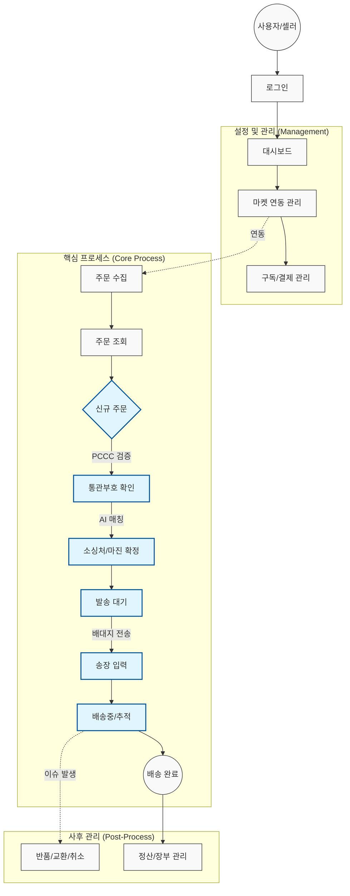

# Log: Service Flowchart Creation

## Action
Constructing the "Master Service Flowchart" to provide a high-level view of the system.

## Designed Flow (Mermaid)

## Next Steps
- Insert this chart into `docs/03_서비스기획/기획_프로세스_플로우차트.md`.
- Ensure consistency with sub-charts.
