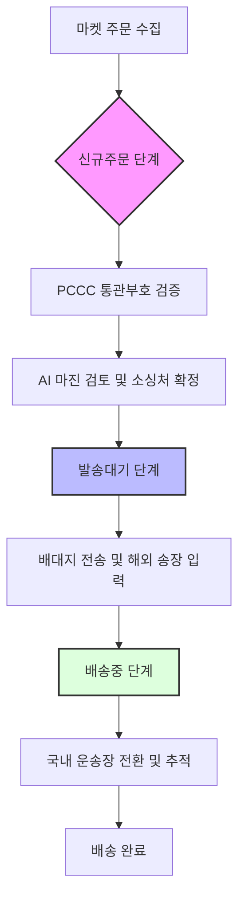
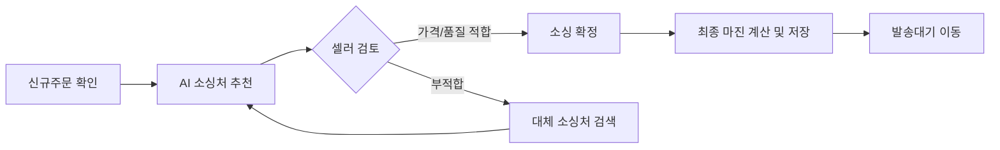
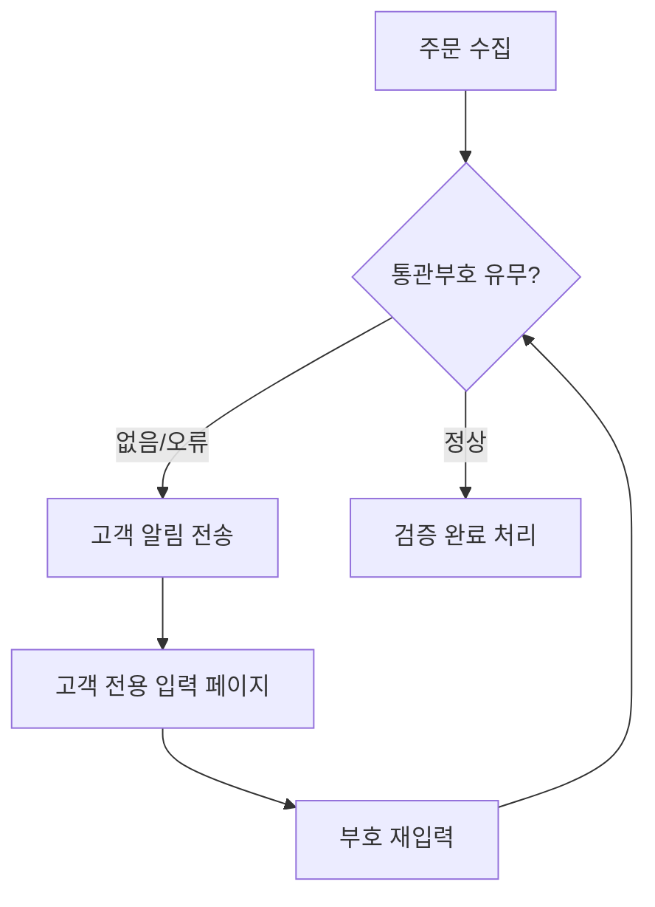
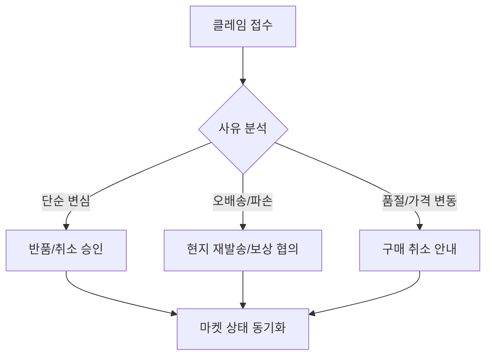

# [기획] 핵심 프로세스 플로우차트 (Flowcharts)

사용자가 시스템을 통해 주문을 처리하는 핵심 과정을 흐름도로 정의합니다.

## 1. 전제 주문 처리 프로세스 (Order To Delivery)

마켓에서 수집된 주문이 최종 배송 완료되기까지의 전체 흐름입니다.

---

## 2. 소싱 및 마진 검토 프로세스 (Sourcing Flow)

AI 기반으로 최적의 상품을 찾아 마진을 확정하는 상세 단계입니다.

---

## 3. PCCC (개인통관고유부호) 관리 프로세스

해외 직구 필수 정보인 통관부호의 유효성을 검사하고 수집하는 방식입니다.

---

## 4. 반품 및 클레임 처리 프로세스

고객의 요구나 현지 사정으로 발생하는 클레임 처리 과정입니다.

