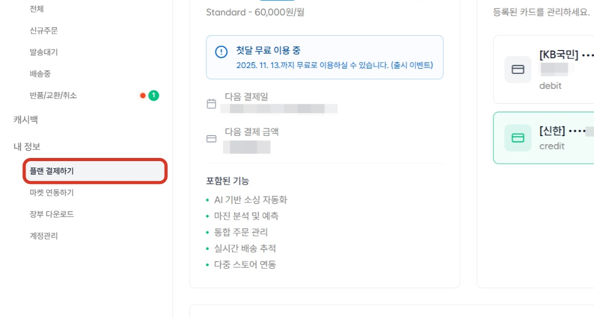
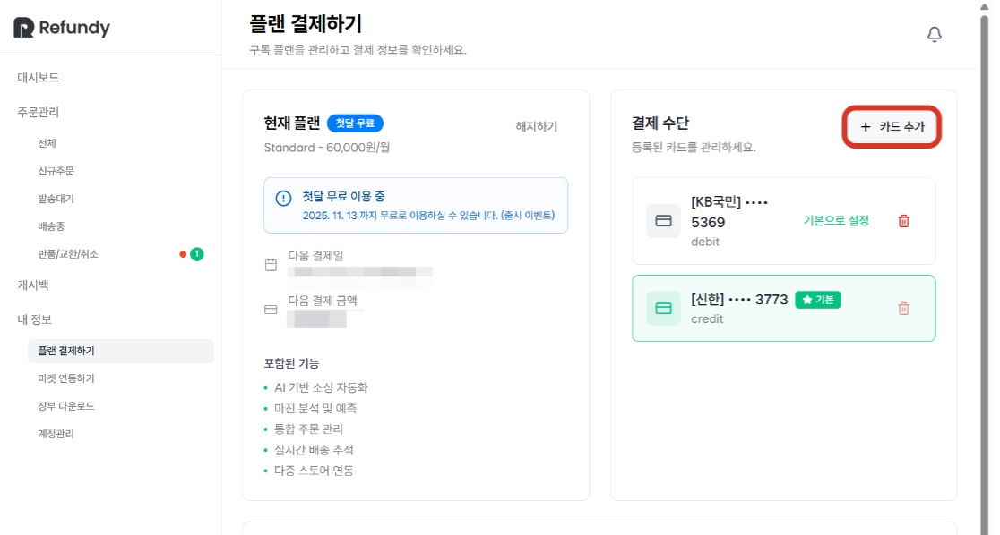
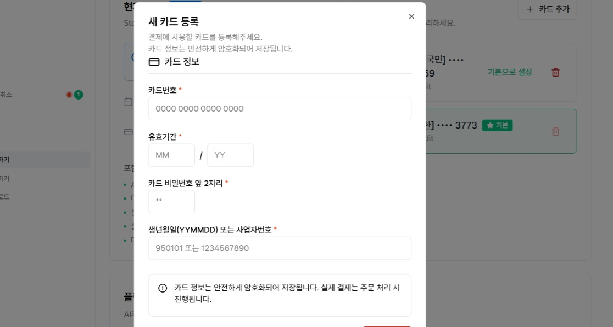
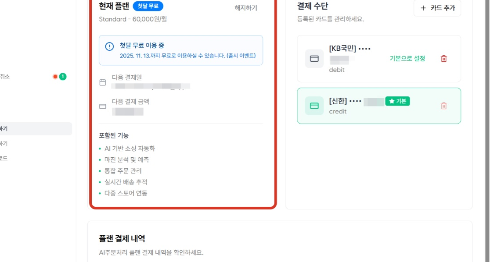

# 1. [플랜결제하기] - 결제 카드 등록

- **원본 URL**: https://docs.channel.io/oms_refundy/ko/articles/1-%ED%94%8C%EB%9E%9C%EA%B2%B0%EC%A0%9C%ED%95%98%EA%B8%B0---%EA%B2%B0%EC%A0%9C-%EC%B9%B4%EB%93%9C-%EB%93%B1%EB%A1%9D-6318c27b

---

#### 1. 카드 등록을 위해서 [플랜 결제하기] 메뉴를 클릭합니다.

#### 2. [카드 추가] 버튼을 클릭합니다.

#### 3. 서비스 이용료 결제 및 주문처리 과정에서 사용할 카드 정보를 입력합니다.

기본 설정 카드
- '기본으로 설정'한 카드로 플랜 결제 및 주문처리 비용이 결제되며, 기본 설정 카드로 결제가 진행되지 않는 경우, 등록되어 있는 다른 카드로 결제가 진행됩니다.

'기본으로 설정'한 카드로 플랜 결제 및 주문처리 비용이 결제되며, 기본 설정 카드로 결제가 진행되지 않는 경우, 등록되어 있는 다른 카드로 결제가 진행됩니다.

마켓별 카드 설정 관련
- 오픈 마켓별로 결제 카드를 설정하여 사용하실 수 있습니다.

오픈 마켓별로 결제 카드를 설정하여 사용하실 수 있습니다.
- 마켓별로 각기 다른 결제수단을 사용하기 원하신다면, [마켓연동하기] 메뉴에서 기본 카드로 설정해주시면 해당 마켓별로 설정된 카드로 결제가 진행됩니다.

마켓별로 각기 다른 결제수단을 사용하기 원하신다면, [마켓연동하기] 메뉴에서 기본 카드로 설정해주시면 해당 마켓별로 설정된 카드로 결제가 진행됩니다.

#### 4. 카드가 정상 등록되었다면, 등록된 카드로 서비스 이용료 결제(실결제 0원)가 진행됩니다.

첫달 무료 혜택
- 리펀디 AI 주문처리 시스템에서는 결제 수단 등록 후, 플랜 결제가 진행된 날로부터 30일간 무료로 이용 가능합니다. 30일 이후에는 기본으로 설정한 카드로 이용료(60,000원)가 결제됩니다.

리펀디 AI 주문처리 시스템에서는 결제 수단 등록 후, 플랜 결제가 진행된 날로부터 30일간 무료로 이용 가능합니다. 30일 이후에는 기본으로 설정한 카드로 이용료(60,000원)가 결제됩니다.
- 무료 체험 후, 이용료가 결제되지 않는다면, 신규 주문 수집이 중단됩니다. 이전에 처리하시는 주문은 이어서 리펀디 AI 주문처리에서 작업이 가능합니다.

무료 체험 후, 이용료가 결제되지 않는다면, 신규 주문 수집이 중단됩니다. 이전에 처리하시는 주문은 이어서 리펀디 AI 주문처리에서 작업이 가능합니다.

❗플랜이 시작되어야 신규 주문 수집이 가능합니다.

