# 2. 마켓(스토어) 연동_공통

- **원본 URL**: https://docs.channel.io/oms_refundy/ko/articles/2-%EB%A7%88%EC%BC%93%EC%8A%A4%ED%86%A0%EC%96%B4-%EC%97%B0%EB%8F%99_%EA%B3%B5%ED%86%B5-0332e4d2

---

스토어 연동을 하시면 신규주문을 수집하는 것부터주문처리 절차가 가능해집니다

5대 마켓(쿠팡, 스마트 스토어, ESM, 11번가) 연동을 지원하고 있으며,

아래 매뉴얼을 보고 따라서 연동을 시작해 주세요!

#### 1. 리펀디 AI 주문처리 내 좌측 패널 [스토어] 클릭

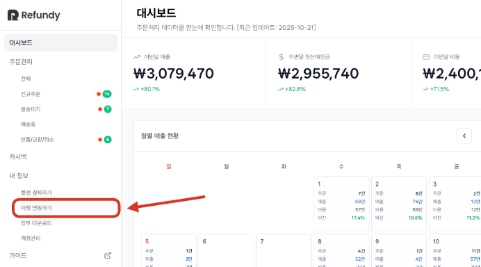

#### 2. 우측 상단 [스토어 추가] 클릭

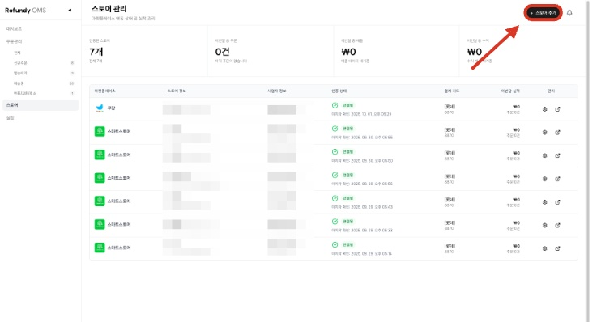

#### 3. [마켓플레이스] 선택

5대 마켓(쿠팡, 스마트 스토어, ESM, 11번가) 중등록할 마켓을 선택하면 됩니다.

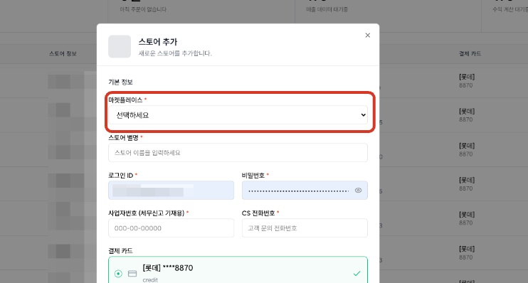

#### 4. [스토어 별명] 입력

스토어 별명은마켓 이름이나 임의로 기억하기 쉽게지정해 주세요.

신규 주문이 들어오면 스토어 별명이 함께 표기되어 구별이 쉽습니다

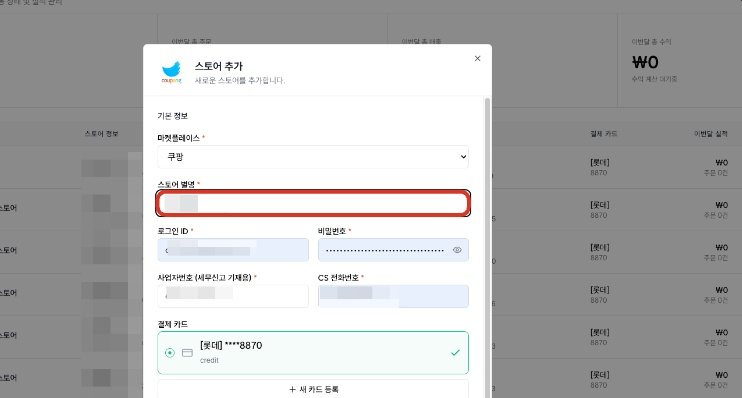

#### 5. [로그인 ID/PW]

해당 스토어 로그인 아이디와 비밀번호를 입력해 주세요.

이 부분은 연동에 영향을 주지 않으며 마켓 관리용으로 이용해 보세요!

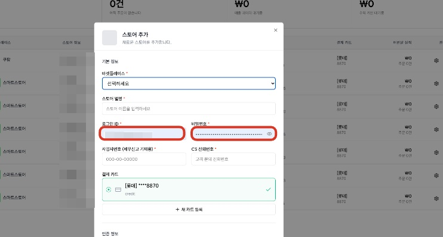

#### 6. [사업자번호],[CS 전화번호] 입력

해당 마켓사업자 번호와 CS 전화번호를 입력해 주세요.

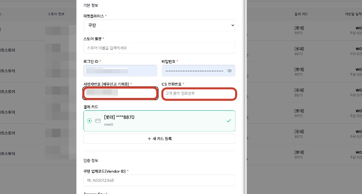

#### 7. [새 카드 등록]을 눌러 카드정보 등록

리펀디 AI 주문처리는타오바오 결제를 지원하고 있습니다.

상품을 결제하실사업용 카드또는개인 카드 정보를 입력해 주세요.

해당 마켓에등록된 카드 정보로 결제됩니다. 따라서 사업자별 카드를 개별 등록하시면 관리하기가 쉽습니다

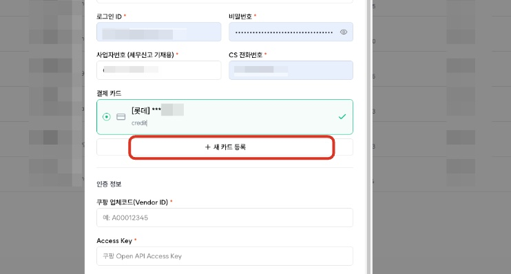

#### 8. 마켓별 [인증 정보] 입력

스토어 기본 정보를 입력했다면인증 정보를작성해야 합니다. 5대 마켓별 작성해야 할 인증 정보는 각각 다르기 때문에, 해당 내용은스토어 매뉴얼에서 더 자세히 확인 가능합니다

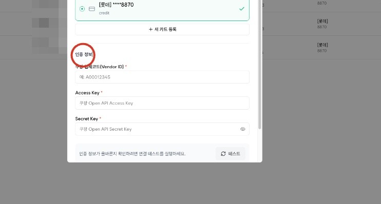

#### 9. [테스트] 클릭

마켓 인증 정보를 입력하셨다면[테스트] 버튼을 눌러 잘 연동이 되는지 확인합니다.

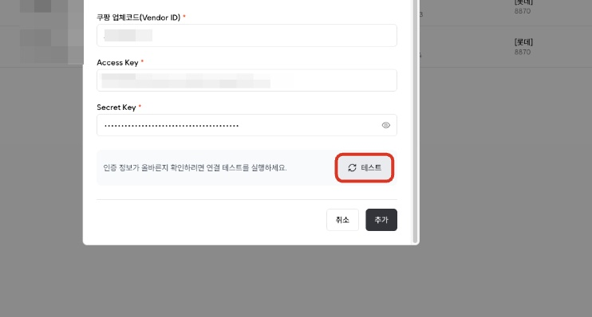

## 

인증 정보가 유효하다면[성공] 알림이 나옵니다.

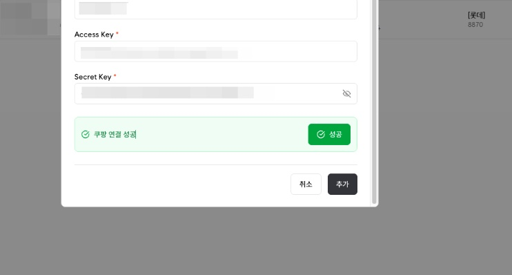

## 10. [추가] 클릭

마지막으로[추가]버튼까지 눌러 마무리합니다.

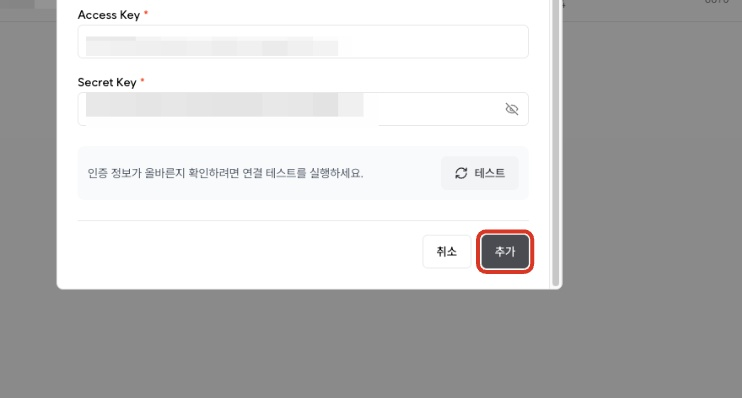