# 2.1 스마트스토어 연동(최초가입 ver.)

- **원본 URL**: https://docs.channel.io/oms_refundy/ko/articles/21-%EC%8A%A4%EB%A7%88%ED%8A%B8%EC%8A%A4%ED%86%A0%EC%96%B4-%EC%97%B0%EB%8F%99%EC%B5%9C%EC%B4%88%EA%B0%80%EC%9E%85-ver-a71c3142

---

커머스 API센터 접속 후 스마트 스토어 아이디로 접속해 주세요.

바로가기(클릭)

https://apicenter.commerce.naver.com/ko/member/home

### 1. [커머스API센터 시작하기] 버튼 클릭

스마트스토어 계정을 리펀디 AI 주문처리와 연동하기 위해서 API가 필요합니다.

네이버 커머스 API 계정을 만들어서 API 생성을 진행해보겠습니다.

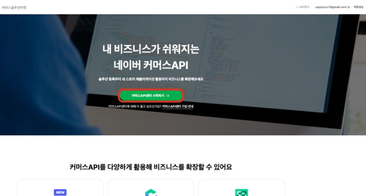

### 2. [계정생성] 버튼 클릭

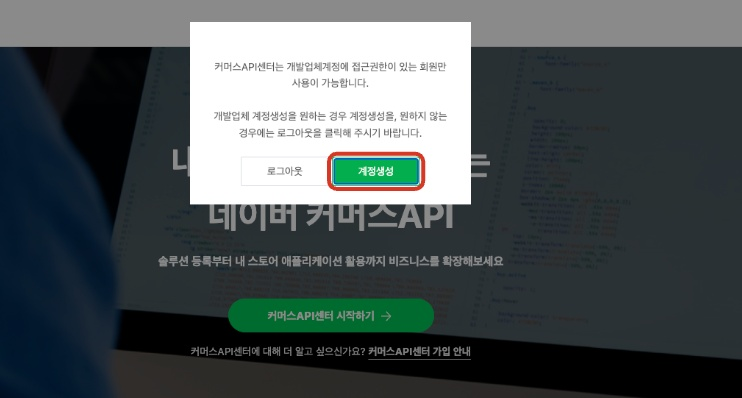

### 3. 개발업체 계정 생성 페이지 확인이 가능합니다

계정 생성 버튼 클릭하면 몇가지 정보 입력후 가입이 완료됩니다.

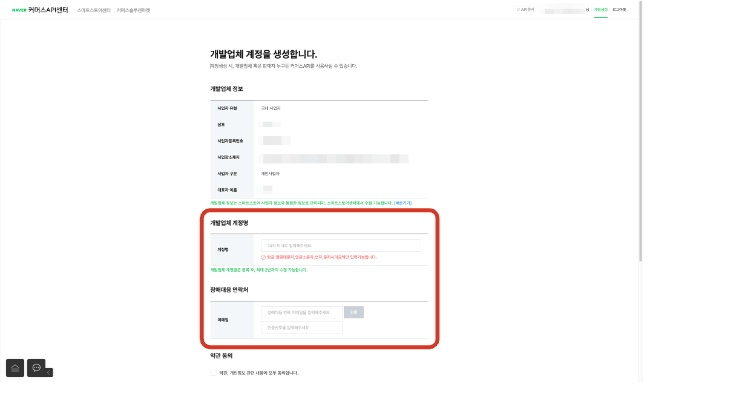

### 4. [개발업체 계정명] 작성

개발업체 계정명은 자유롭게 작성해주시면 됩니다.

계정명은 다른 이용자와 중복된 이름으로 작성이 불가능합니다.

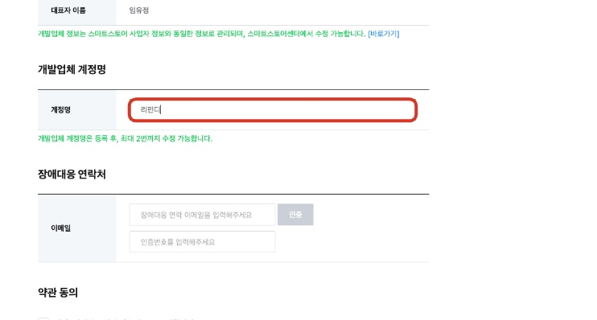

### 5. [장애대응 연락처] 이메일 작성

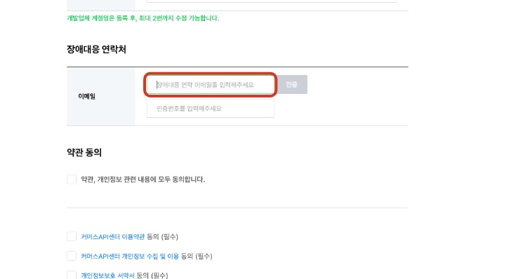

### 6. [인증] 버튼 클릭

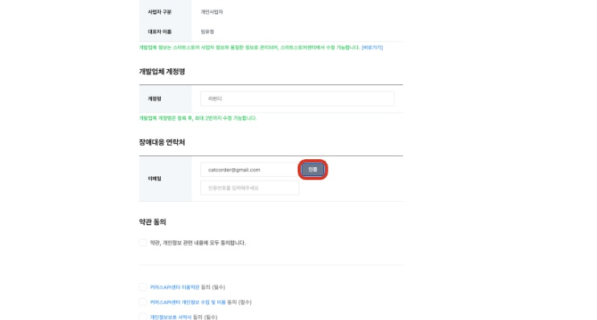

### 7. 자동화 입력 방지 인증

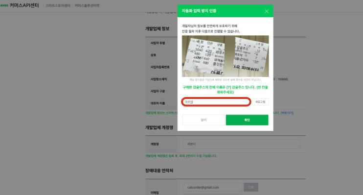

### 8. 약관 동의 후 → [가입하기] 버튼 클릭

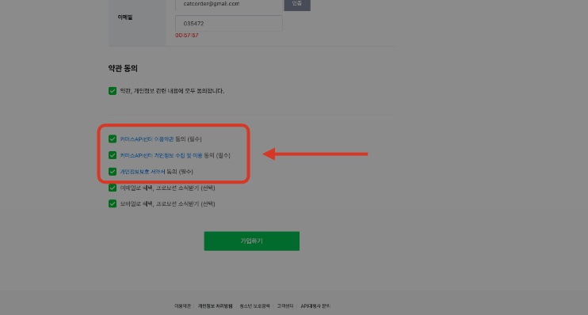

### 9. [등록하기] 클릭

애플리케이션 등록 우측에 [등록하기]를 클릭해 주세요.

링크 :https://apicenter.commerce.naver.com/ko/member/home

## 

### 10. [애플리케이션 이름] - AI주문처리 연동 혹은 임의로 설정

애플리케이션 이름은 단순 기억용으로 사용됩니다. 리펀디 AI 주문처리 연동 혹은 임의로 설정하셔도 무방합니다.

### 11. [설명] - 리펀디 AI 주문처리 입력

애플리케이션 설명은 단순 작성용으로 사용됩니다. 리펀디 AI 주문처리 연동 혹은 임의로 설정하셔도 무방합니다.

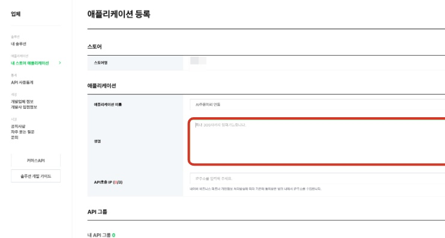

### 12. [API호출 IP] - 34.64.92.73 추가

타 프로그램 연동 이력이 있다면, 이미 api 번호가 등록되어 있을 수 있습니다. 리펀디 AI 주문처리 api [34.64.92.73]를 추가 입력해 주세요.

### 13. [전체 API 그룹] - 5가지 모두 추가 클릭

현재 리펀디 AI 주문처리 자동화에서는 주문 수집~배송 관리까지 가능합니다. 이 외에 고객 문의 관리 및 정산 기능은 순차적으로 업데이트될 예정입니다.

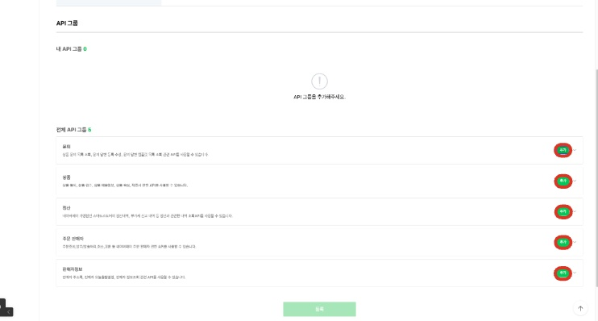

### 14. [등록] 클릭해 주시면, 마켓 시스템에서 API 키가 발급됩니다

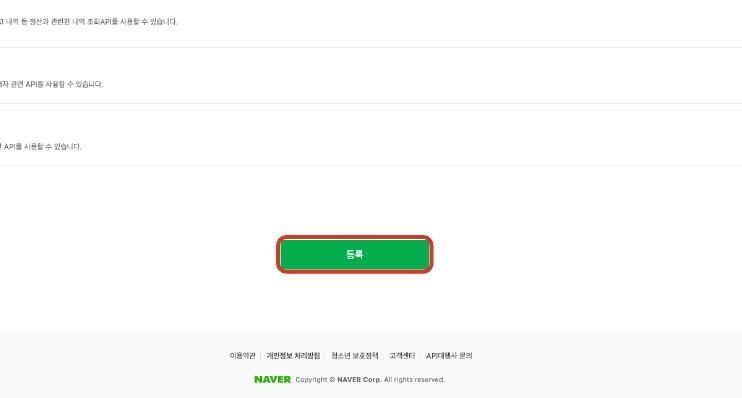

### 15. 성공적으로 발급된, [애플리케이션 ID / 시크릿 키] 복사하여 리펀디 AI 주문처리에 각각 입력해 주시면 됩니다.

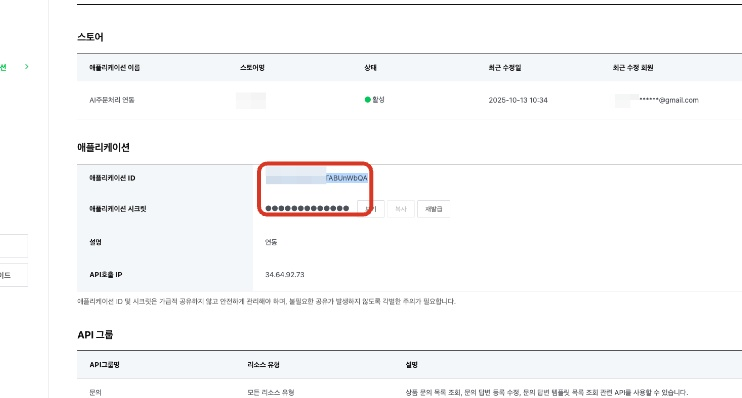

### 16. 리펀디 AI 주문처리 스토어 등록에 붙여넣기

[Client ID] → 애플리케이션 ID

[Client Secret] → 애플리케이션 시크릿

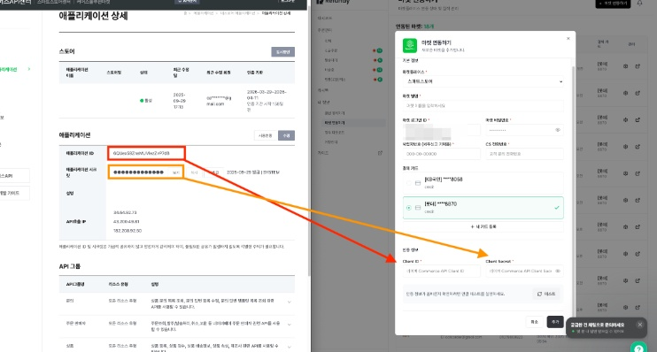

### 17. 리펀디 AI 주문처리 스토어 등록에 붙여넣기

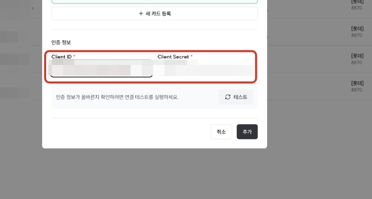

### 18. [테스트] 클릭

19. 최종 확인

[성공] 알림이 나오면 연동이 정상적으로 완료된 것입니다.

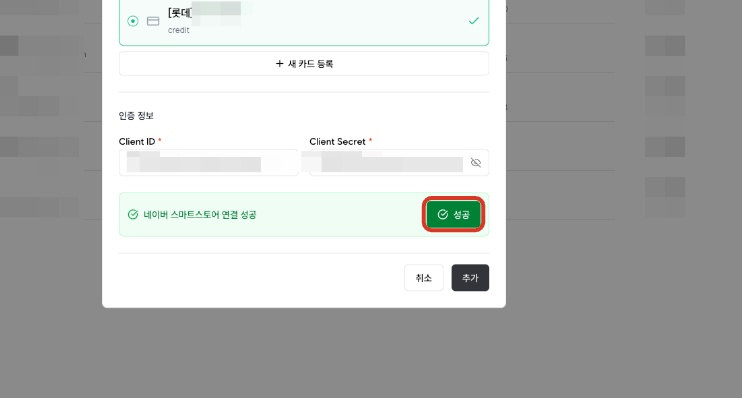