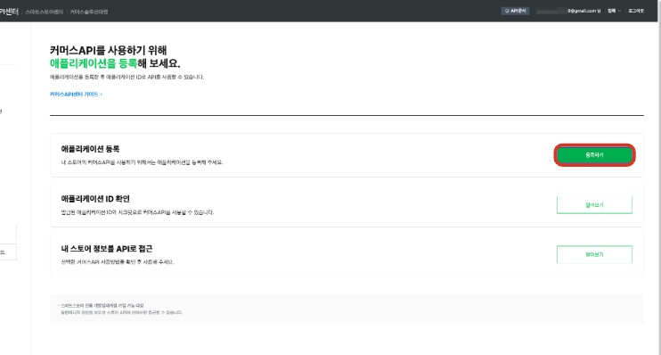
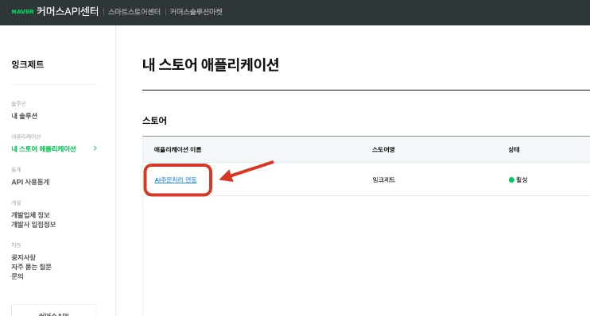
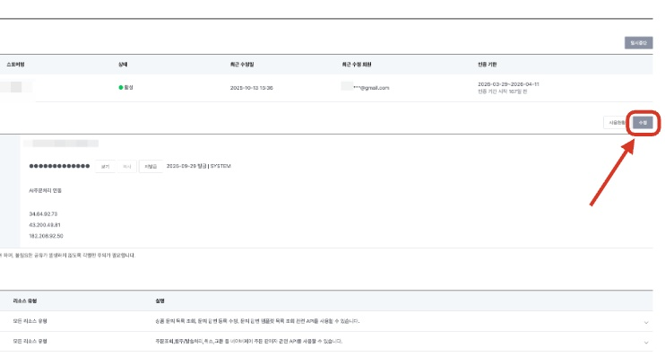
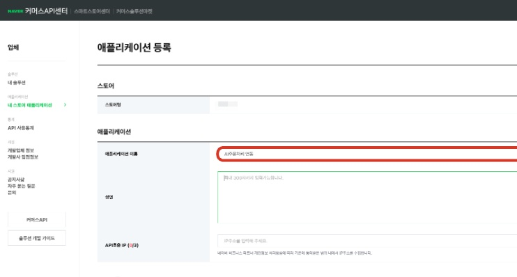
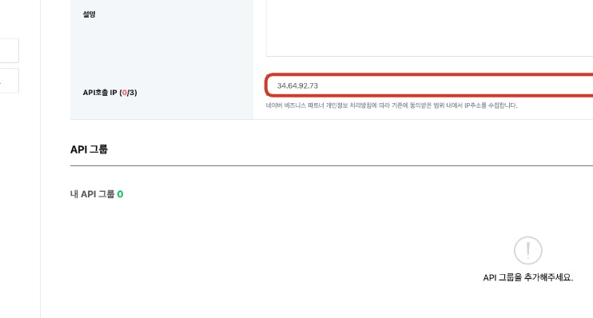
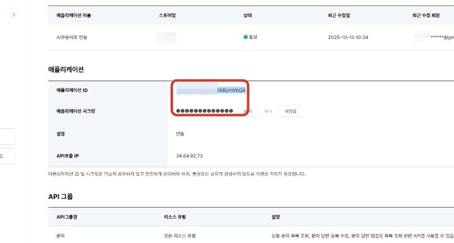
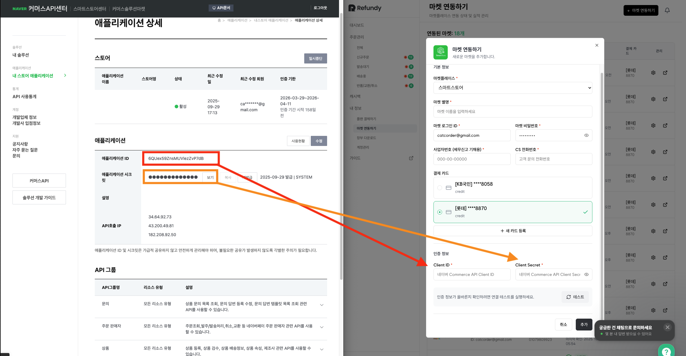
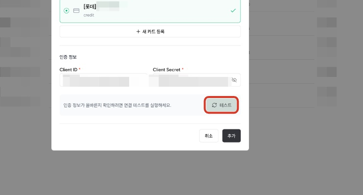

# 2.1 스마트스토어 연동(타프로그램 사용자ver.)

- **원본 URL**: https://docs.channel.io/oms_refundy/ko/articles/21-%EC%8A%A4%EB%A7%88%ED%8A%B8%EC%8A%A4%ED%86%A0%EC%96%B4-%EC%97%B0%EB%8F%99%ED%83%80%ED%94%84%EB%A1%9C%EA%B7%B8%EB%9E%A8-%EC%82%AC%EC%9A%A9%EC%9E%90ver-a3a5bc95

---

커머스 API센터 접속 후 스마트 스토어 아이디로 접속해 주세요.

바로가기(클릭)

https://apicenter.commerce.naver.com/ko/member/home

#### 1. [등록하기] 클릭

애플리케이션 등록 우측에 [등록하기]를 클릭해 주세요.

링크 :https://apicenter.commerce.naver.com/ko/member/home

#### 이미 애플리케이션이 등록되어 있는 경우

타프로그램 사용시 이미 애플리케이션이 등록되어 있습니다.

등록 되어있는 애플리케이션 클릭해 주세요.

#### 이미 애플리케이션이 등록되어 있는 경우

수정버튼 클릭후 2번 절차로 넘어가주세요

#### 2. [애플리케이션 이름] - AI주문처리 연동 혹은 임의로 설정

애플리케이션 이름은 단순 작성용으로 사용됩니다. 리펀디 AI 주문처리 연동 혹은 임의로 설정하셔도 무방합니다.

#### 3. [설명] - 리펀디 AI 주문처리 입력

애플리케이션 설명은 단순 작성용으로 사용됩니다. 리펀디 AI 주문처리 연동 혹은 임의로 설정하셔도 무방합니다.

#### 4. [API호출 IP] - 34.64.92.73 추가

타 프로그램 연동 이력이 있다면, 이미 api 번호가 등록되어 있을 수 있습니다. 리펀디 AI 주문처리 api [34.64.92.73]를 추가 입력해 주세요.

#### 5. [전체 API 그룹] - 5가지 모두 추가 클릭

현재 리펀디 AI 주문처리 자동화에서는 주문 수집~배송 관리까지 가능합니다. 이 외에 고객 문의 관리 및 정산 기능은 순차적으로 업데이트될 예정입니다.

#### 6. [등록] 클릭해 주시면, 마켓 시스템에서 API 키가 발급됩니다

#### 7. 성공적으로 발급된, [애플리케이션 ID / 시크릿 키] 복사하여 리펀디 AI 주문처리에 각각 입력해 주시면 됩니다.

#### 8. 리펀디 AI 주문처리 스토어 등록에 붙여넣기

[Client ID] → 애플리케이션 ID

[Client Secret] → 애플리케이션 시크릿

#### 9. [테스트] 클릭

#### 10. 최종 확인

[성공]알림이 나오면 연동이 정상적으로 완료된 것입니다.

