# 2.3 11번가 연동

- **원본 URL**: https://docs.channel.io/oms_refundy/ko/articles/23-11%EB%B2%88%EA%B0%80-%EC%97%B0%EB%8F%99-cfcb3129

---

11번가 API센터접속

https://openapi.11st.co.kr/openapi/OpenApiFrontMain.tmall

#### 1. 11번가 API센터 접속 후 [로그인] 클릭

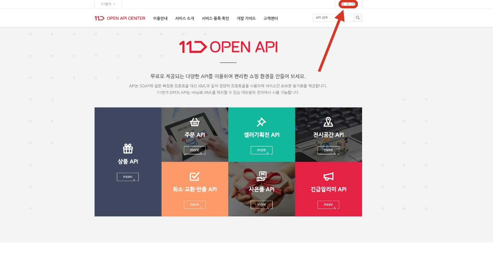

#### 2. 11번가 판매자 센터 [ID/PW] 입력

11번가 판매자 아이디로 로그인해주시면 됩니다.

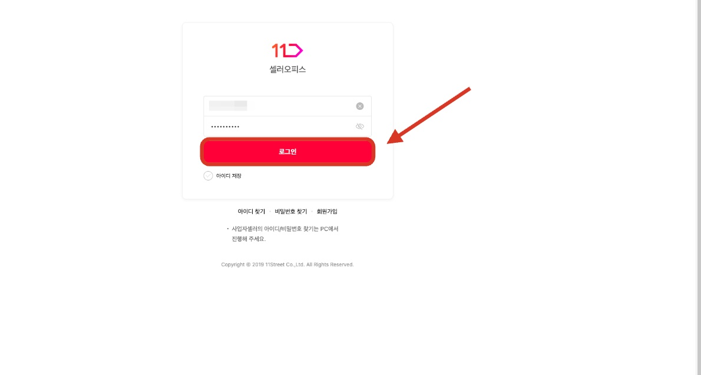

#### 3. [API관리] 메뉴를 클릭합니다.

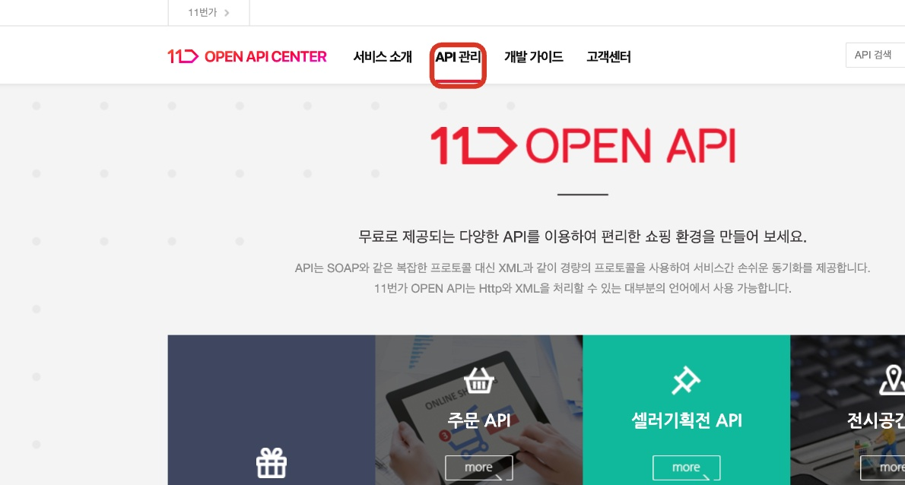

#### 4. '접속권한' 의 ip 정보를 수정하여 API 를 새로 수정 발급 받아야합니다.
- 하단의 개발서버 IP, 개발자 PC, 상용서버 IP 항목에 각각 리펀디 AI 주문처리 API 인 [34.64.92.73] 을 입력합니다.

하단의 개발서버 IP, 개발자 PC, 상용서버 IP 항목에 각각 리펀디 AI 주문처리 API 인 [34.64.92.73] 을 입력합니다.
- API를 사용할 API 주소가 여러개라면 세미콜론(;)으로 구분해주세요.타프로그램 사용시, API를 확인해주세요. (검색포털에 'API 주소' 검색)개발서버 IP / 개발자 PC / 상용서버 IP3가지 모두 동일하게 입력해 주세요세미콜론(;)으로 API 주소를 구분해주세요예시) 34.64.92.73;'타프로그램 api'

API를 사용할 API 주소가 여러개라면 세미콜론(;)으로 구분해주세요.
- 타프로그램 사용시, API를 확인해주세요. (검색포털에 'API 주소' 검색)

타프로그램 사용시, API를 확인해주세요. (검색포털에 'API 주소' 검색)
- 개발서버 IP / 개발자 PC / 상용서버 IP3가지 모두 동일하게 입력해 주세요

개발서버 IP / 개발자 PC / 상용서버 IP3가지 모두 동일하게 입력해 주세요
- 세미콜론(;)으로 API 주소를 구분해주세요

세미콜론(;)으로 API 주소를 구분해주세요
- 예시) 34.64.92.73;'타프로그램 api'

예시) 34.64.92.73;'타프로그램 api'

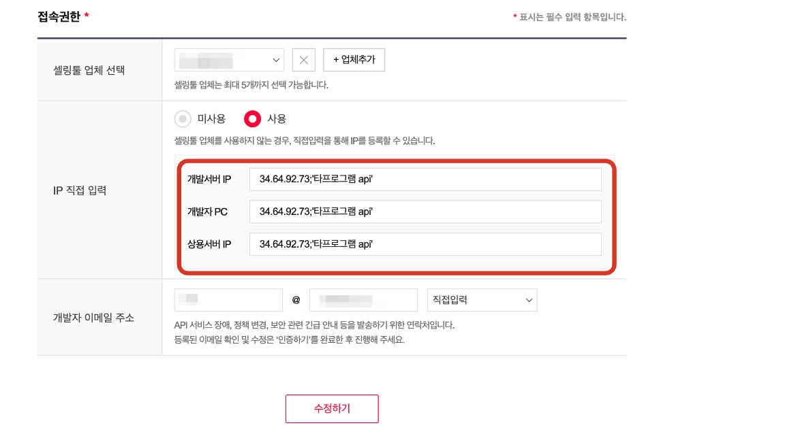

#### 5. 사용하고 계시는 셀링툴이 있는 경우, 설정되어 있는 셀링툴을 그대로 두신 후, 'IP 직접 입력 항목'만 수정해주시면 됩니다.

#### 6. IP 정보를 모두 수정입력하셨다면, 하단의 수정하기 버튼을 클릭해주세요.

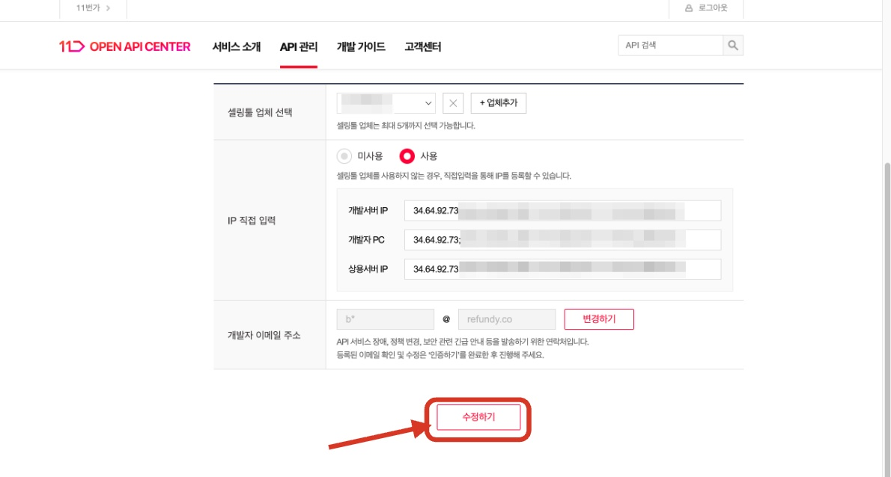

#### 7. 수정된 정보를 바탕으로 새로운 API KEY 값을 리펀디에 입력하기 위해 인증하기 버튼을 클릭합니다.

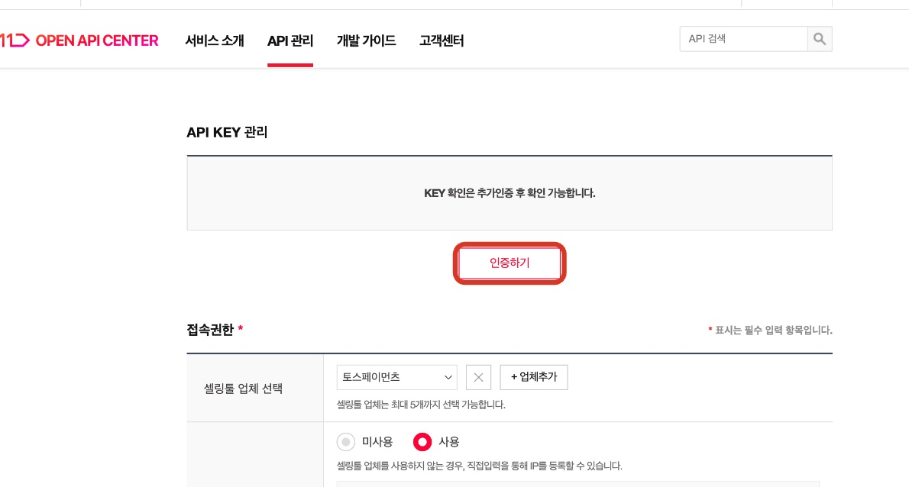

#### 8. 인증 후 새로 업데이트 된 API KEY 를 복사하여, 리펀디 연동하기 페이지에 입력합니다.

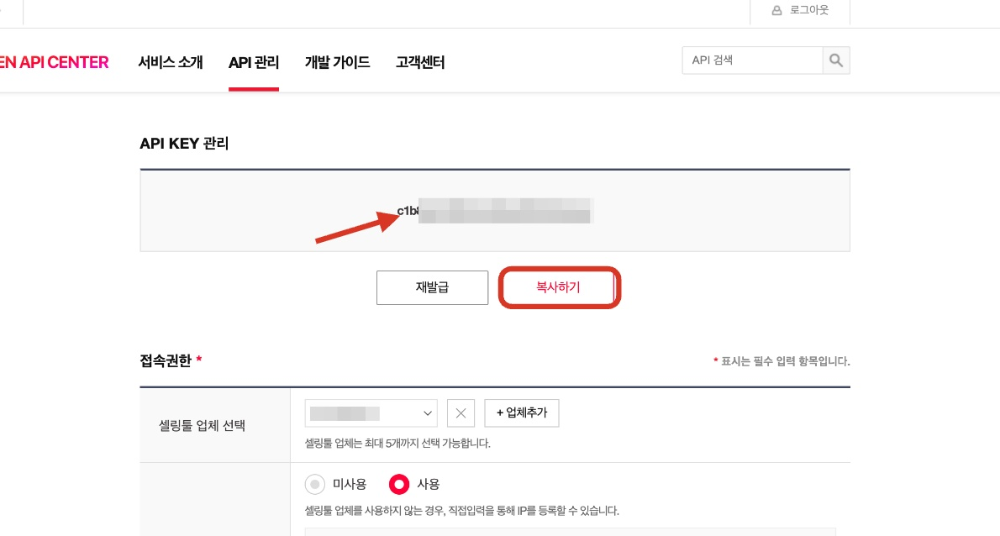

#### 9. 복사한 API KEY 를 인증정보에 입력합니다.

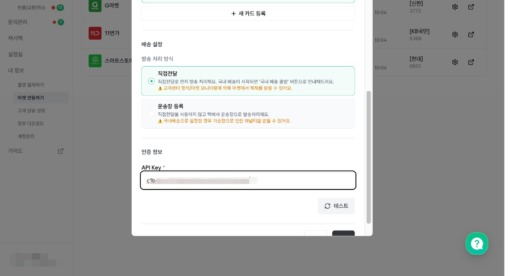

#### 10. 테스트 버튼을 클릭하여 발급된 API Key 로 연동이 완료 되었는지 확인합니다.

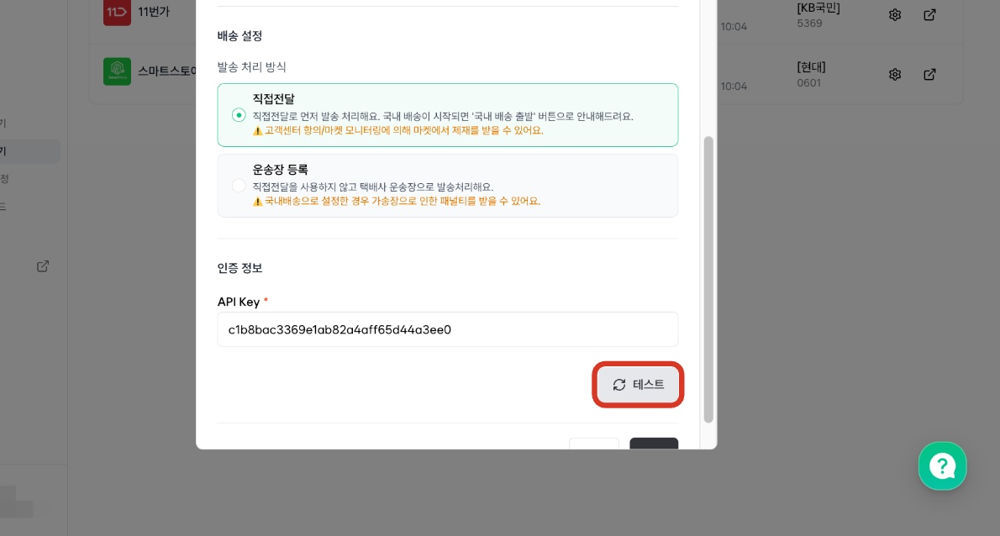

#### 11. 테스트 결과 스토어 연결이 성공되었다면, 추가 버튼을 클릭하여 연동 상태를 저장합니다.

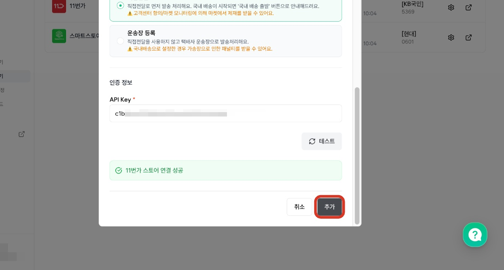

#### 참고) 11번가의 경우, 배송방법 등록을 일괄 설정할 수 있습니다.
- 발송처리 방식

발송처리 방식
- 직접 전달처리직접 전달처리 방식을 선택하시는 경우, 발송대기 상태에서 [직접전달처리] 버튼을 클릭하지 않더라도, 소싱 결제 후 일괄 '직접전달'로 배송중 타입이 변경되고 있습니다.

직접 전달처리
- 직접 전달처리 방식을 선택하시는 경우, 발송대기 상태에서 [직접전달처리] 버튼을 클릭하지 않더라도, 소싱 결제 후 일괄 '직접전달'로 배송중 타입이 변경되고 있습니다.

직접 전달처리 방식을 선택하시는 경우, 발송대기 상태에서 [직접전달처리] 버튼을 클릭하지 않더라도, 소싱 결제 후 일괄 '직접전달'로 배송중 타입이 변경되고 있습니다.
- 운송장 등록운송장 등록 방식을 선택하는 경우, 소싱 결제 후 생성되는 배대지 주문서의 운송장 번호로 송장이 업데이트 됩니다.

운송장 등록
- 운송장 등록 방식을 선택하는 경우, 소싱 결제 후 생성되는 배대지 주문서의 운송장 번호로 송장이 업데이트 됩니다.

운송장 등록 방식을 선택하는 경우, 소싱 결제 후 생성되는 배대지 주문서의 운송장 번호로 송장이 업데이트 됩니다.

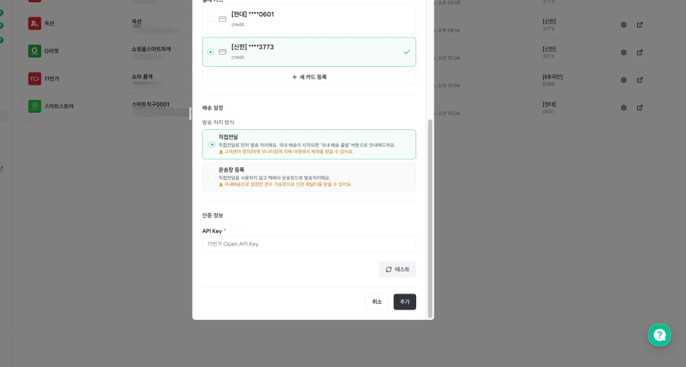