# 2.4 ESM 연동

- **원본 URL**: https://docs.channel.io/oms_refundy/ko/articles/24-ESM-%EC%97%B0%EB%8F%99-4dc82777

---

ESM 접속 후 로그인을 해주세요.

ESM 링크 :https://signin.esmplus.com/login

💡 ESM PLUS ID (마스터 ID)와 옥션, 지마켓 ID 가 모두 있어야 등록이 가능합니다.

#### 1. [판매자정보] 클릭

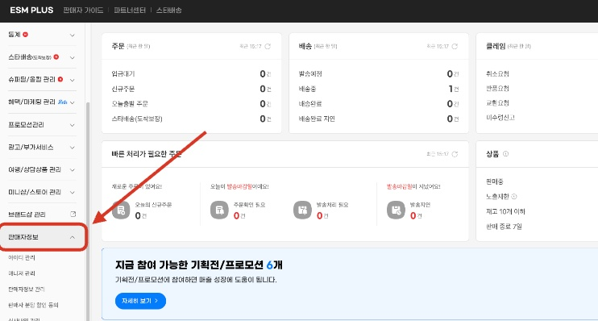

#### 2. [셀링툴 관리] 클릭

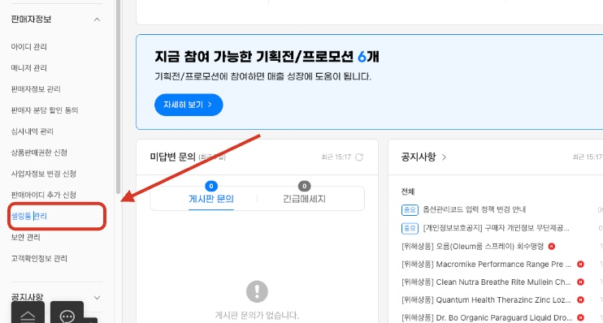

#### 3. [셀링툴 사용여부] - 사용함 클릭

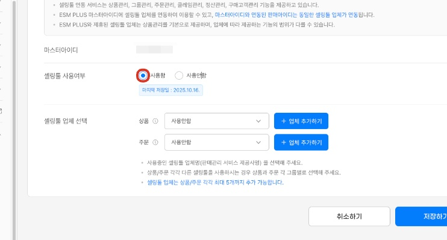

#### 4. 셀링툴 업체 선택

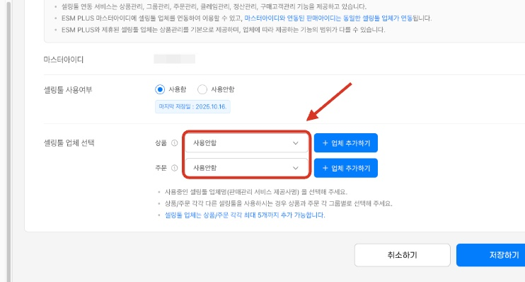

이미 사용하고 계신 업체가 있다면 [+업체 추가하기] 버튼을 클릭 후, 셀링툴 업체를 선택해주세요.

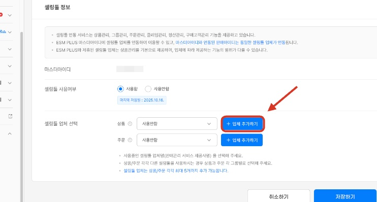

#### 5. 상품 → [AI리펀디] 선택

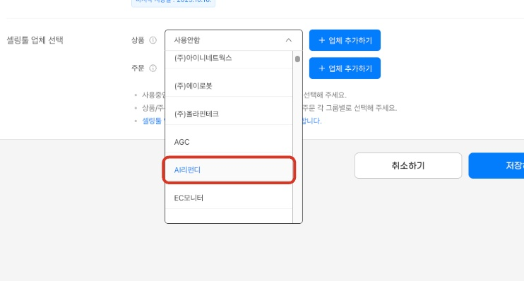

#### 6. 주문 → [AI리펀디] 선택

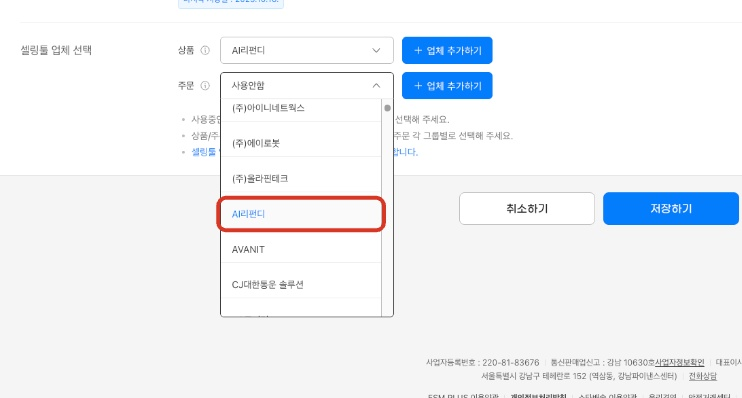

#### 7. [저장하기] 클릭

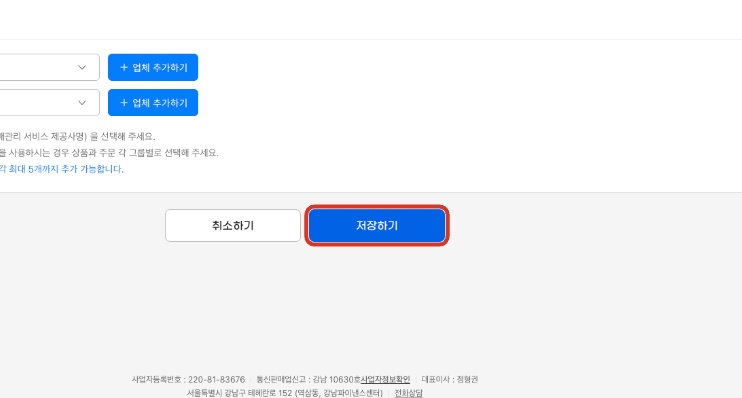

#### 8. [Master ID / Seller ID] 입력

Master ID와 Seller ID는 로그인 할 때, 사용하시는 ESM ID와 Seller ID를 넣어주셔야 합니다.

💡Master ID : ESM ID

💡Seller ID : G마켓 / 옥션 ID (연동 시에 해당하는 마켓계정 ID를 입력해주세요)

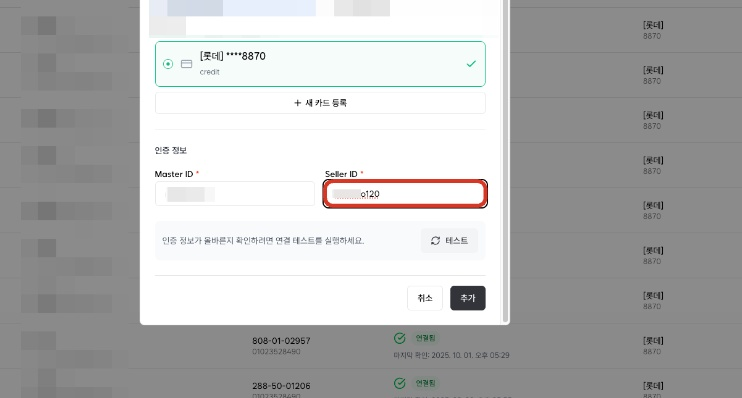

#### 9. [테스트] 클릭

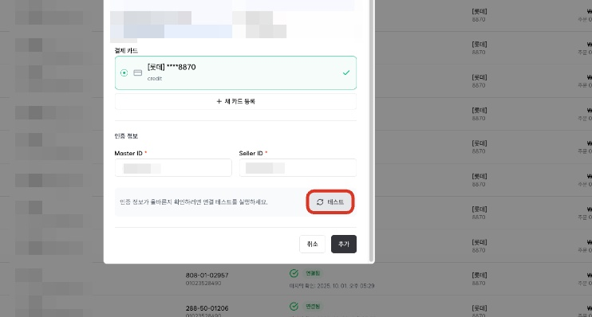

#### 10. [추가] 클릭

[성공]알림이 나오면 연동이 정상적으로 완료된 것입니다.

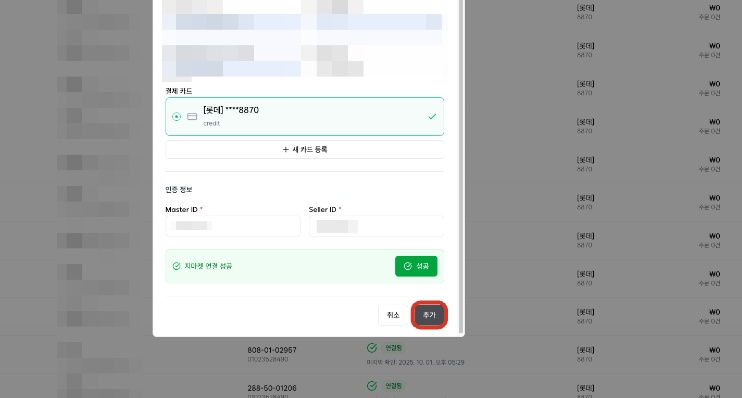