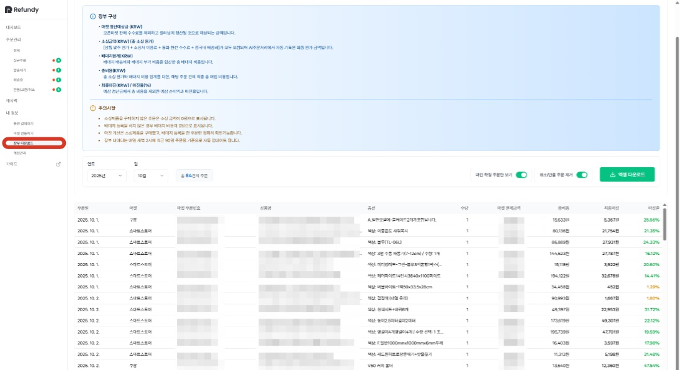
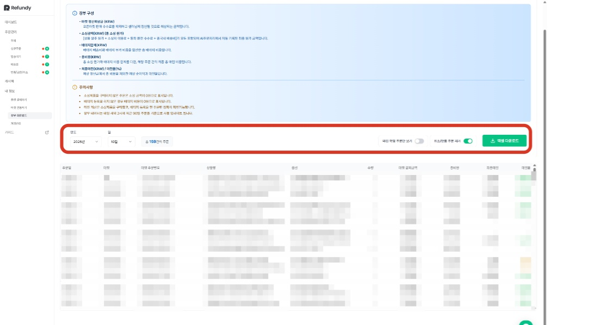
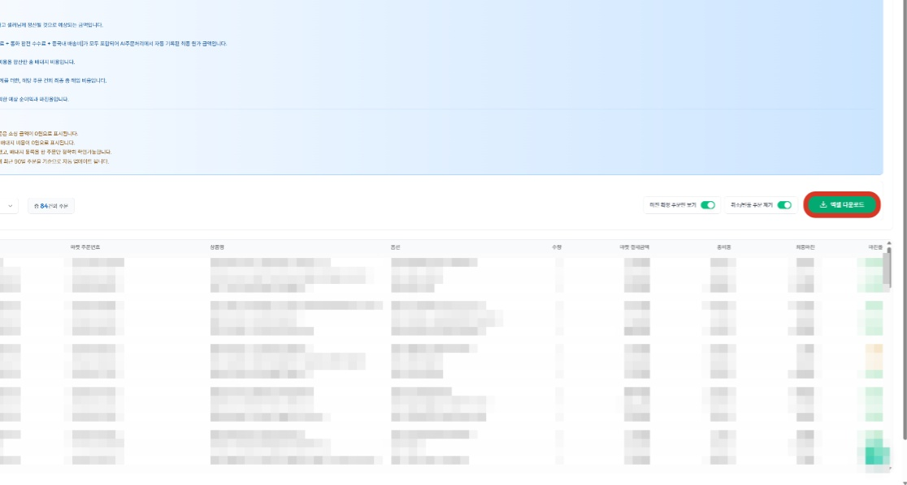

# 1. 장부 다운로드

- **원본 URL**: https://docs.channel.io/oms_refundy/ko/articles/1-%EC%9E%A5%EB%B6%80-%EB%8B%A4%EC%9A%B4%EB%A1%9C%EB%93%9C-44611115

---

'장부 다운로드' 기능은 리펀디에 수집된 모든 주문 데이터를 기간별, 유형별로 정리하여 매출신고 또는 마진 관리에 활용할 수 있도록 Excel 형태로 제공합니다.

셀러님께서는 복잡하고 번거로운 데이터 입력 과정 없이, 필요한 기간의 주문데이터를원클릭으로빠르게 확보하실 수 있습니다.

#### 1. 필요한 주문 데이터를 간편하게 다운로드하세요.

주문처리 단계에서 자동으로기록된 모든 주문 상태, 매출, 정산예정금액, 소싱 비용, 배대지 비용, 마진 등의데이터를 통합 관리 파일로 추출하는 기능입니다.

월별/분기별 정산 및 마진 분석, 매출신고 기초자료로 사용하실 수 있습니다.

#### 2. 장부 다운로드에 포함할 데이터의 범위와 조건을 설정합니다.

기간 설정 및 검색 조건 활용
- 화면 상단의 [날짜] 및 [검색조건]을 활용하여 다운로드할 데이터 범위를 지정할 수 있습니다.

화면 상단의 [날짜] 및 [검색조건]을 활용하여 다운로드할 데이터 범위를 지정할 수 있습니다.
- 검색조건마진 확정 주문만 보기마진 계산은 소싱제품을 구매했고, 배대지 등록을 한 주문만 정확히 확인가능합니다.해당 필터를 설정하시면 리펀디 내에서 자동으로 계산된 주문내역만 다운로드 받으실 수 있습니다.취소/반품 주문 제거실제 매출이 발생된 주문내역만 다운로드 받으실 수 있습니다.

검색조건
- 마진 확정 주문만 보기마진 계산은 소싱제품을 구매했고, 배대지 등록을 한 주문만 정확히 확인가능합니다.해당 필터를 설정하시면 리펀디 내에서 자동으로 계산된 주문내역만 다운로드 받으실 수 있습니다.

마진 확정 주문만 보기
- 마진 계산은 소싱제품을 구매했고, 배대지 등록을 한 주문만 정확히 확인가능합니다.

마진 계산은 소싱제품을 구매했고, 배대지 등록을 한 주문만 정확히 확인가능합니다.
- 해당 필터를 설정하시면 리펀디 내에서 자동으로 계산된 주문내역만 다운로드 받으실 수 있습니다.

해당 필터를 설정하시면 리펀디 내에서 자동으로 계산된 주문내역만 다운로드 받으실 수 있습니다.
- 취소/반품 주문 제거실제 매출이 발생된 주문내역만 다운로드 받으실 수 있습니다.

취소/반품 주문 제거
- 실제 매출이 발생된 주문내역만 다운로드 받으실 수 있습니다.

실제 매출이 발생된 주문내역만 다운로드 받으실 수 있습니다.

#### 3. 다운로드 받고 싶은 내역을 위한 설정을 완료했다면, [엑셀다운로드] 버튼을클릭합니다

#### *예시 장부다운로드 파일

#### 유의사항
- 마진 계산은 소싱제품을 구매했고, 배대지 등록을 한 주문만 정확히 확인 가능합니다.

마진 계산은 소싱제품을 구매했고, 배대지 등록을 한 주문만 정확히 확인 가능합니다.
- 소싱제품을 구매하지 않은 주문은 소싱 금액이 0원으로 표시됩니다.

소싱제품을 구매하지 않은 주문은 소싱 금액이 0원으로 표시됩니다.
- 배대지 등록을 하지 않은 경우 배대지 비용이 0원으로 표시됩니다.

배대지 등록을 하지 않은 경우 배대지 비용이 0원으로 표시됩니다.
- 장부 데이터는 매일 새벽 2시에 최근 90일 주문을 기준으로 자동 업데이트 됩니다.

장부 데이터는 매일 새벽 2시에 최근 90일 주문을 기준으로 자동 업데이트 됩니다.