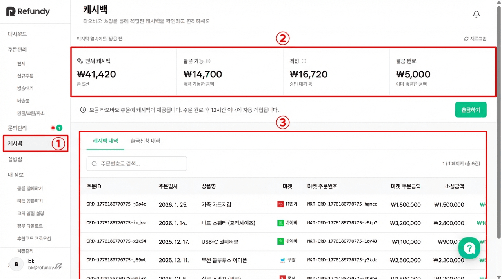
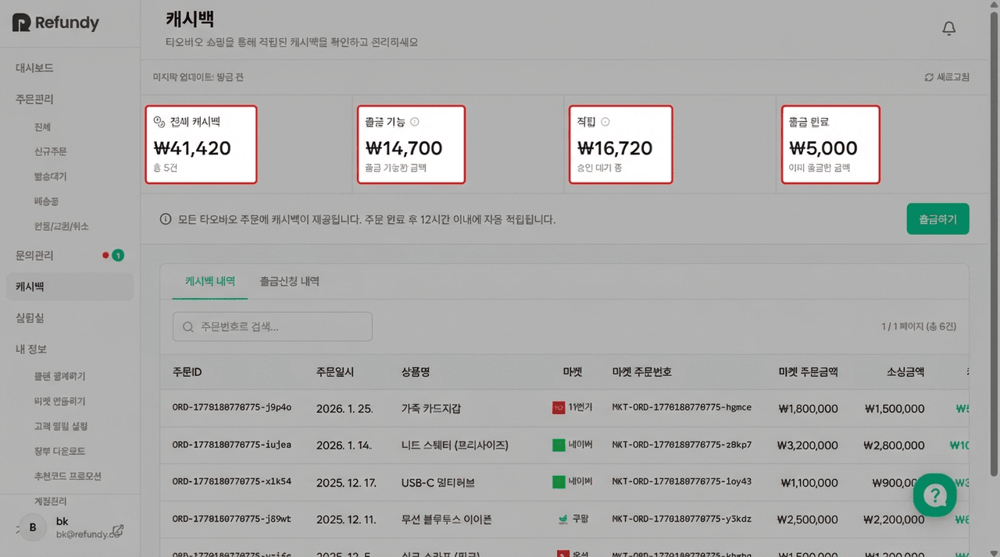
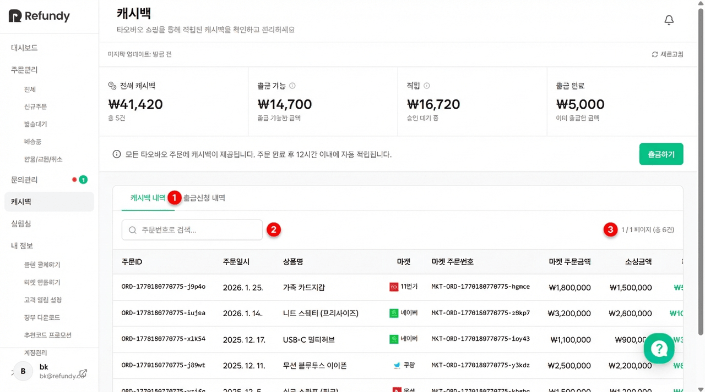
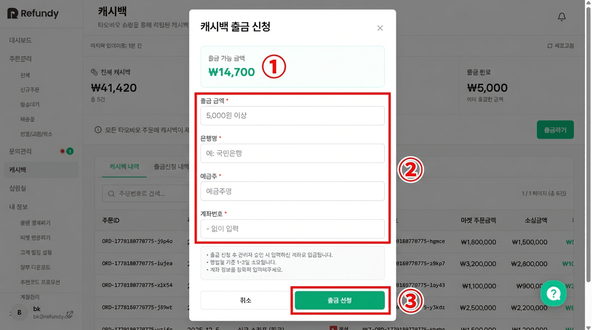
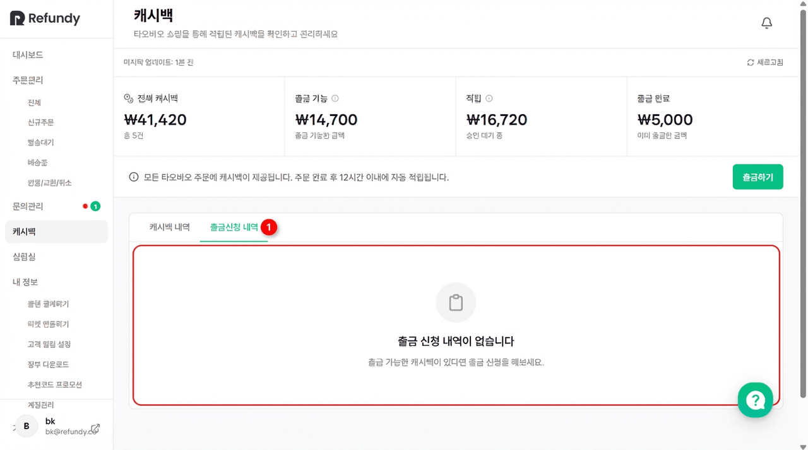

# 2. 캐시백

- **원본 URL**: https://docs.channel.io/oms_refundy/ko/articles/2-%EC%BA%90%EC%8B%9C%EB%B0%B1-3b2dba34

---

## 캐시백

리펀디 AI 주문처리를 이용하시면, 과거처럼 수동으로 캐시백 버튼을 클릭할 필요 없이 모든 발주 건에 대해 캐시백이 자동으로 적립됩니다.

### 이 가이드에서 다루는 내용
- 캐시백 적립 현황 확인하기

캐시백 적립 현황 확인하기
- 캐시백 내역 조회 및 검색

캐시백 내역 조회 및 검색
- 출금 신청하기

출금 신청하기
- 출금 신청 내역 확인하기

출금 신청 내역 확인하기

### 캐시백이란?

타오바오 상품을 주문하면, 소싱 금액의 일정 비율이 캐시백으로 자동 적립돼요. 별도의 신청 없이 주문이 완료되면 자동으로 쌓이니 편리하게 이용할 수 있어요.

항목

내용

적립 대상

모든 타오바오 발주 건

적립 비율

소싱 금액의 0.38%

적립 시점

주문 완료 후 12시간 이내 자동 적립

승인 기간

적립 후 60일 경과 시 자동 승인

최소 출금 금액

5,000원

### 캐시백 화면 구성

왼쪽 사이드바에서캐시백메뉴를 클릭하면 캐시백 페이지로 이동해요.

페이지 상단에는 캐시백 현황을 한눈에 볼 수 있는요약 카드 4개가 표시돼요.

카드

설명

전체 캐시백

지금까지 적립된 캐시백 총액과 건수를 보여줘요

출금 가능

현재 출금할 수 있는 금액이에요. 최소 5,000원 이상이어야 출금할 수 있어요

적립

아직 승인 대기 중인 캐시백 금액이에요. 60일이 지나면 자동으로 승인돼요

출금 완료

이미 출금한 총 금액이에요

요약 카드 아래에는 안내 메시지와 함께출금하기버튼이 있어요. 데이터가 최신이 아닌 것 같다면 상단의새로고침버튼을 클릭해주세요.

### 캐시백 내역 조회

#### Step 1: 캐시백 내역 탭 확인하기

캐시백 페이지 하단의캐시백 내역탭을 클릭하면 적립된 캐시백 목록을 확인할 수 있어요.

테이블에서 아래 정보를 확인할 수 있어요.

컬럼

설명

주문ID

리펀디 내부 주문 ID

주문일시

주문이 생성된 날짜

상품명

주문한 상품의 이름

마켓

판매 마켓 (네이버, 쿠팡 등)

마켓 주문번호

마켓에서 발급한 주문번호

마켓 주문금액

마켓에서의 판매 금액 (KRW)

소싱금액

타오바오 소싱에 사용된 금액 (KRW)

캐시백

적립된 캐시백 금액

상태

현재 캐시백 상태

승인 예정일

적립 상태인 건의 승인 예정 날짜

#### Step 2: 주문번호로 검색하기

테이블 상단의 검색창에주문번호를 입력하면 해당 주문의 캐시백 내역만 필터링할 수 있어요.

데이터가 많을 경우 테이블 하단의이전 / 다음버튼으로 페이지를 이동할 수 있어요.

#### 캐시백 상태 안내

상태

의미

적립

캐시백이 적립되었지만, 아직 승인 대기 중이에요. 60일 후 자동 승인돼요

승인 완료

승인이 완료되어 출금 가능한 캐시백이에요

적립 취소

주문 취소 등의 사유로 캐시백 적립이 취소됐어요

### 출금 신청하기

출금 가능 금액이 5,000원 이상이면 출금을 신청할 수 있어요.

#### Step 1: 출금하기 버튼 클릭

캐시백 페이지 상단의출금하기버튼을 클릭하세요. 출금 가능 금액이 5,000원 미만이면 버튼이 비활성화돼요.

#### Step 2: 출금 정보 입력

출금 신청 모달이 나타나면 아래 정보를 입력해주세요.

입력 항목

설명

출금 금액

출금할 금액을 입력해요. 최소 5,000원 이상, 출금 가능 금액 이하로 입력할 수 있어요

은행명

입금받을 은행 이름을 입력해요 (예: 국민은행)

예금주

계좌의 예금주명을 입력해요

계좌번호

입금받을 계좌번호를 '-' 없이 숫자만 입력해요

#### Step 3: 출금 신청 완료

모든 정보를 입력한 후출금 신청버튼을 클릭하면 신청이 완료돼요.

출금 신청 후 관리자 승인이 완료되면 입력한 계좌로 입금돼요. 영업일 기준 1~3일 정도 소요됩니다.

### 출금 신청 내역 확인

출금신청 내역탭을 클릭하면 지금까지 신청한 출금 내역을 확인할 수 있어요.

컬럼

설명

신청일

출금을 신청한 날짜

출금 금액

신청한 출금 금액

은행명

입금 은행

예금주

예금주명

계좌번호

입금 계좌번호

상태

출금 처리 상태

처리일

출금이 처리된 날짜

#### 출금 상태 안내

상태

의미

승인 대기

출금 신청이 접수되었고, 관리자 승인을 기다리고 있어요

출금 완료

승인이 완료되어 계좌로 입금이 완료됐어요

반려

출금 신청이 반려됐어요. 계좌 정보를 확인한 후 다시 신청해주세요

### 자주 묻는 질문

Q. 캐시백은 언제 적립되나요?

A. 타오바오 주문이 완료되면 12시간 이내에 자동으로 적립돼요. 별도의 신청은 필요 없어요.

Q. 적립된 캐시백은 바로 출금할 수 있나요?

A. 적립 후 60일이 지나 승인 완료 상태가 되어야 출금할 수 있어요. 승인 예정일은 캐시백 내역 테이블에서 확인할 수 있어요.

Q. 최소 출금 금액은 얼마인가요?

A. 최소 출금 금액은 5,000원이에요. 출금 가능 금액이 5,000원 이상이면 출금하기 버튼이 활성화돼요.

Q. 출금 신청 후 입금까지 얼마나 걸리나요?

A. 관리자 승인 후 영업일 기준 1~3일 이내에 입력하신 계좌로 입금돼요.