# 스마트스토어 이메일계정 생성방법

- **원본 URL**: https://docs.channel.io/oms_refundy/ko/articles/%EC%8A%A4%EB%A7%88%ED%8A%B8%EC%8A%A4%ED%86%A0%EC%96%B4-%EC%9D%B4%EB%A9%94%EC%9D%BC%EA%B3%84%EC%A0%95-%EC%83%9D%EC%84%B1%EB%B0%A9%EB%B2%95-761c0b49

---

리펀디 AI 주문처리에서 제공하는 '2차 로그인 인증 + (구매확정 자동 요청, 운송장 자동 업데이트)' 기능은 스마트스토어이메일 계정으로만 연동할 수 있어요. 네이버 아이디로 스마트스토어를 이용하고 계시다면, 아래 가이드를 따라 이메일 계정을 만들고 연동해주세요.

### 이 가이드에서 다루는 내용
- 네이버 아이디 사용자를 위한 이메일 계정 만들기 (매니저 초대)

네이버 아이디 사용자를 위한 이메일 계정 만들기 (매니저 초대)
- 네이버 커머스 ID 회원가입

네이버 커머스 ID 회원가입
- 리펀디 AI 주문처리에서 스마트스토어 연동하기

리펀디 AI 주문처리에서 스마트스토어 연동하기

### 시작하기 전에
- 스마트스토어 판매자센터에 로그인할 수 있어야 해요

스마트스토어 판매자센터에 로그인할 수 있어야 해요
- 문자 수신이 가능한 휴대폰이 필요해요

문자 수신이 가능한 휴대폰이 필요해요
- 스마트스토어 로그인 이메일로 사용할 이메일이 필요해요

스마트스토어 로그인 이메일로 사용할 이메일이 필요해요
- 리펀디 AI 주문처리 계정이 필요해요

리펀디 AI 주문처리 계정이 필요해요

### 스마트스토어 이메일 계정 만들기

네이버 아이디로 스마트스토어를 이용하고 계시다면, 매니저 초대 기능을 통해 이메일 계정을 만들 수 있어요.

#### 1. 스마트스토어 판매자센터에 로그인하세요

스마트스토어 판매자센터(https://sell.smartstore.naver.com)에 접속한 뒤로그인하기를 클릭하세요.

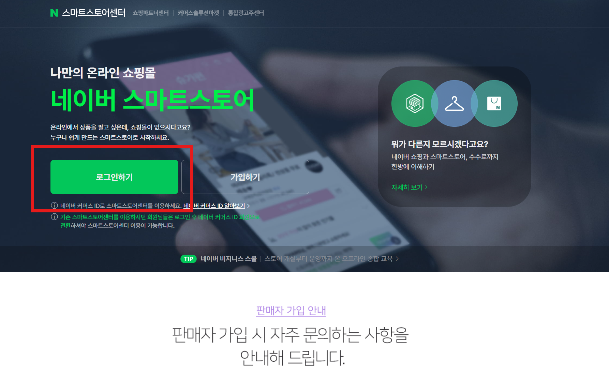

우측네이버 아이디로 로그인을 클릭하세요.

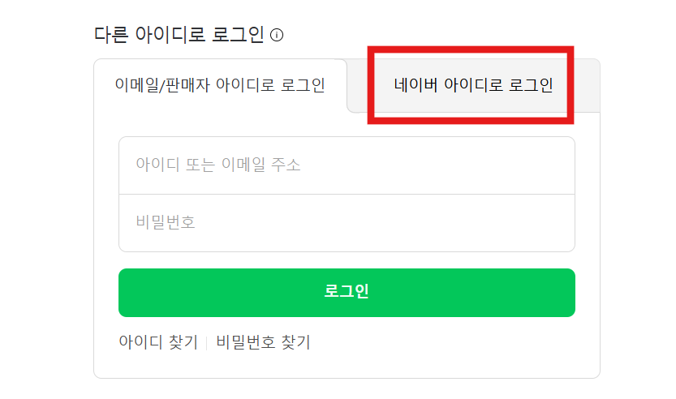

스마트스토어에서 사용 중인 네이버 아이디로 로그인하세요.

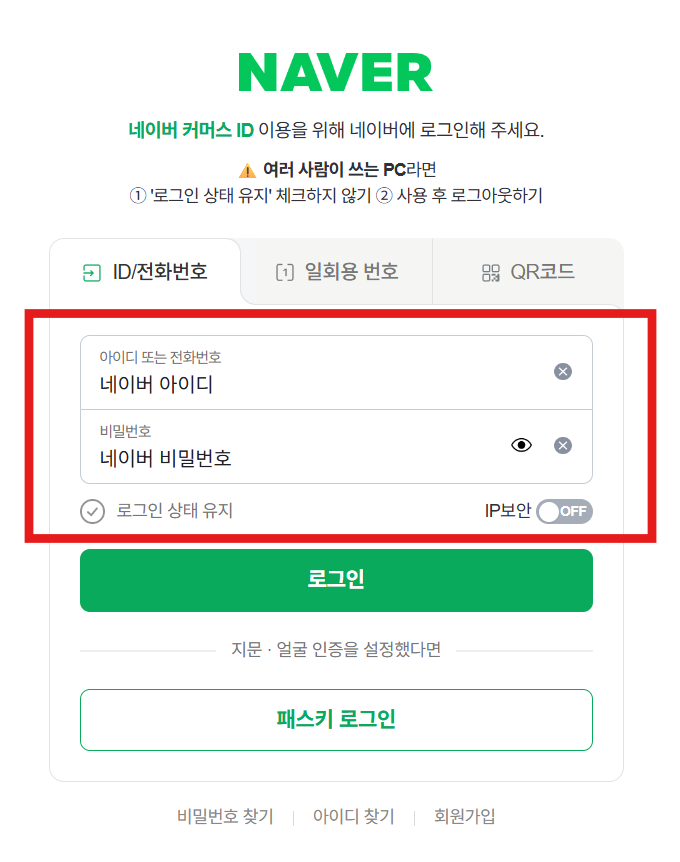

#### 2. 매니저 관리 메뉴로 이동하세요

로그인이 완료되면, 좌측 메뉴에서판매자정보→매니저 관리를 클릭하세요.

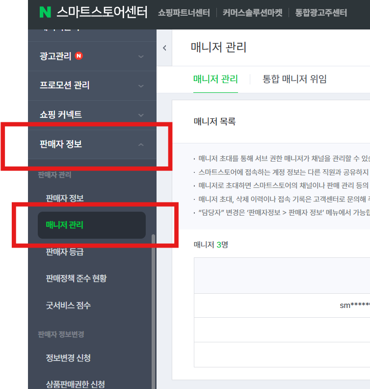

#### 3. 매니저 초대를 진행하세요

우측 상단의매니저 초대버튼을 클릭하세요.

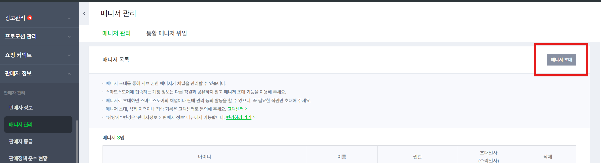

초대 정보를 입력하세요:
- 이름: 아무 이름이나 입력하셔도 괜찮아요 (예: 이메일계정)

이름: 아무 이름이나 입력하셔도 괜찮아요 (예: 이메일계정)
- 휴대폰 번호: 문자를 수신할 수 있는 번호를 입력하세요

휴대폰 번호: 문자를 수신할 수 있는 번호를 입력하세요
- 권한:계정 주매니저로 선택하세요 (매우 중요!!)

권한:계정 주매니저로 선택하세요 (매우 중요!!)

모두 입력한 뒤확인을 클릭하세요.

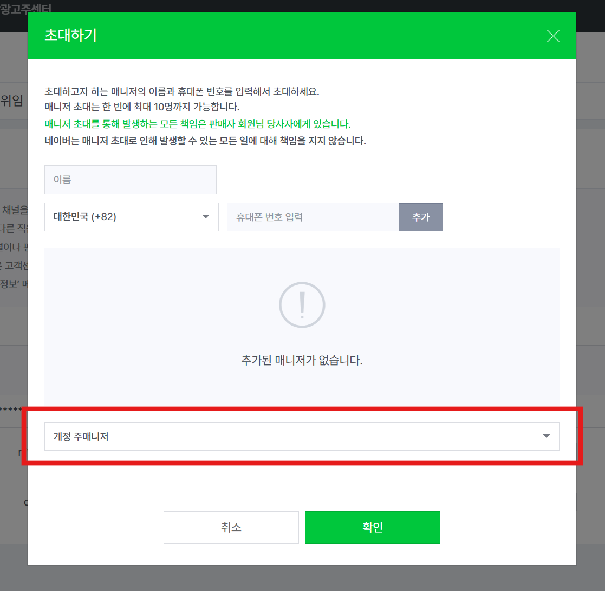

통신사에 따라 문자(SMS) 수신이 지연될 수 있어요. 일정 시간 동안 문자가 오지 않으면, 초대 중으로 표시된 매니저를 삭제하고 다시 진행해주세요. 1588-3819 국번이나 '스토어' 문구가 차단되어 있는 경우 문자가 수신되지 않을 수 있으니 확인해주세요.

#### 4. 초대 문자를 확인하세요

확인을 누르면 "초대하였습니다"라는 안내와 함께 네이버에서 문자가 와요.

문자에 포함된파란색 링크를 눌러주세요.

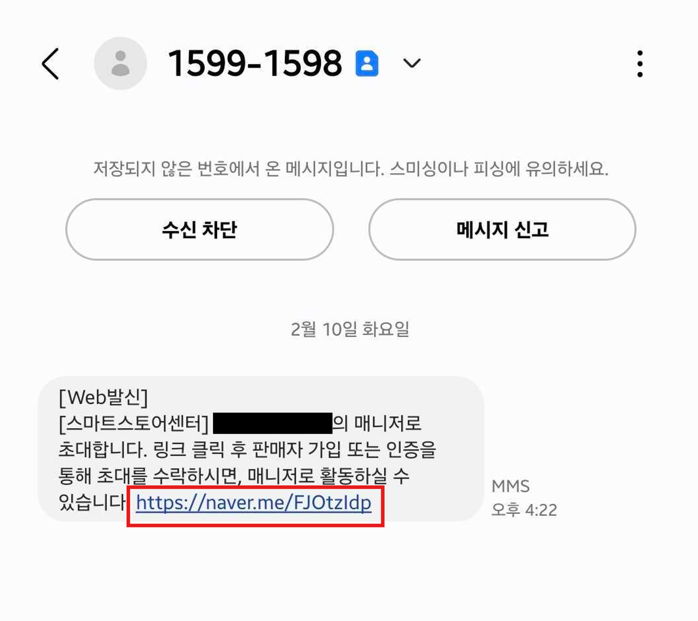

#### 5. 네이버 커머스 ID로 회원가입하세요

링크를 클릭하면 팝업이 나타날 수 있어요.확인을 눌러주세요.

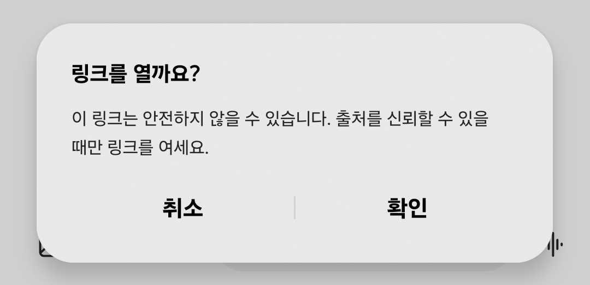

로그인 화면이 나타나면, 제일 아래네이버 커머스 ID로 로그인을 클릭하세요.

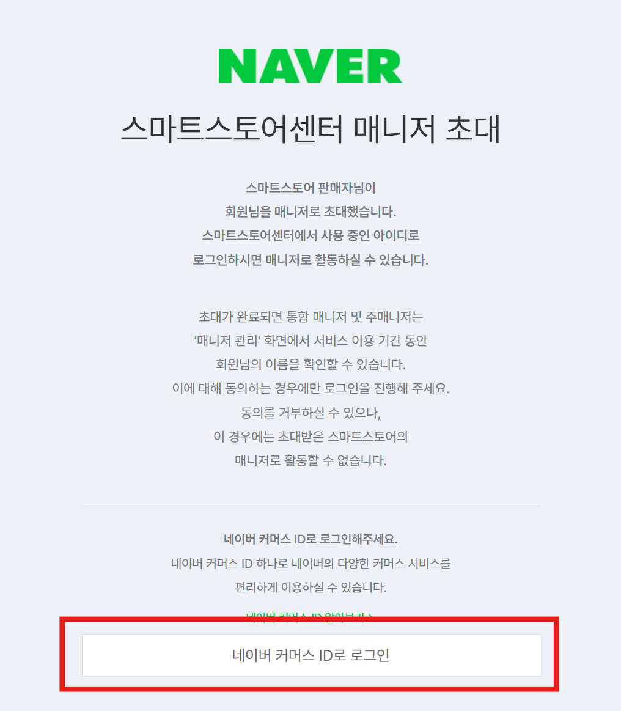

제일 아래회원가입하기를 클릭하세요.

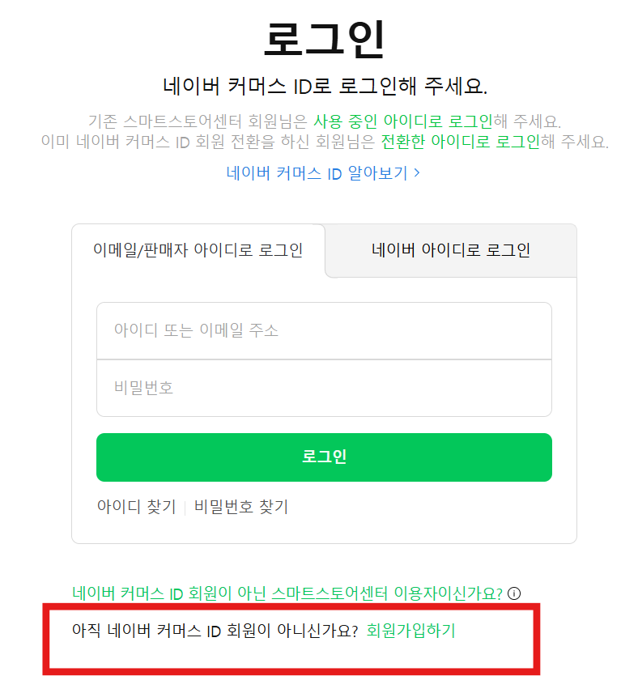

이메일 아이디로 가입하기를 클릭하세요.(매우 중요!)

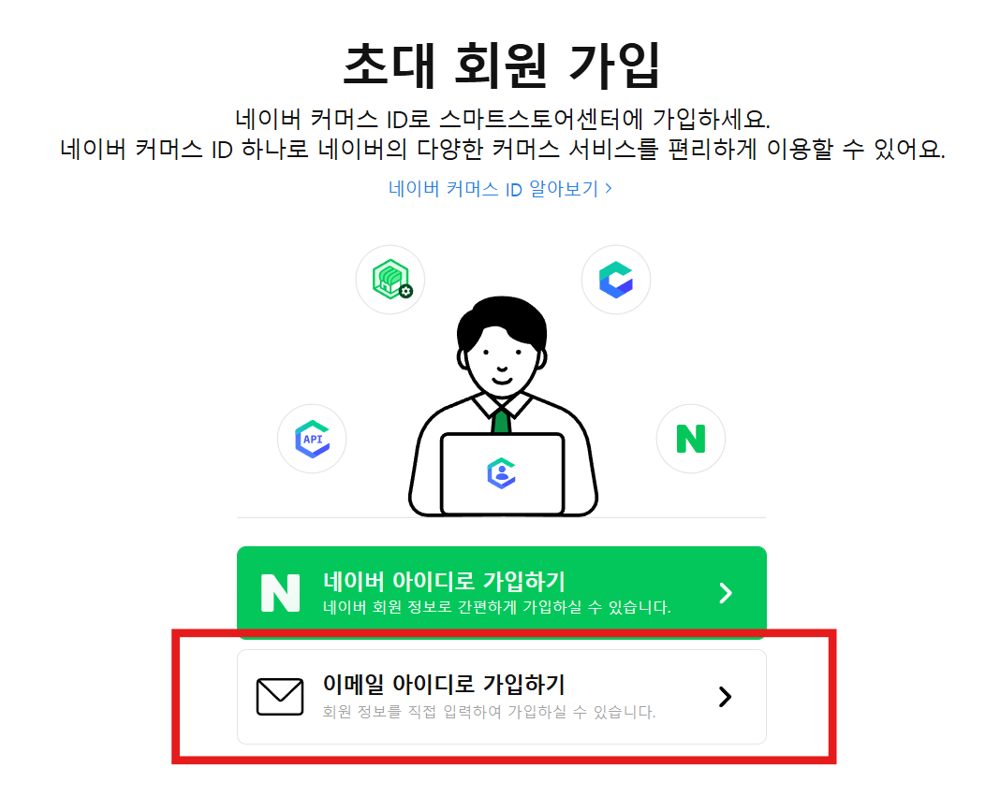

회원가입 양식을 작성하세요:
- 가입할 이메일: 판매자 아이디와 다른 이메일을 입력하고인증버튼을 클릭하세요

가입할 이메일: 판매자 아이디와 다른 이메일을 입력하고인증버튼을 클릭하세요
- 비밀번호: 비밀번호를 입력하세요

비밀번호: 비밀번호를 입력하세요
- 비밀번호 재입력: 동일한 비밀번호를 다시 입력하세요

비밀번호 재입력: 동일한 비밀번호를 다시 입력하세요
- 성함: 이름을 입력하세요

성함: 이름을 입력하세요
- 본인 이메일: 입력 후 인증 버튼을 클릭하세요 ("로그인 아이디와 동일한 이메일 사용" 체크 필수)

본인 이메일: 입력 후 인증 버튼을 클릭하세요 ("로그인 아이디와 동일한 이메일 사용" 체크 필수)
- 핸드폰번호: 입력 후 인증 버튼을 클릭하세요

핸드폰번호: 입력 후 인증 버튼을 클릭하세요
- 약관 동의: 체크하세요

약관 동의: 체크하세요
- 가입버튼을 클릭하세요

가입버튼을 클릭하세요

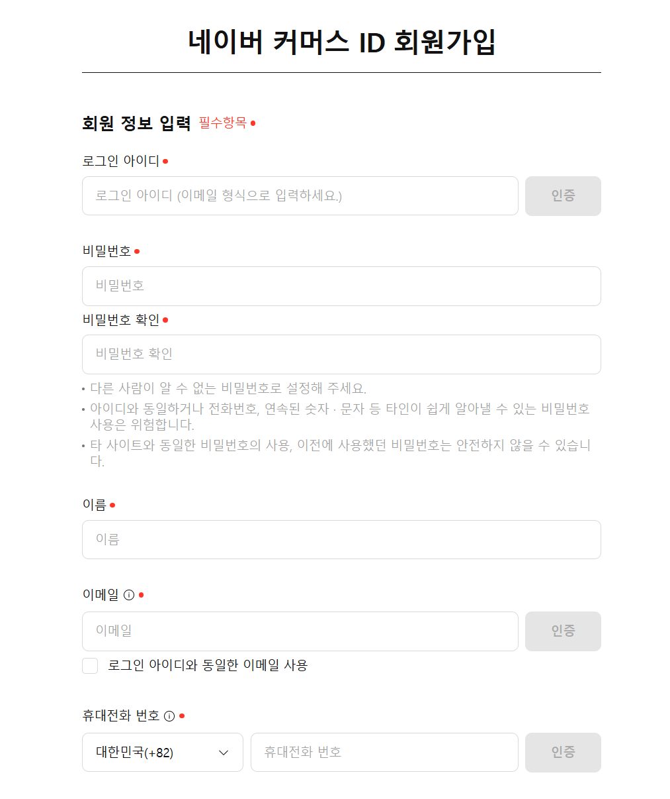

#### 6. 초대를 수락하세요

회원가입이 완료되면, 아까 받았던 문자로 돌아가서다시 링크를 클릭하세요.

네이버 커머스 ID로 로그인을 클릭하세요.

방금 가입한이메일 아이디와비밀번호를 입력하여 로그인하세요.

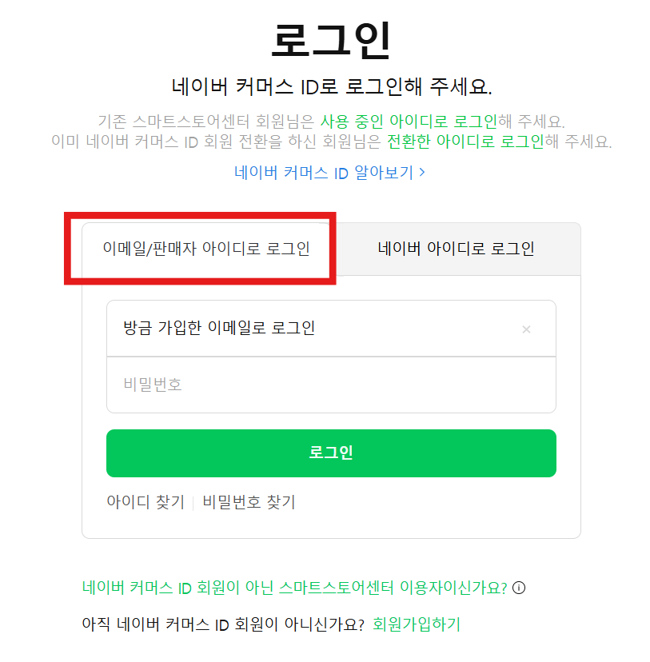

로그인하시면 2단계 인증 방법 설정화면이 표시됩니다.

원하시는 수단으로 2단계 인증을 진행해 주세요.

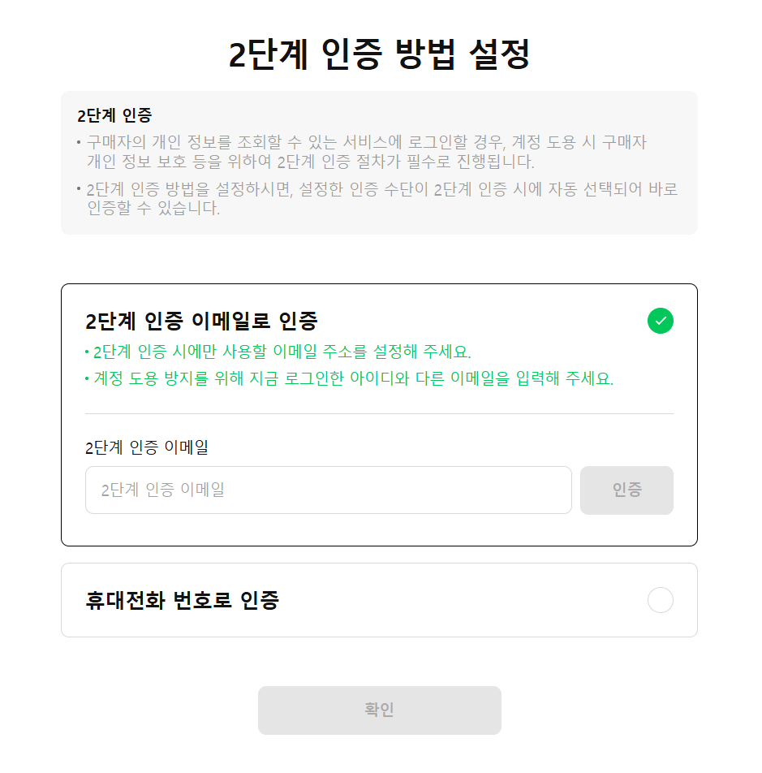

스마트스토어 센터에 로그인이 되신마녀 매니저 초대가 완료된 것입니다.

### 자주 묻는 질문

Q. 네이버 아이디로는 연동할 수 없나요?

A. 네, 리펀디 AI 주문처리 2차로그인 + 자동화 기능은 스마트스토어 이메일 계정만 지원해요. 네이버 아이디로 로그인하고 계시다면 가이드를 따라 이메일 계정을 만들어주세요.

Q. 매니저 초대 문자가 오지 않아요.

A. 통신사에 따라 지연될 수 있어요. 1588-3819 국번이나 '스토어' 문구가 차단되어 있지 않은지 확인해주세요. 그래도 안 오면 초대를 삭제 후 다시 시도해주세요.

Q. 매니저 권한은 어떤 걸로 설정해야 하나요?

A.계정 주매니저로 설정해주세요. 주문 수집과 처리에 필요한 권한이 포함되어 있어요.

Q. 이미 이메일 계정이 있는데 연동이 안 돼요.

A. 이메일 계정의 비밀번호를 다시 확인해주세요. 그래도 문제가 있으면 채널톡으로 문의해주세요.