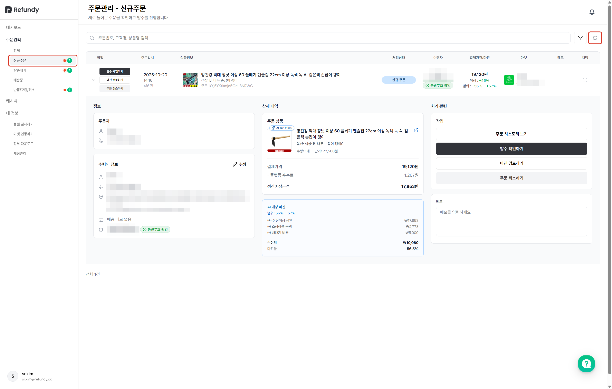
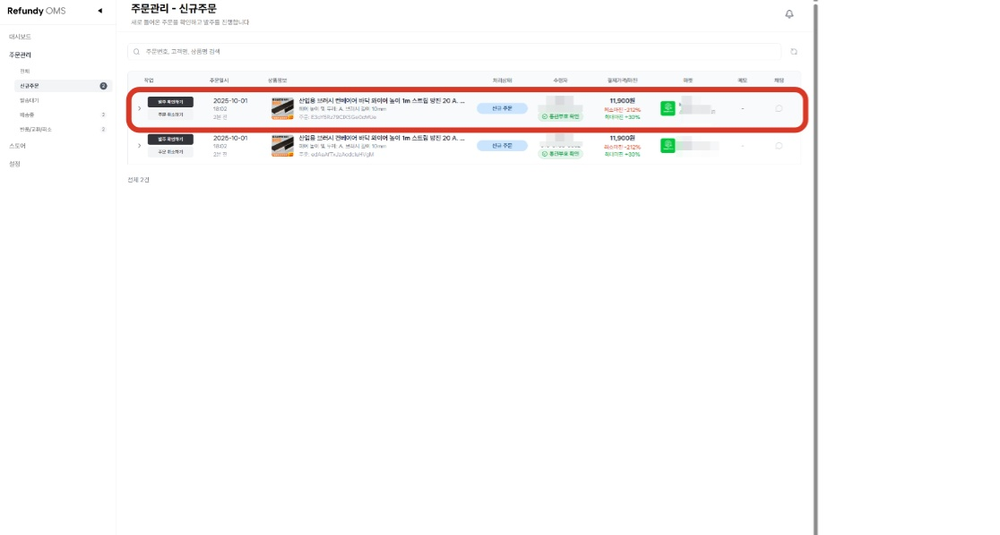
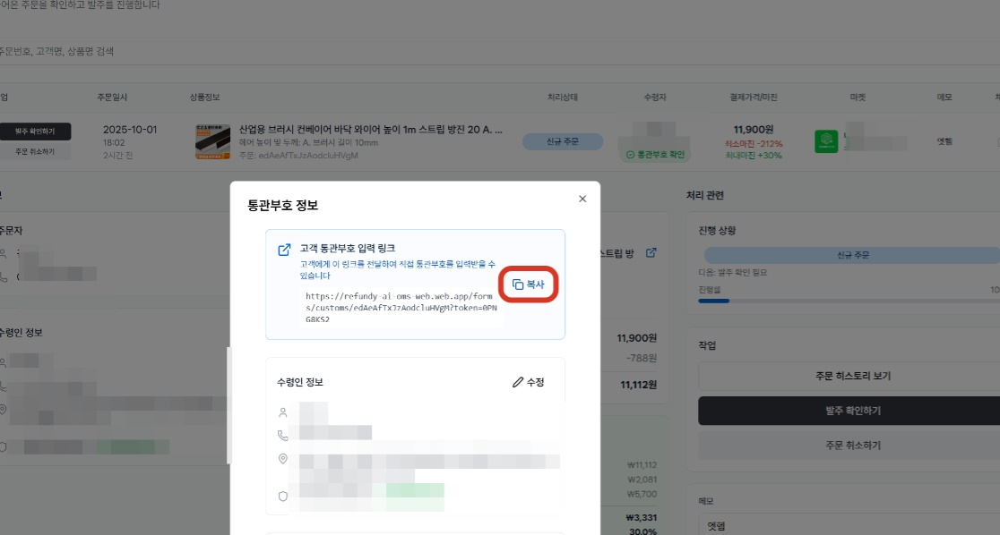
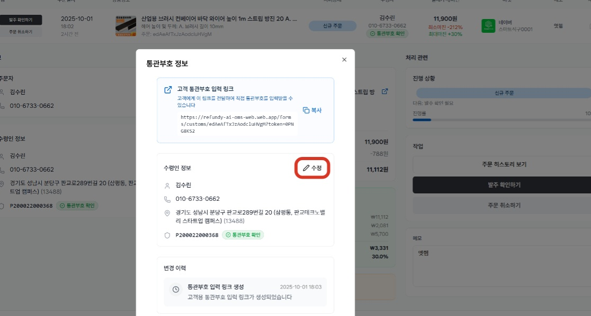

# 1. 신규 주문

- **원본 URL**: https://docs.channel.io/oms_refundy/ko/articles/1-%EC%8B%A0%EA%B7%9C-%EC%A3%BC%EB%AC%B8-209e0280

---

카드 등록 후, 플랜결제를 완료 하셨나요? 이제 신규 주문이 들어오면 리펀디 AI 주문처리에 자동으로 수집될 거에요. 리펀디 AI 주문처리에서 수집된 신규 주문을 확인하고, 주문처리를 본격적으로 시작해보세요.

#### 1. [신규 주문탭] 클릭
- 신규주문 페이지 접속 시,[주문불러오기]버튼이 자동으로 활성화 되면서, 주문을 수집하게 됩니다. 10분 이내에 신규 주문이 업로드 될 예정이에요.

신규주문 페이지 접속 시,[주문불러오기]버튼이 자동으로 활성화 되면서, 주문을 수집하게 됩니다. 10분 이내에 신규 주문이 업로드 될 예정이에요.

신규 주문 수집이 안 되는 경우, 아래 2가지를 확인해주세요.
- 플랜(이용료)이 결제 완료 되어야 신규 주문 수집이 가능합니다. 신규 주문 수집이 안 된다면, 이용료 결제 상태를 확인해주세요.

플랜(이용료)이 결제 완료 되어야 신규 주문 수집이 가능합니다. 신규 주문 수집이 안 된다면, 이용료 결제 상태를 확인해주세요.
- 수집하려는 주문 상태가 마켓에서도 '신규주문' 상태인지 확인해주세요.마켓에서 이미 발주확인 처리를 했거나, 배송중 상태로 변경한 주문은 수집이 불가합니다.

수집하려는 주문 상태가 마켓에서도 '신규주문' 상태인지 확인해주세요.
- 마켓에서 이미 발주확인 처리를 했거나, 배송중 상태로 변경한 주문은 수집이 불가합니다.

마켓에서 이미 발주확인 처리를 했거나, 배송중 상태로 변경한 주문은 수집이 불가합니다.

#### 2. 검토가 필요한 주문 내역이 있으신가요? 주문내역을 클릭하시면 자세한 내용을 확인할 수 있습니다.

#### 3. 수동으로 통관부호 수집이 필요하신 경우, "통관부호 입력 링크"를 복사하여 고객에게 전달해주세요.

해당 링크를 통해 수집된 응답 내역은 자동으로 업데이트 됩니다.

#### 4. 수령인 정보 수정이 필요한 경우 간단하게 수정이 가능합니다.

수정이 완료된 주문 정보는 오픈마켓 주문번호를 기준으로 연동되어 관리되며, 배송대행지에 입력하는 최종 도착지 주소를 넣어주시면 됩니다.

최종 도착지 정보만 수정이 되며, 오픈마켓의 본래 주문 정보는 수정되지 않습니다.

