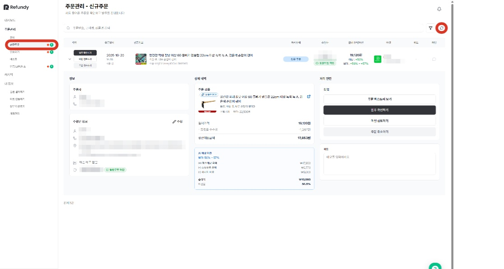
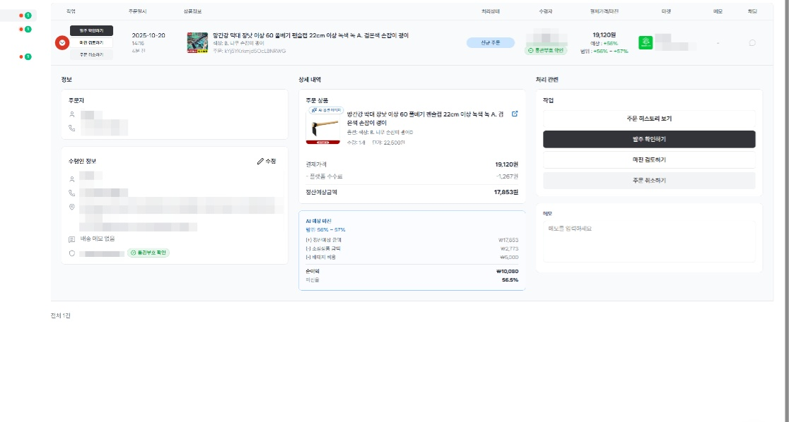
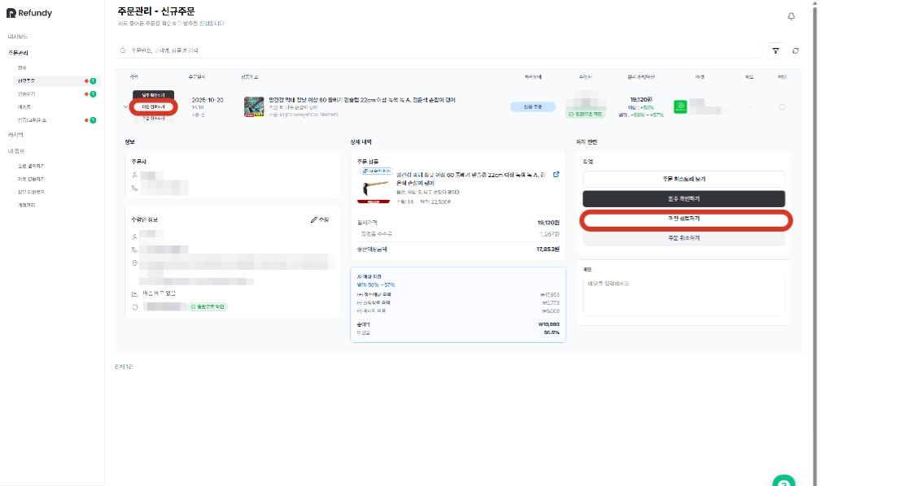
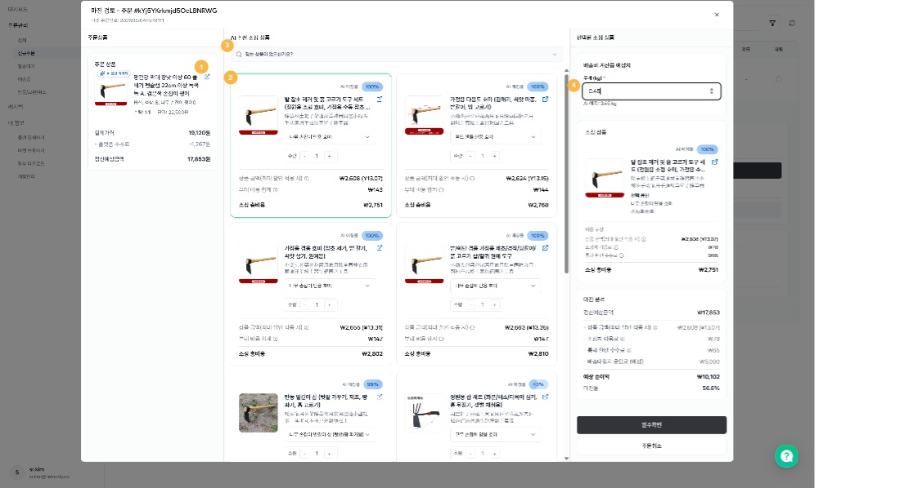
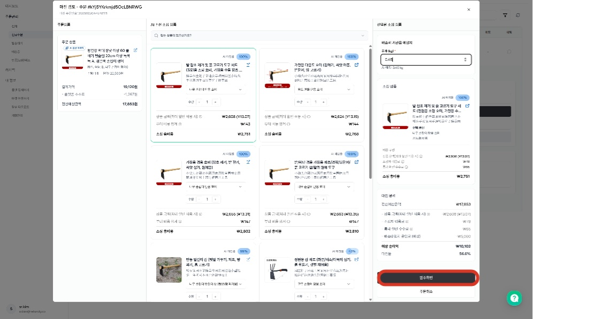
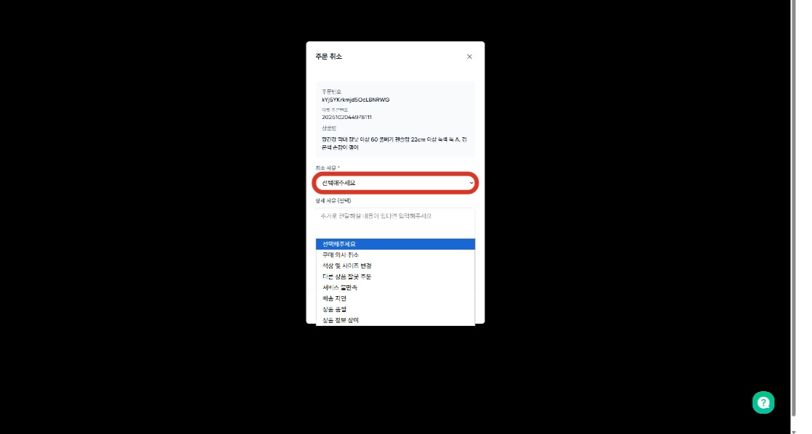
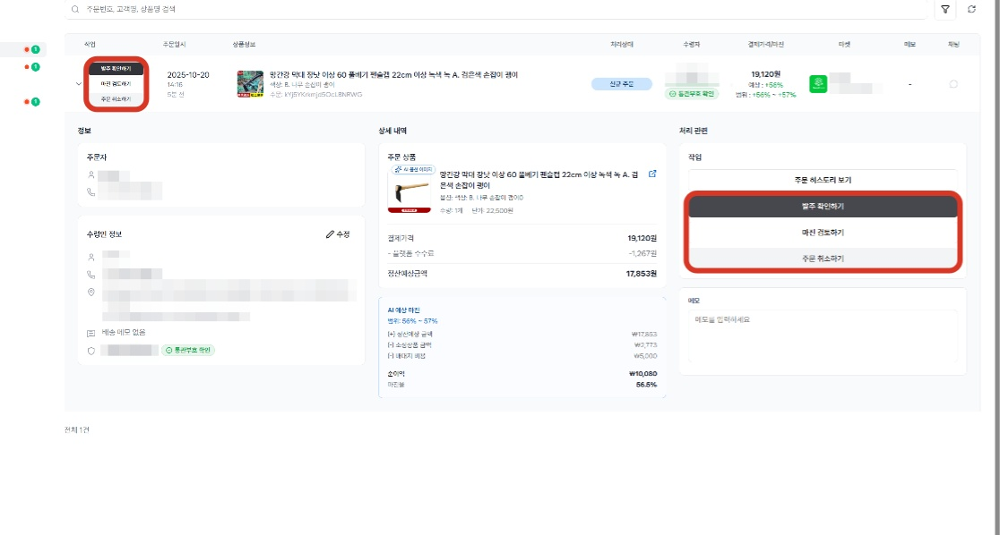

# 1.1 신규주문 수집하기

- **원본 URL**: https://docs.channel.io/oms_refundy/ko/articles/11-%EC%8B%A0%EA%B7%9C%EC%A3%BC%EB%AC%B8-%EC%88%98%EC%A7%91%ED%95%98%EA%B8%B0-0bb875ee

---

아래의 단계를 통해, 리펀디 AI 주문처리에서 수집된 신규 주문을 확인하고, 주문처리를 본격적으로 시작해보세요.

#### 1. 신규 주문탭 클릭하기

신규 주문 수집이 안 되는 경우, 오른쪽 상단의 [새로고침] 버튼을 클릭해주세요.
- 신규 주문 수집은 반드시 [새로고침] 버튼을 누르셔야 진행됩니다. 신규 주문이 있는 경우, 10분 이내로 반영될 예정입니다.

신규 주문 수집은 반드시 [새로고침] 버튼을 누르셔야 진행됩니다. 신규 주문이 있는 경우, 10분 이내로 반영될 예정입니다.

#### 2. 주문내역을 클릭하시면, 마진 검토를 위한 자세한 내용을 확인할 수 있습니다.

#### 3. 신규 주문 단계에서 현재 소싱 가능한 제품을 직접 대입하여, 더 상세히 검토하기 원하신다면, [마진 검토하기] 버튼을 클릭하세요.

#### 4. 현재 타오바오에서 판매하고 있는 리스트를 토대로 세부 마진 검토가 가능합니다.

마진 검토하기 메뉴

① 오픈마켓의 상품페이지로 이동이 가능합니다

② AI 추천리스트 중, 원하는 상품 리스트를 클릭하면 예상 마진이 자동으로 계산됩니다.

③ AI 추천리스트 중 원하는 상품이 없다면, 직접 링크를 입력하여 계산할 수 있습니다. 입력된 링크는 저장되어, 소싱 검토 단계에서도 다른 소싱 리스트들과 함께 확인이 가능합니다.

④ 예상 배대지 비용이 많이 나왔다면,무게비용을 직접 조정하여, 마진 검토를 더 세부적으로 할 수 있습니다.

#### 5. (발주확인) 주문 전 검토해야 하는 내용이 모두 확인되었다면, 발주 확인하기 버튼을 눌러 발송대기 상태에서 주문을 관리하세요.

#### 6. (주문취소) 세부 정보 검토 결과 주문 취소가 필요하다면, [주문취소하기] 버튼을 클릭하세요.

#### 7.  주문 취소 사유도 선택이 가능하며, 마켓에 연동되어 취소 작업이 진행됩니다.

#### 8. 마진 검토하기 페이지가 아닌, 주문 리스트에서도 바로 [발주확인] 과 [주문취소] 를 진행할 수 있습니다.

#### 