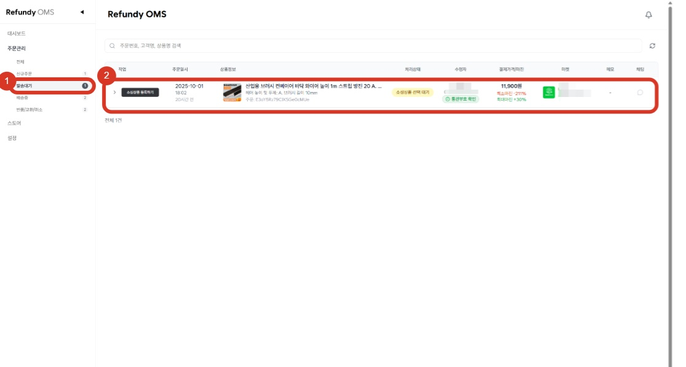
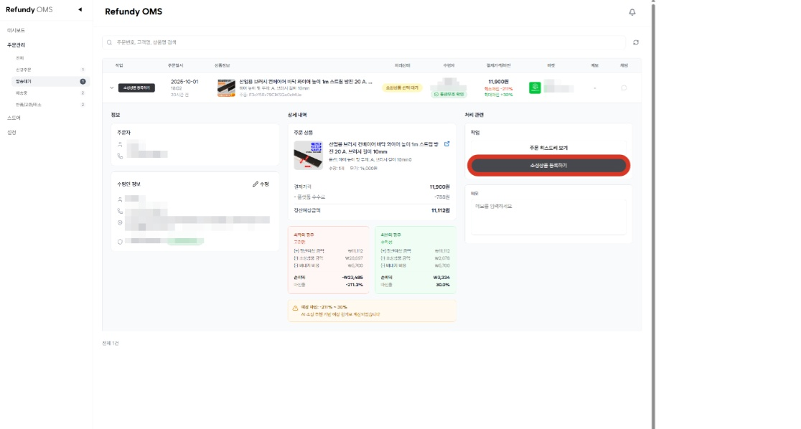
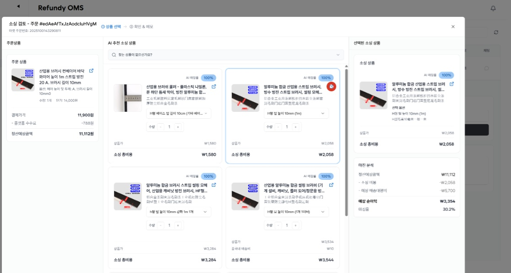
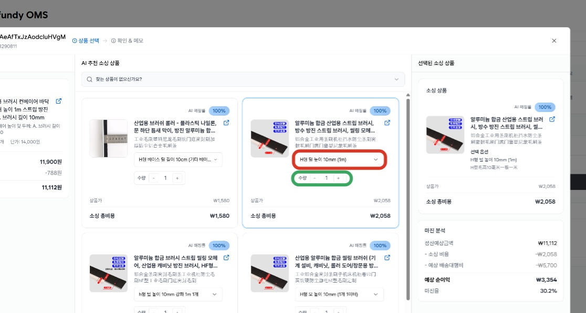
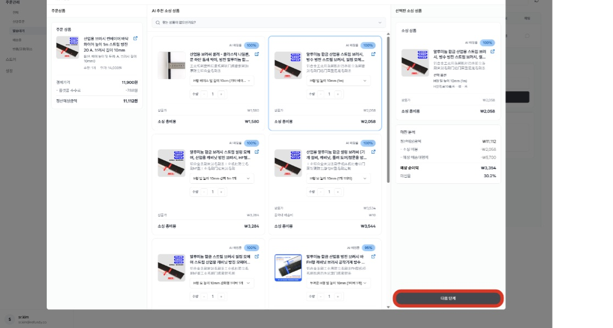
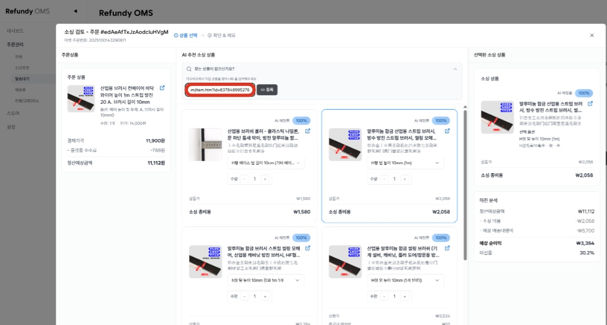
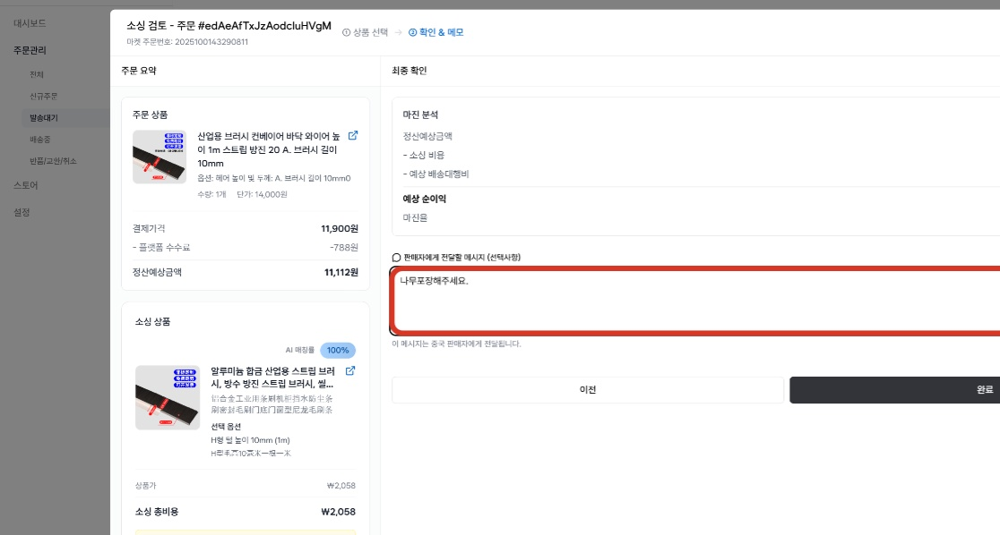
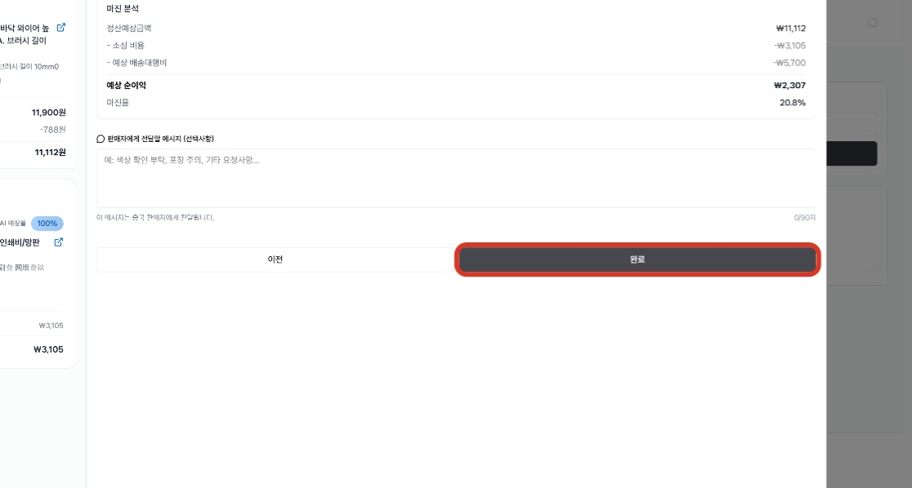
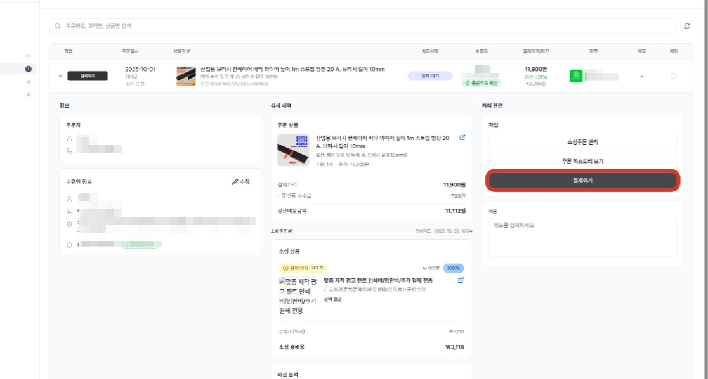
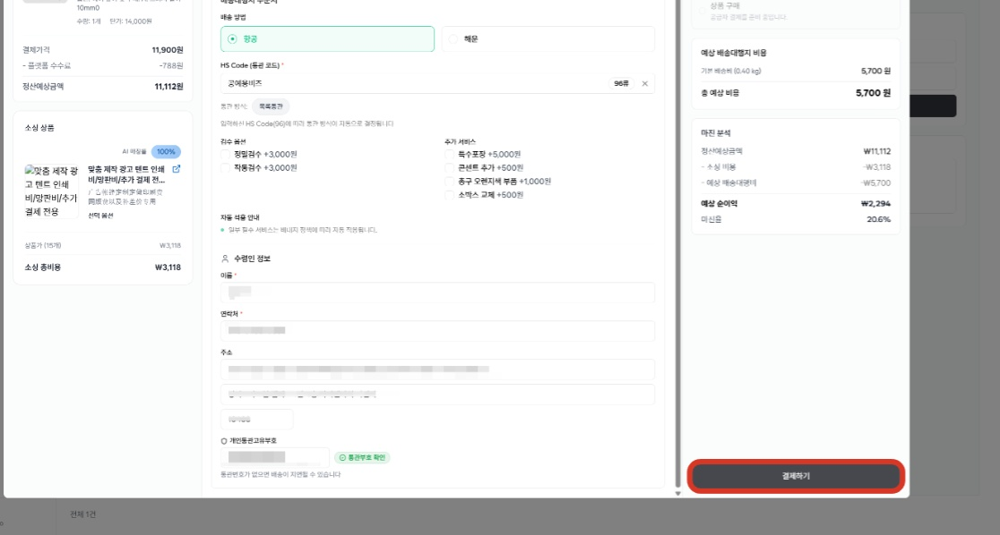

# 2. 발송대기

- **원본 URL**: https://docs.channel.io/oms_refundy/ko/articles/2-%EB%B0%9C%EC%86%A1%EB%8C%80%EA%B8%B0-7d052f47

---

발송대기 상태에서 소싱할 상품을 찾으면,

클릭 한번으로 상품 결제(발주)와 배송대행지 주문서 등록까지 한번에 하실 수 있으며,

통관부호 수집이 필요한 주문내역은 자동으로 알림톡(카카오톡)이 발송되어,

유효한 통관부호가 자동으로 수집됩니다.

#### 1. 발송대기 주문으로 들어가서 소싱 작업을 시작할 주문내역을 찾습니다.

#### 2. 본격적으로 소싱상품을 등록하기 원하신다면, [소싱등록하기] 버튼을 클릭해주세요.

#### 4. 제품 상세페이지에서 더 자세히 옵션을 확인하기 원하신다면 상세페이지 링크 버튼을 클릭하시면 바로 타오바오 상페세이지로 이동합니다.

#### 5. AI가 설정한 옵션과 수량이 마음에 들지 않는다면, 자유롭게 변경할 수 있습니다.

#### 6. 원하시는 상품을 찾으셨다면, 다음 단계를 클릭하여 주문서를 작성합니다.

#### 7. 찾으시는 상품이 없다면, 타오바오에서 직접 상품을 찾아 상세페이지에 링크를 입력하면 리스트업이 됩니다.

주문제작 상품이나, 중국 판매자와 별도로 협의한 링크로 결제를 원하시는 경우에도 링크를 입력해주시면 해당 주문서로 발주가 진행됩니다.

#### 8. 발주하기 전, 최종적으로 금액을 확인해주세요. 또한 판매자에게 전달하고 싶은 메세지가 있다면 작성해주세요.

#### 9. 주문서 작성 및 검토가 끝났다면, 완료 버튼을 눌러주세요.

#### 10. 결제하기 버튼을 누르시면, 배대지 주문서 작성과 선택한 상품을 결제할 수 있는 창이 생성됩니다.

#### 11. 배대지 주문서 작성 및 주문하기 전 확인해야 하는 사항에 대한 검토가 완료되었다면 결제하기 버튼을 클릭하여 소싱상품을 결제해주세요.

배대지 주문서는 소싱 상품 결제와 동시에 제출되며, 배대지 비용 결제 전까지 배대지 주문서 수정이 가능합니다.

배대지 주문서는 반드시 유효한 통관부호 정보만 제출이 가능합니다. 수령인(고객)의 통관부호 없이 배대지 주문서 제출을 원하시거나, 배대지 출고 전 통관부호 수정을 원하신다면, 셀러님의 통관부호나, 대리인의 유효한 통관부호를 입력 후 제출해주시고, 출고 보류(배대지 비용 결제 x)를 해주시면 됩니다.

#### 12. 소싱상품 결제가 된 주문내역은 배송중으로 자동으로 이동합니다.

