# 2.1 상품 발주하기

- **원본 URL**: https://docs.channel.io/oms_refundy/ko/articles/21-%EC%83%81%ED%92%88-%EB%B0%9C%EC%A3%BC%ED%95%98%EA%B8%B0-635c6864

---

발송대기 상태에서 소싱할 상품을 찾으면,

클릭 한번으로 상품 결제(발주)와 배송대행지 주문서 등록까지 한번에 하실 수 있어요.

#### 1. 발송대기 주문으로 들어가서 소싱 작업을 시작할 주문내역을 찾습니다.

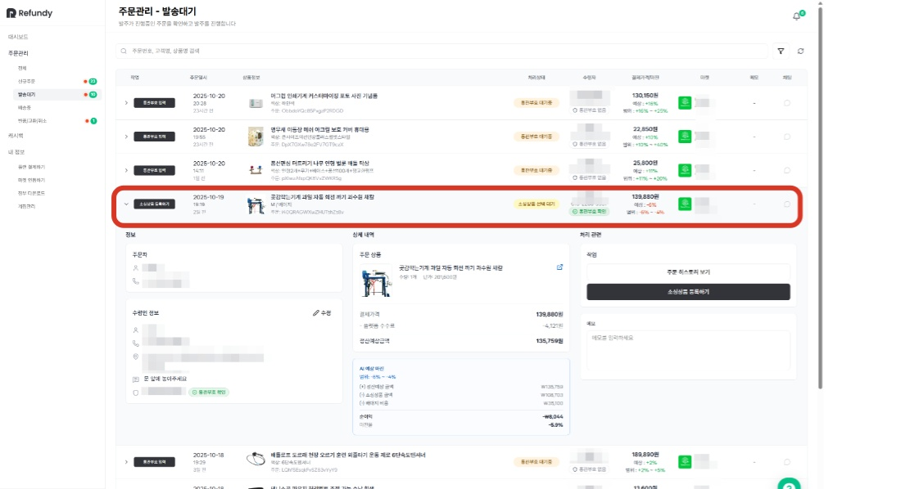

#### 2. [소싱등록하기] 버튼을 클릭해주세요.

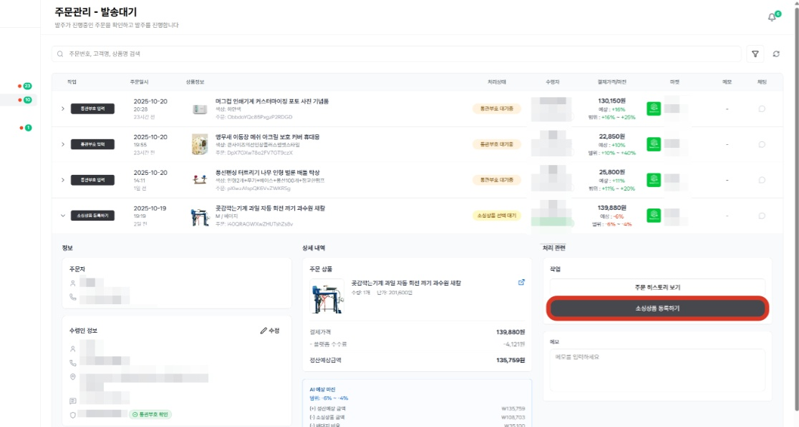

#### 3. 리펀디 AI 주문처리봇이 추천하는 소싱 후보 리스트에서 가장 적합한 상품을 고르세요.

상품리스트
- 추천 상품리스트는 수 만개의 상품 학습데이터를 거친 AI 주문처리 봇이 제안하는 소싱에 가장 적합한 상품 후보 상품 리스트입니다.

추천 상품리스트는 수 만개의 상품 학습데이터를 거친 AI 주문처리 봇이 제안하는 소싱에 가장 적합한 상품 후보 상품 리스트입니다.

소싱검토
- 소싱할 최종 상품 선택은 셀러님께서 하시며, 리펀디 AI 봇은 셀러님의 결정을 도울 수 있도록 상품 링크와 가격, 옵션을 투명하게 제공합니다.

소싱할 최종 상품 선택은 셀러님께서 하시며, 리펀디 AI 봇은 셀러님의 결정을 도울 수 있도록 상품 링크와 가격, 옵션을 투명하게 제공합니다.

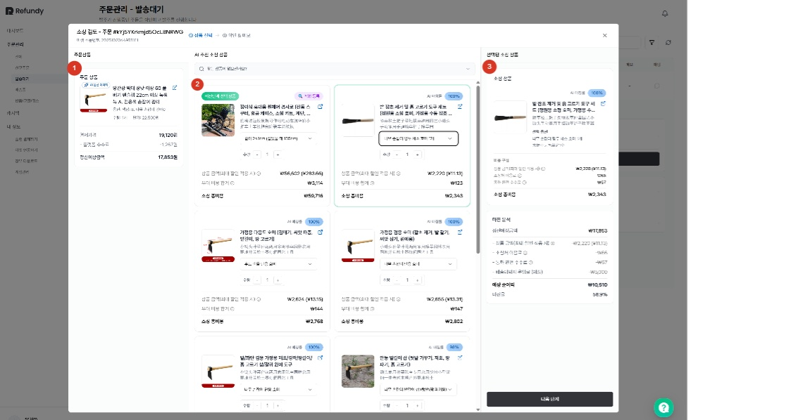

소싱 리스트 검토 메뉴 구성

① 주문 받은 상품의 상세 정보 : 상세 페이지 링크와 옵션 썸네일

② AI 추천 소싱 리스트

③ 마진 검토 화면

#### 5. AI가 설정한 옵션과 수량이 마음에 들지 않는다면, 자유롭게 변경할 수 있습니다.

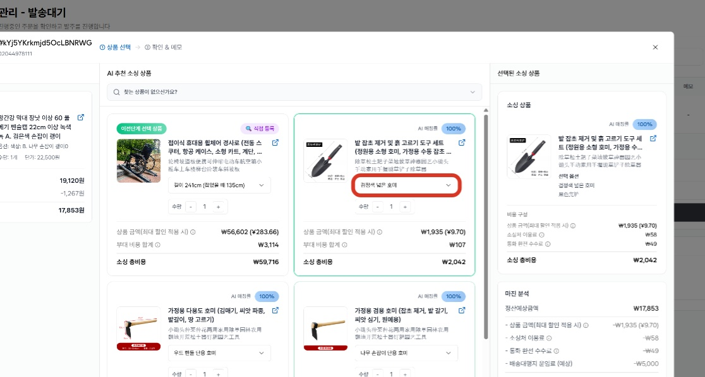

#### 6. 찾으시는 상품이 없다면, 타오바오에서 직접 상품을 찾아 상세페이지에 링크를 입력하면 리스트업이 됩니다.

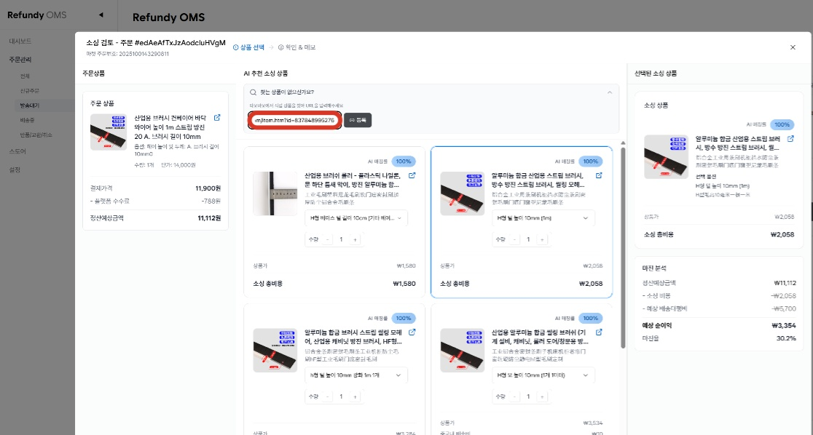

소싱 가격 관련
- 상품 금액순수 상품 구매 비용입니다. 적용가능한 할인쿠폰이 감지 되는 경우, 쿠폰적용가로 노출됩니다. 쿠폰 적용 여부는 소싱 주문서 제출 후 확인 가능합니다.

상품 금액
- 순수 상품 구매 비용입니다. 적용가능한 할인쿠폰이 감지 되는 경우, 쿠폰적용가로 노출됩니다. 쿠폰 적용 여부는 소싱 주문서 제출 후 확인 가능합니다.

순수 상품 구매 비용입니다. 적용가능한 할인쿠폰이 감지 되는 경우, 쿠폰적용가로 노출됩니다. 쿠폰 적용 여부는 소싱 주문서 제출 후 확인 가능합니다.
- 소싱처 이용료소싱처에서 부과하는 서비스 이용료로 타오바오 주문서의 지불수수료에 해당되는 비용입니다.

소싱처 이용료
- 소싱처에서 부과하는 서비스 이용료로 타오바오 주문서의 지불수수료에 해당되는 비용입니다.

소싱처에서 부과하는 서비스 이용료로 타오바오 주문서의 지불수수료에 해당되는 비용입니다.
- 통화 환전 수수료카드사·환전 등 해외 결제 과정에서 발생하는 비용으로, 중국 현지 가격으로 주문이 진행되므로 이로 인해 지불하셔야 하는 비용입니다.

통화 환전 수수료
- 카드사·환전 등 해외 결제 과정에서 발생하는 비용으로, 중국 현지 가격으로 주문이 진행되므로 이로 인해 지불하셔야 하는 비용입니다.

카드사·환전 등 해외 결제 과정에서 발생하는 비용으로, 중국 현지 가격으로 주문이 진행되므로 이로 인해 지불하셔야 하는 비용입니다.

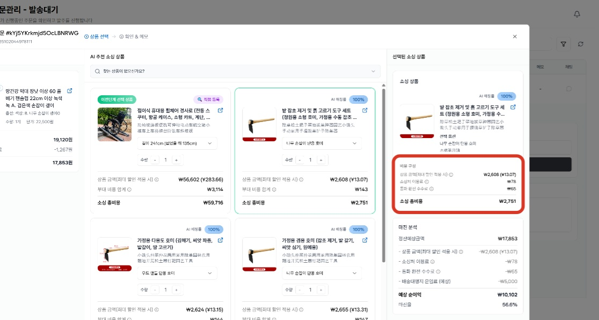

#### 7. 원하시는 상품을 찾으셨다면, 다음 단계를 클릭하여 주문서를 작성합니다.

예상마진
- 소싱검토 단계에서는 예상 소싱가격과 예상 배대지 비용으로 추정한 예상 마진을 검토할 수 있습니다.소싱가격 : 주문서 제출 후 확정배대지 비용 : 배대지에서 무게 측정 후 확정

소싱검토 단계에서는 예상 소싱가격과 예상 배대지 비용으로 추정한 예상 마진을 검토할 수 있습니다.
- 소싱가격 : 주문서 제출 후 확정

소싱가격 : 주문서 제출 후 확정
- 배대지 비용 : 배대지에서 무게 측정 후 확정

배대지 비용 : 배대지에서 무게 측정 후 확정

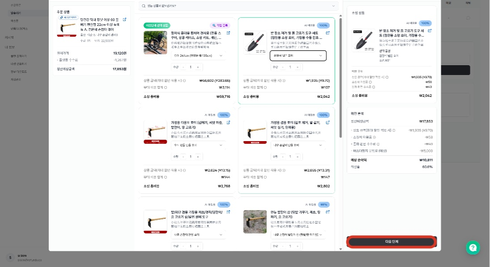

#### 8. 모든 검토가 마무리 되었다면, [완료] 버튼을 클릭하여 주문서를 제출해주세요.

중국 판매자에게 전달할 메모가 있다면, 메모란에 작성해주세요 (ex. 나무포장해주세요)

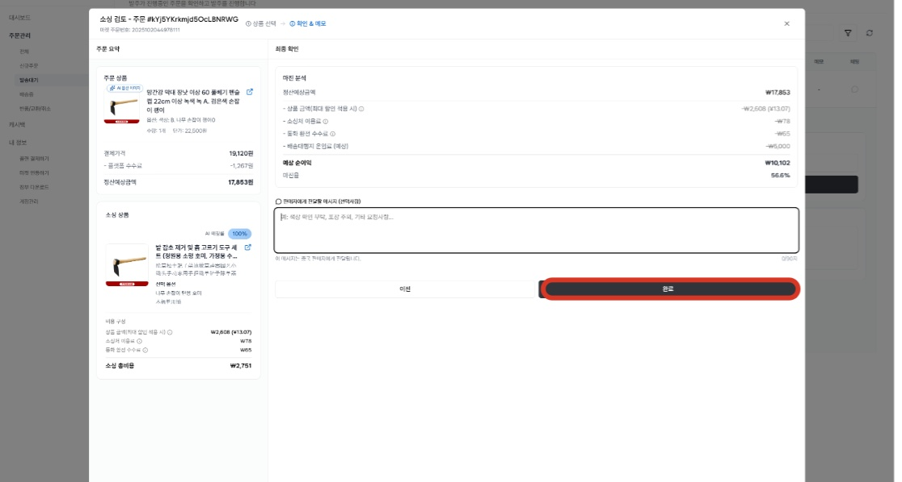

#### 9. 결제하기 버튼을 누르시면, 배대지 주문서 작성과 선택한 상품을 결제할 수 있는 창이 생성됩니다.

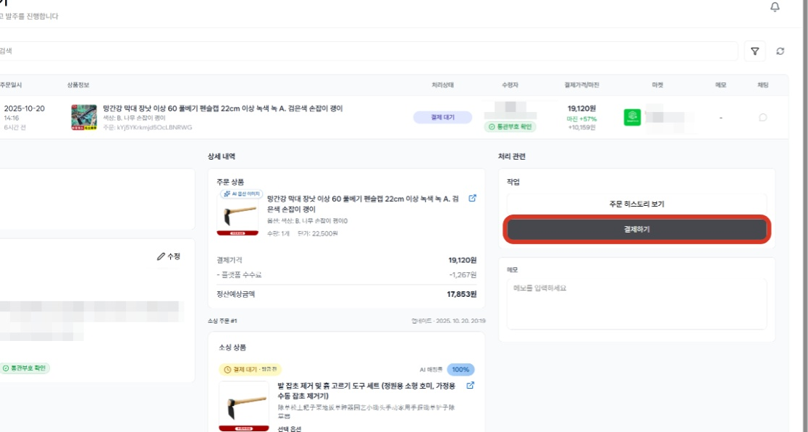

#### 10. (상품결제 / 배대지 주문서 작성) 이전 단계에서 선택한 소싱 상품의 확정 결제 금액을 확인할 수 있습니다.

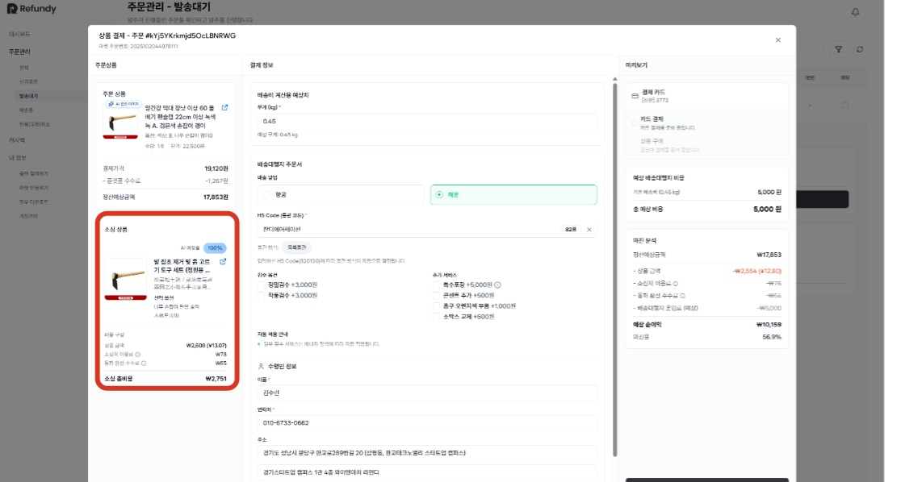

#### 11. 소싱제품 결제 전, 배대지 주문서를 작성해주시면 소싱제품 결제와 동시에 배대지 주문서까지 제출이 완료 됩니다.

배대지 주문서는 소싱 상품 결제와 동시에 제출되며, 출고준비 전까지 배대지 주문서 수정이 가능합니다.

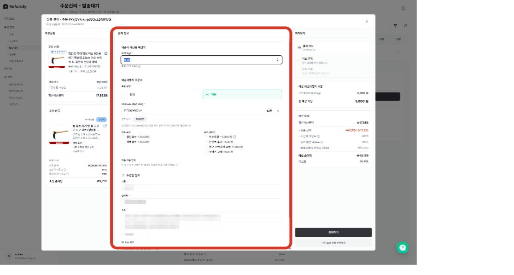

💡예상 배대지 비용이 과도하게 많이 계상되거나, 적게 계상되는 경우
- 무게를 직접 입력하여 계산이 가능합니다.

무게를 직접 입력하여 계산이 가능합니다.

💡고객의 통관부호가 없는 주문서를 발주하고 싶은 경우
- 셀러님의 통관부호나, 대리인의 유효한 통관부호를 입력 후 제출해주시고, 출고 보류(배대지 비용 결제 x)를 해주시면 됩니다.

셀러님의 통관부호나, 대리인의 유효한 통관부호를 입력 후 제출해주시고, 출고 보류(배대지 비용 결제 x)를 해주시면 됩니다.
- 단, 배대지 출고 시에는 정확한 통관부호 전달이 필요하며, 통관부호 정보 없이는 출고 지시가 불가합니다.

단, 배대지 출고 시에는 정확한 통관부호 전달이 필요하며, 통관부호 정보 없이는 출고 지시가 불가합니다.

#### 14. 배대지 주문서 검토와 소싱 상품 검토가 모두 완료 되었다면, [결제하기] 버튼을 클릭해주세요.

배대지 주문서는 소싱 상품 결제와 동시에 제출되며, 배대지 비용 결제 전까지 배대지 주문서 수정이 가능합니다.

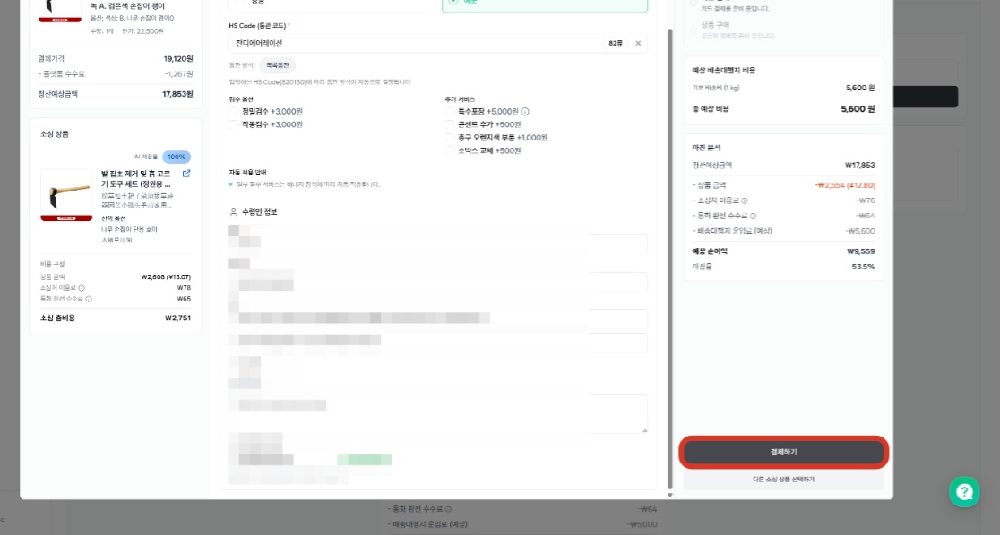

#### 15. 소싱상품 결제가 된 주문내역은 배송중으로 자동으로 이동합니다.

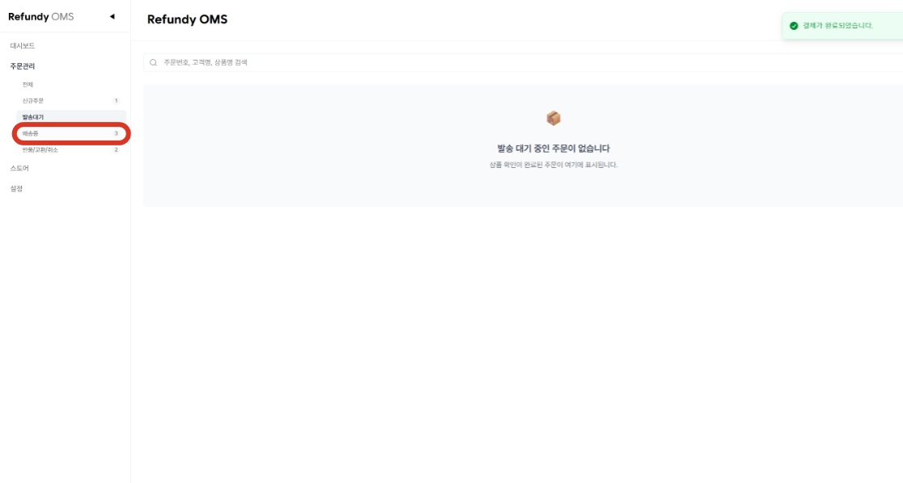

#### 16. 배송중 상태로 이동하면, 소싱한 주문내역을 확인할 수 있습니다.

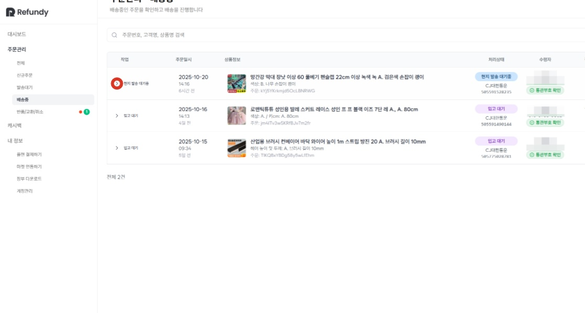

#### 17. 결제가 완료된 소싱 주문에 대해, 환불 및 배송상태 확인 등의 작업이 필요하다면 [소싱주문관리]에서 관리가 가능합니다.

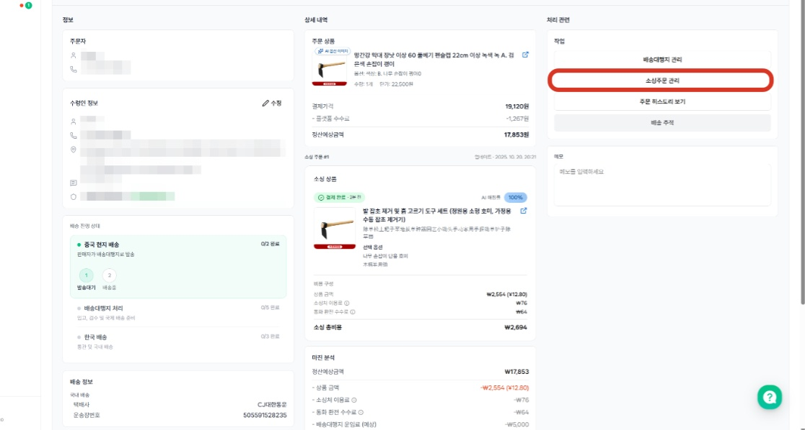