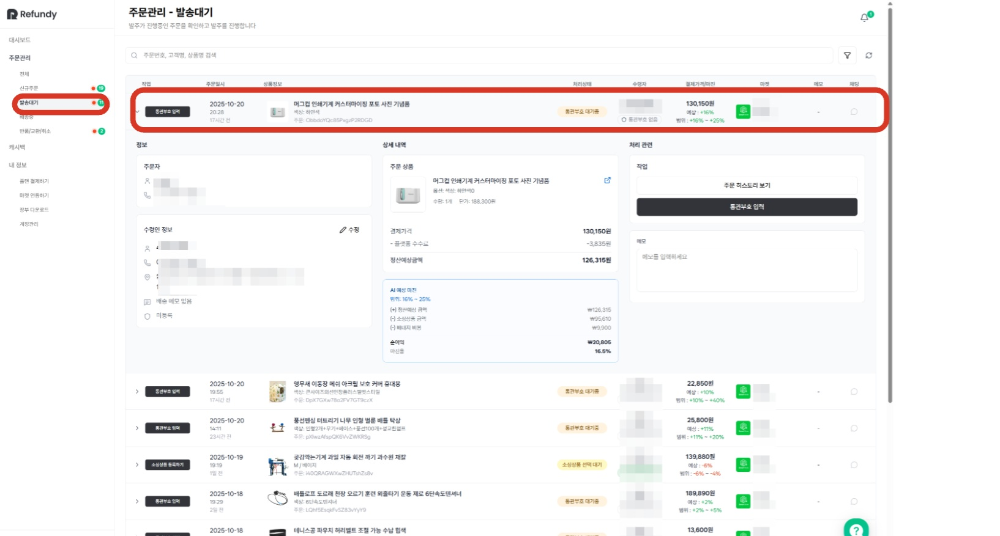
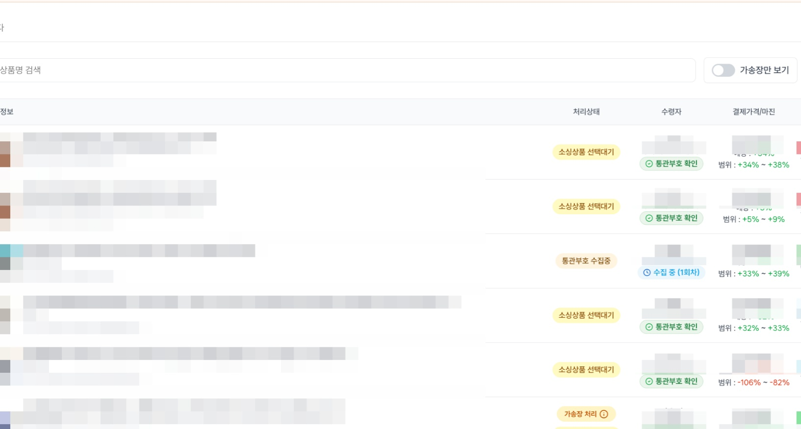
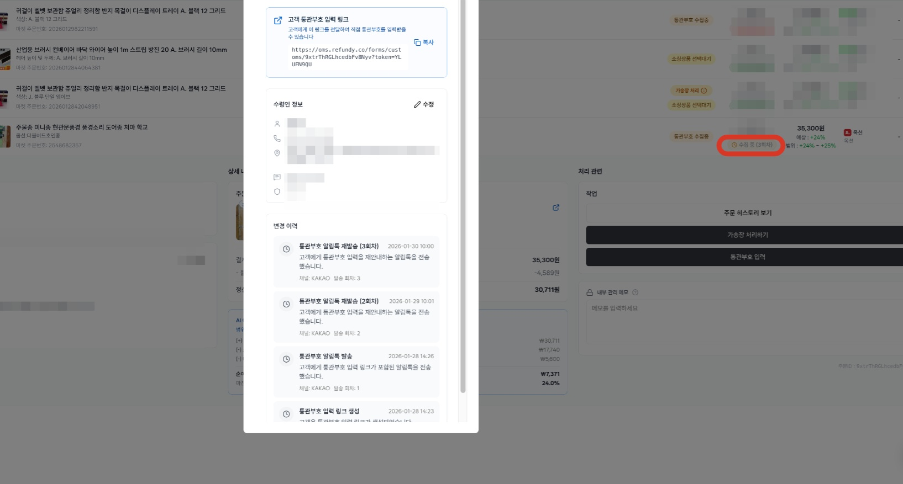
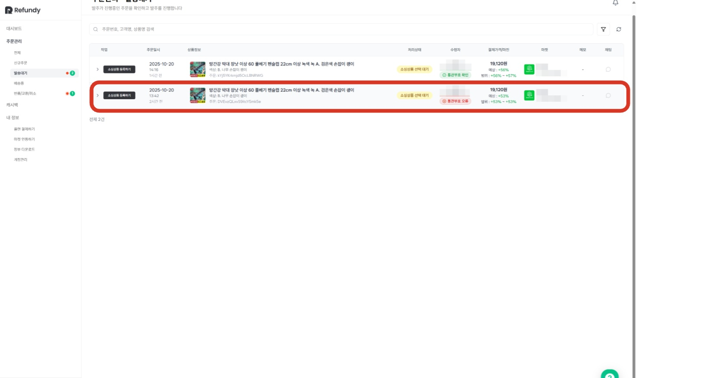
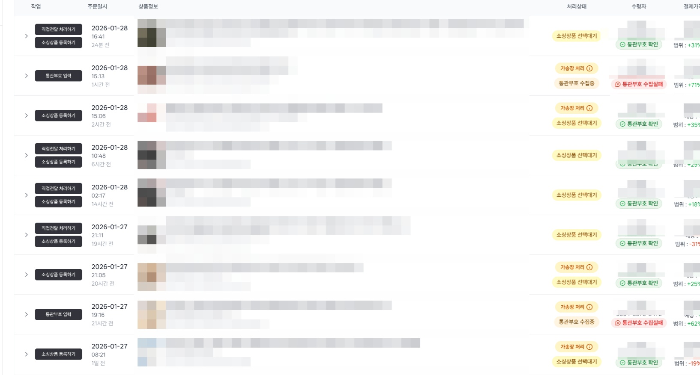
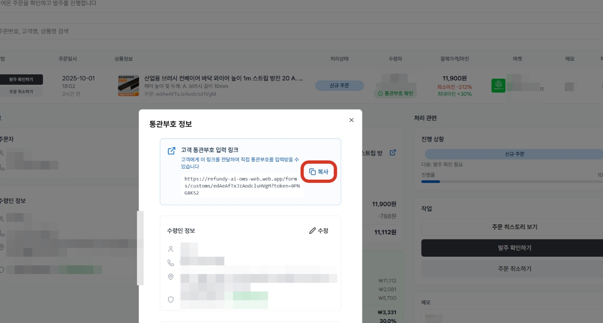
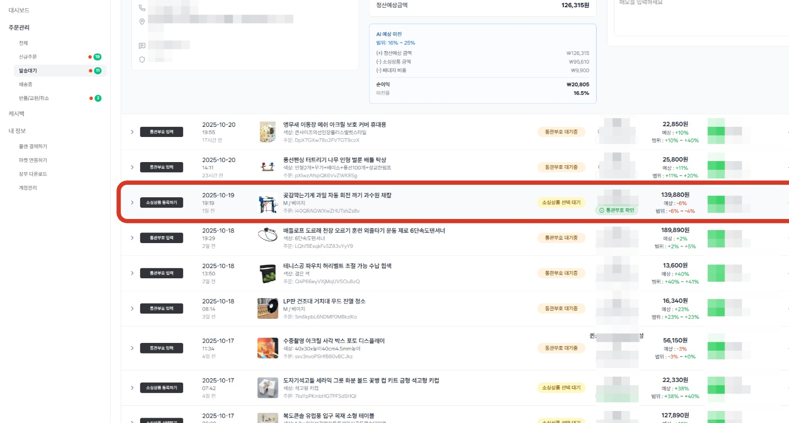
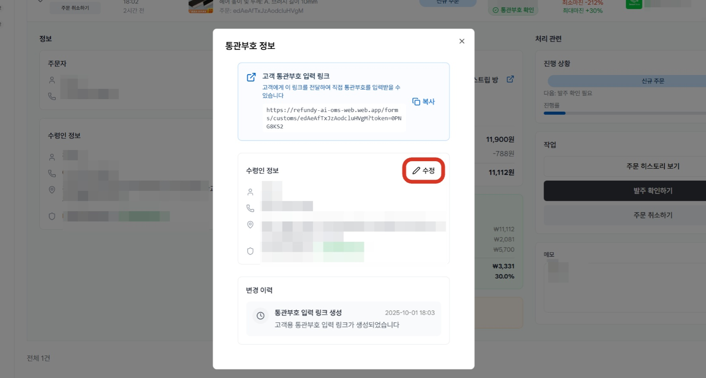
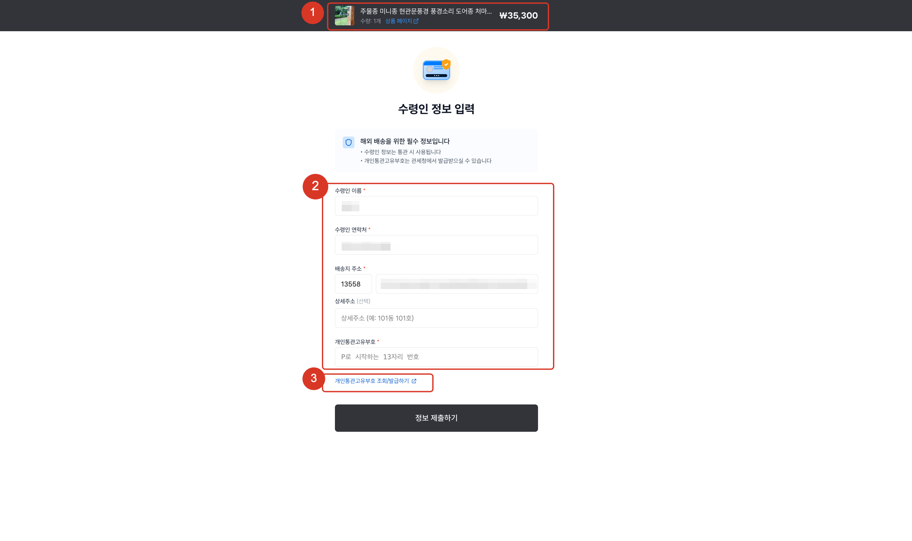

# 2.2 통관부호 수집하기(26년 통관부호 검증 강화 정책 반영 ver)

- **원본 URL**: https://docs.channel.io/oms_refundy/ko/articles/22-%ED%86%B5%EA%B4%80%EB%B6%80%ED%98%B8-%EC%88%98%EC%A7%91%ED%95%98%EA%B8%B026%EB%85%84-%ED%86%B5%EA%B4%80%EB%B6%80%ED%98%B8-%EA%B2%80%EC%A6%9D-%EA%B0%95%ED%99%94-%EC%A0%95%EC%B1%85-%EB%B0%98%EC%98%81-ver-7ecf1b9e

---

리펀디 AI 주문처리에서 수집된 주문내역은 발송대기 상태로 전환되는 순간,

통관부호가 필요한 주문의 경우, 자동으로 고객에게 통관부호 확인 요청 메세지가 발송됩니다.

관세청의 개인통관고유부호 검증체계 고도화 (2026.02.02 전면시행) 에 맞춰, 리펀디의 통관부호 수집 로직도 업데이트 되었습니다.

업데이트 내용

통관부호 정보 요청 항목에 우편번호(주소) 추가
- 이름, 연락처, 통관부호, 우편번호 4자 유효성 검증

이름, 연락처, 통관부호, 우편번호 4자 유효성 검증
- 정책 과도기로 우편번호(주소)의 경우 알림톡 입력 창에서 선택항목으로 두고, 유효성 검증에 필요한 고객에게만 받을 수 있도록 업데이트함.

정책 과도기로 우편번호(주소)의 경우 알림톡 입력 창에서 선택항목으로 두고, 유효성 검증에 필요한 고객에게만 받을 수 있도록 업데이트함.

*25년 11월 31일 이후 개인 통관부호를 신규 발급 받거나 정보 변경한 사용자부터 단계적으로 적용되고, 이 전 발급 사용자의 경우, 기존 정보로 통관 가능

(이전 발급 사용자의 경우, 27년도 본인 생일자 이후에는 새로 업데이트한 통관부호로 통관가능)

#### 1. 리펀디에서는 발송대기 상태에서 통관부호 수집이 필요한 주문은 수령인 고객에게 통관부호 제출 요청 메세지가 자동 발송되고 있습니다.

자동 수집 조건
- 통관부호 자동 수집 기능은 [발송대기] 상태에서 활성화됩니다. 신규 주문 수집 후, 발주 확인 버튼을 누르셔야 자동으로 수집되고 있으며, 발주 확인 버튼을 누름과 동시에 고객은 통관부호 알림톡을 받게 됩니다.

통관부호 자동 수집 기능은 [발송대기] 상태에서 활성화됩니다. 신규 주문 수집 후, 발주 확인 버튼을 누르셔야 자동으로 수집되고 있으며, 발주 확인 버튼을 누름과 동시에 고객은 통관부호 알림톡을 받게 됩니다.

발송 프로세스
- 통관부호 수집이 필요한 경우에만 자동으로 자동으로 발송되고 있습니다. 고객의 응답 내역은 자동으로 수집되며, 미수집 시, 자동으로 리마인드 메세지가 발송되고 있습니다. 최초 발송 포함 3회까지 자동으로 통관부호 확인요청 메세지가 발송됩니다. (일 1회 발송)

통관부호 수집이 필요한 경우에만 자동으로 자동으로 발송되고 있습니다. 고객의 응답 내역은 자동으로 수집되며, 미수집 시, 자동으로 리마인드 메세지가 발송되고 있습니다. 최초 발송 포함 3회까지 자동으로 통관부호 확인요청 메세지가 발송됩니다. (일 1회 발송)

이미 유효한 통관부호가 수집된 주문의 경우, 통관부호 확인요청 알림톡이 발송되지 않고 있습니다.

#### 2. 통관부호 수집 중인 주문내역 예시

통관부호 대기중
- 유효하지 않은 통관부호로 수집되거나, 통관부호정보 없이 수집된 주문으로 주문고객에게 통관부호 확인이 필요한 주문입니다.

유효하지 않은 통관부호로 수집되거나, 통관부호정보 없이 수집된 주문으로 주문고객에게 통관부호 확인이 필요한 주문입니다.

통관부호 알림톡 수집 상태
- 통관부호 수집실패 :

통관부호 수집실패 :

알림톡 발송 시도 3회가 초과되었거나, 주문고객 연락처 문제로 알림톡을 시도했으나 정상적으로 발송되지 않을 때, '통관부호 수집실패'로 표시되고 있습니다.

*알림톡 수신할 수 없는 번호로 수집되는 경우, 통관부호 요청 링크를 문자로 발송하실 수 있습니다.
- 통관부호 확인 :

통관부호 확인 :

유효한 통관부호가 수집된 주문의 경우, '통관부호 확인'으로 표시되며, 이 때부터 소싱상품 등록하기(소싱결제) 버튼이 표시됩니다.

*자동 알림톡 발송 ~ 응답 대기 중 주문내역은 [통관부호 대기중] 상태로 보이며, 수집이 완료 되면 다음 단계인 [소싱상품 선택대기]로 변경됩니다.

#### 3. 통관부호 요청 알림톡 히스토리 확인하는 방법

통관부호 요청 상태 벳지를 클릭하면, '변경이력'에서 알림톡 발송 히스토리와 수집 진행상황을 확인할 수 있습니다.

#### 4. 통관부호 확인 필요한 주문내역 예시

'통관부호 확인'으로 상태가 확인되는 내역은 정상적으로 통관부호가 수집된 주문이며, '통관부호 오류 상태'와 '수집중(n회차)' 주문에 대해 알림톡을 통해 통관부호 확인요청 알림톡이 자동으로 발송되고 있습니다.

#### 5. 통관부호 수집 실패 예시

통관부호 수집 실패 상태는 아래 2개의 상황 때에 표시되고 있으며, 통관부호 수집실패 상태가 발생하면 왼쪽에 [통관부호 입력] 이라는 작업 버튼이 표시되고 있습니다.
- 수령인 연락처로 알림톡 발송 시도 했으나, 수신인 연락처 문제로 발송이 실패하는 경우

수령인 연락처로 알림톡 발송 시도 했으나, 수신인 연락처 문제로 발송이 실패하는 경우

연락처를 변경하여 다시 알림톡 발송 시도할 수 있으며, 연락처를 변경하는 경우, 다음 날 발송시도하고 있습니다. (단, 알림톡 발송 시도 3회가 초과되는 경우, 연락처를 변경하더라도 알림톡은 발송되지 않습니다.)
- 수취인 연락처로 알림톡 3회 발송했고, 알림톡도 정상적으로 받았으나 주문고객이 답변을 제출하지 않음.

수취인 연락처로 알림톡 3회 발송했고, 알림톡도 정상적으로 받았으나 주문고객이 답변을 제출하지 않음.

이 경우, 더 이상 리펀디에서는 알림톡이 발송되지 않으며, 통관부호 입력 링크를 주문고객님께 전달해야 수집이 가능합니다.

#### 6. 수동으로 통관부호 수집이 필요하신 경우, "통관부호 입력 링크"를 복사하여 주문 고객에게 문자로 전달해주세요.

해당 링크를 통해 수집된 응답 내역은 자동으로 업데이트되고 있으며, 직접 시스템에 통관부호를 입력하여 통관부호 수집이 완료 되는 경우, 알림메세지 발송은 중단됩니다.

#### 7. 통관부호 수집이 완료 된 주문내역 예시(ex. 소싱 상품 선택 전)

통관부호 수집 순서
- 리펀디 AI 주문처리에서는 통관부호 수집을 먼저 진행하신 다음, 실제 주문하실 소싱 상품을 검토하시는 것을 추천드립니다. 수집이 필요한 주문내역에 대해 리펀디 AI가 통관부호를 수집하는 동안, 통관부호가 수집된 주문내역의 소싱상품을 검토하시거나, 다른 주문내역들의 작업을 이어가시는 것을 추천드립니다.

리펀디 AI 주문처리에서는 통관부호 수집을 먼저 진행하신 다음, 실제 주문하실 소싱 상품을 검토하시는 것을 추천드립니다. 수집이 필요한 주문내역에 대해 리펀디 AI가 통관부호를 수집하는 동안, 통관부호가 수집된 주문내역의 소싱상품을 검토하시거나, 다른 주문내역들의 작업을 이어가시는 것을 추천드립니다.
- 또한, 직접 고객과 소통하여 수집을 원하신다면, 3일에 걸쳐 통관부호 알림이 발송되는 기간 동안, 요청 링크를 고객에게 직접 발송하여 푸쉬를 할 수도 있습니다.

또한, 직접 고객과 소통하여 수집을 원하신다면, 3일에 걸쳐 통관부호 알림이 발송되는 기간 동안, 요청 링크를 고객에게 직접 발송하여 푸쉬를 할 수도 있습니다.

#### 8. 수령인 정보 수정이 필요한 경우 간단하게 수정이 가능합니다.

수정이 완료된 주문 정보는 오픈마켓 주문번호를 기준으로 연동되어 관리되며, 배송대행지에 입력하는 최종 도착지 주소를 넣어주시면 됩니다.

최종 도착지 정보만 수정이 되며, 오픈마켓의 본래 주문 정보는 수정되지 않습니다.

#### 9. 통관부호 제출 요청 화면 예시

통관부호 요청 메세지(링크 확인) 화면은 아래와 같습니다.
- 고객 주문 상품 페이지

고객 주문 상품 페이지
- 통관부호 정보 입력

통관부호 정보 입력
- 유니패스 링크가 연결되어 있으며, 발급 필요 시, 고객은 바로 접속하여 발급 받을 수 있습니다.

유니패스 링크가 연결되어 있으며, 발급 필요 시, 고객은 바로 접속하여 발급 받을 수 있습니다.

유효한 통관 부호 정보만 수집되며, 유효하지 않는 정보는 제출이 불가하도록 설계 되어 있습니다. 또한 유효하지 않는 정보가 입력되는 경우, 어떤 정보 문제로 유효하지 않는지 검증 실패 사유를 보여드리고 있습니다.

26년 통관부호 검증강화 반영
- 주소(우편전호) 선택적 검증 :

주소(우편전호) 선택적 검증 :

25년 11월 21일 이후 통관부호를 신규 발급하거나 정보를 변경한 고객은 주소(우편번호) 검증이 필요수입니다. 대상자에게는 우편번호까지 일치해야 유효한 정보로 보고 제출하도록 업데이트 되었습니다.

주소 검증 강화 대상자가 아니라면 제출 당시, 기존과 같이 이름, 연락처, 통관부호만 유효한 정보로 입력되면 제출이 가능합니다.

