# 2.3 선발송 처리(가송장 등록)

- **원본 URL**: https://docs.channel.io/oms_refundy/ko/articles/23-%EC%84%A0%EB%B0%9C%EC%86%A1-%EC%B2%98%EB%A6%AC%EA%B0%80%EC%86%A1%EC%9E%A5-%EB%93%B1%EB%A1%9D-9280f371

---

주문관리를 위해 선발송(가송장 등록) 처리가 필요하신가요?

발송대기 상태에서 선발송처리가 가능합니다. 아래의 단계를 따라서 선발송 처리를 해두면, 페널티 점수와 반품 리스크 관리에 필요한 가송장 등록이 가능합니다.

### 💡유의사항💡

가송장은 '임시 송장 등록' 기능입니다.
- 실제 제품이 배송 되기 위해서는 [소싱상품등록하기] 버튼을 통해 상품을 결제해주셔야 배대지에 소싱 정보가 등록되고, 등록한 송장으로 주문고객에게 배송이 됩니다.

실제 제품이 배송 되기 위해서는 [소싱상품등록하기] 버튼을 통해 상품을 결제해주셔야 배대지에 소싱 정보가 등록되고, 등록한 송장으로 주문고객에게 배송이 됩니다.

가송장은 CJ 택배 송장번호를 선발급 받아 등록합니다.
- 국내 택배사 인계시점에 CJ 택배로 배송 되는 경우, 송장 번호 변경 없이 그대로 배송되며, 화물택배(경동 등)로 이관되는 경우, 송장 번호가 변경됩니다.

국내 택배사 인계시점에 CJ 택배로 배송 되는 경우, 송장 번호 변경 없이 그대로 배송되며, 화물택배(경동 등)로 이관되는 경우, 송장 번호가 변경됩니다.
- 리펀디 AI 주문처리에서 발주한 뒤, 등록된 한국 운송장이 변경되는 경우, 자동으로 운송장이 업데이트(변경) 됩니다.단, 스마트스토어, 11번가의 경우, 송장 자동 변경이 불가하여, 직접 마켓에서 처리해주셔야 하는 점 양해 부탁 드립니다. (작업필요 표시 알림)

리펀디 AI 주문처리에서 발주한 뒤, 등록된 한국 운송장이 변경되는 경우, 자동으로 운송장이 업데이트(변경) 됩니다.
- 단, 스마트스토어, 11번가의 경우, 송장 자동 변경이 불가하여, 직접 마켓에서 처리해주셔야 하는 점 양해 부탁 드립니다. (작업필요 표시 알림)

단, 스마트스토어, 11번가의 경우, 송장 자동 변경이 불가하여, 직접 마켓에서 처리해주셔야 하는 점 양해 부탁 드립니다. (작업필요 표시 알림)

단, 11번가의 경우 가송장처리 버튼을 누르시면, cj 송장 등록이 아닌 직접 전달로 처리가 됩니다.
- 마켓 점수 관리를 위해, 소싱 주문 결제 후, 국내 배송이 시작되면 발급된 국내 송장번호를 마켓에 등록해주세요.

마켓 점수 관리를 위해, 소싱 주문 결제 후, 국내 배송이 시작되면 발급된 국내 송장번호를 마켓에 등록해주세요.

#### 1. 발송대기 주문 중 가송장 등록이 필요한 주문을 찾습니다.

신규 주문 상태에서는가송장 등록이 불가합니다.

신규 주문의 경우,주문확인 후 '발송대기' 상태에서 작업을 진행해주세요.

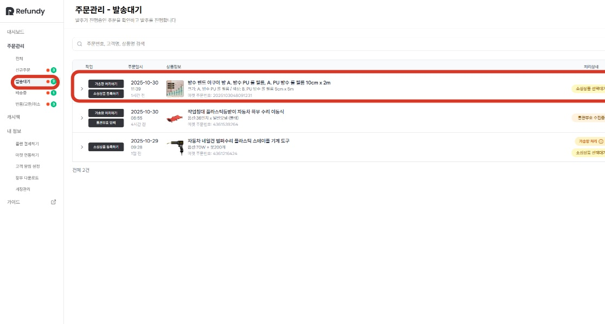

#### 2. [가송장 처리하기] 버튼을 클릭합니다.

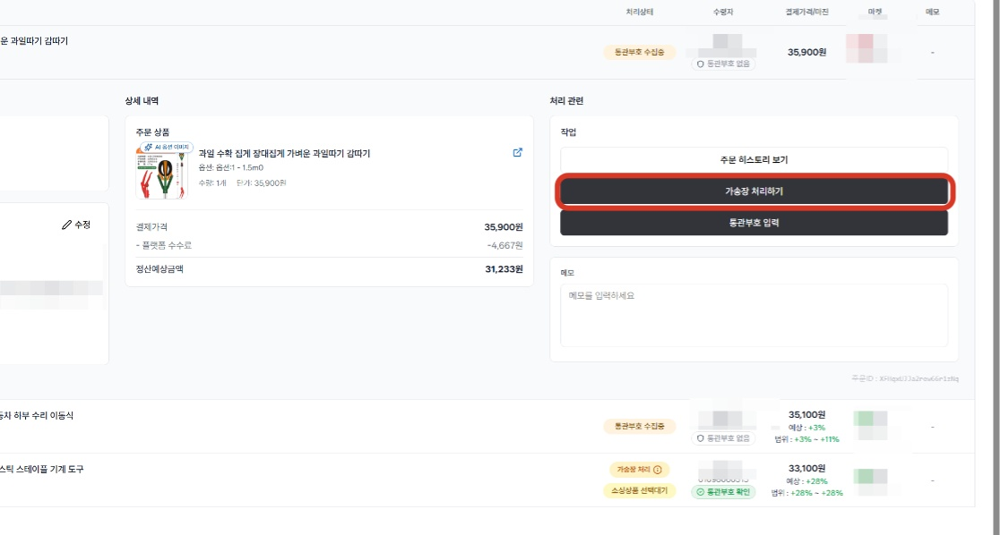

#### 3. 안내창에서 [가송장 처리하기] 버튼을 클릭하시면 가송장 처리가 완료됩니다.

송장 처리하기 버튼을 클릭하면주문상태가 배송중상태로 변경됩니다.

단,리펀디에서는 발송대기 상태값으로 관리가 되고 있으며,가송장 등록 후 소싱 상품 결제를 완료하면 배송중 상태에서 관리가 가능합니다.

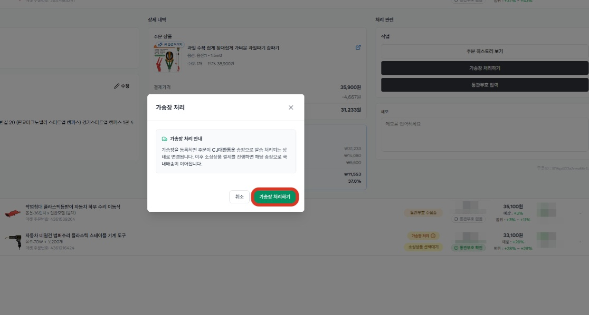

#### 4. 가송장 발급과 등록이 완료되면 화면과 같이 처리상태가 변경됩니다.

가송장은 소싱상품 결제 이후 배송대행지에서 발급해주는 국내 운송장(CJ)을 미리 발급 받아 등록한 상황입니다.

이어서 소싱상품 결제를 진행해주시면 제출된 배송대행주문서와 연결되어 등록된 운송장 번호로 국내 배송이 진행됩니다.

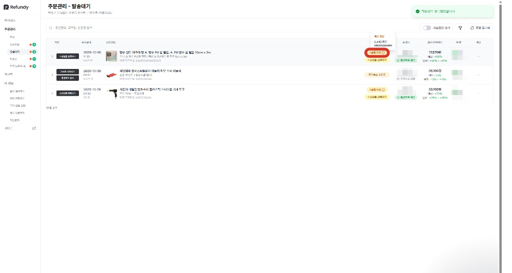

cf. 네이버 관리자센터에서 배송중으로 변경된 화면

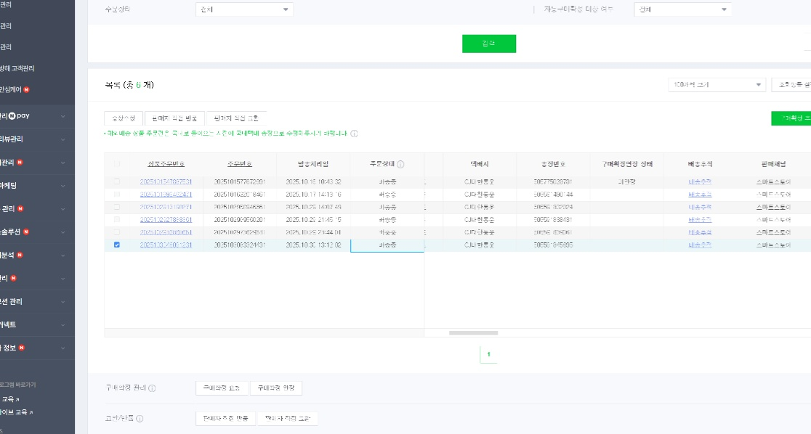

#### 6. 통관 부호 수집이 완료 된 주문내역은 이어서 [소싱상품 등록하기] 버튼 클릭하시면 소싱 주문 발주 진행이 가능합니다.

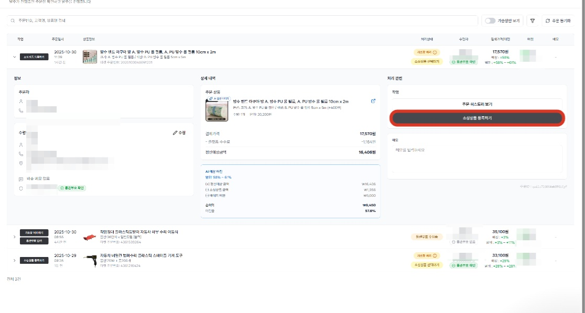

#### 7. 가송장이 등록된 주문 내역은 '발송대기' 상태에서 관리가 되며, '발송대기' 상태에서 소싱 주문 결제가 완료 되면, '배송중' 상태로 변경됩니다.

단, 마켓에서 이미 발송처리를 진행했기 때문에 마켓에서 바라보는 주문의 상태는 배송중 상태입니다.

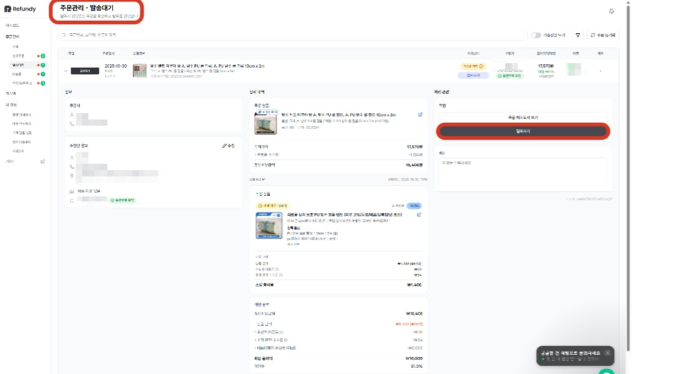

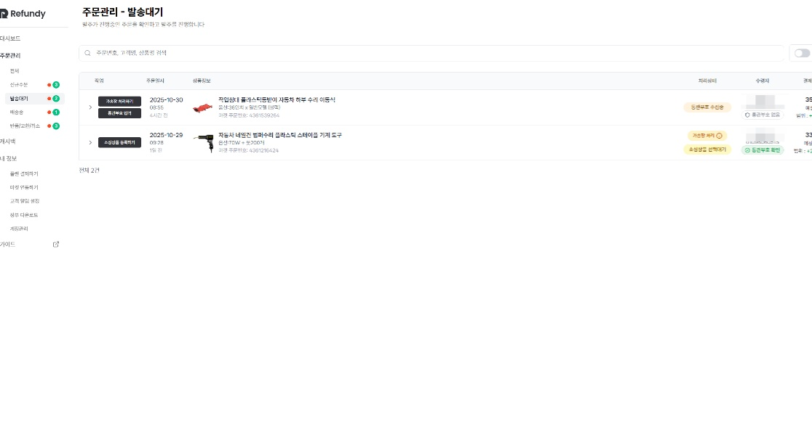

소싱 주문 결제 후 발송대기 상태에서 사라진 가송장 등록 주문

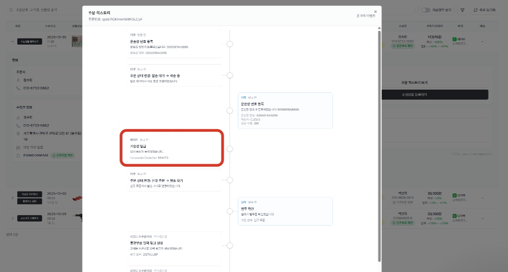

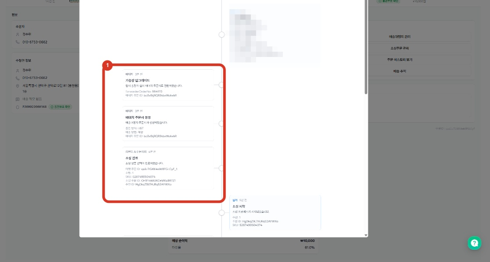

주문히스토리에서 확인하는 가송장 등록 및 소싱 주문 결제 연결

#### 💡 발송대기에서 소싱상품 결제를 위해서는 반드시 통관부호가 입력되어 있어야 합니다.

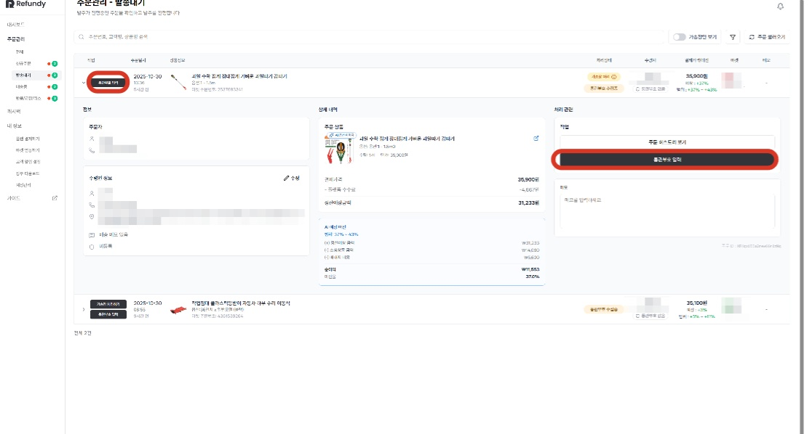