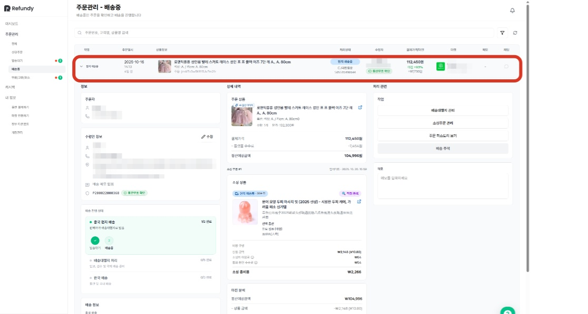
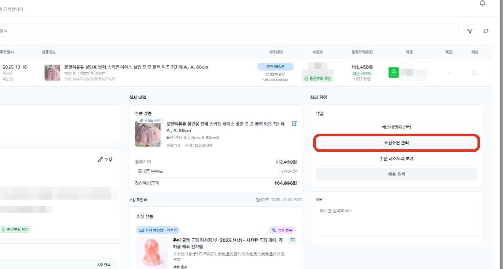
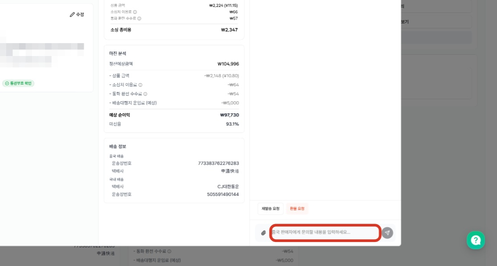
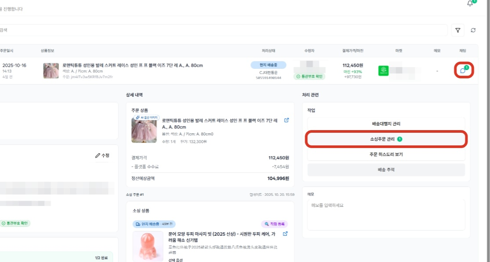
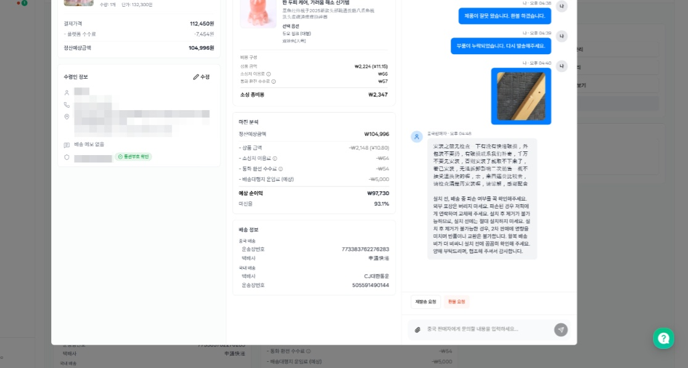

# 3.1 [소싱주문관리] - 중판대화

- **원본 URL**: https://docs.channel.io/oms_refundy/ko/articles/31-%EC%86%8C%EC%8B%B1%EC%A3%BC%EB%AC%B8%EA%B4%80%EB%A6%AC---%EC%A4%91%ED%8C%90%EB%8C%80%ED%99%94-407fde2f

---

발주 이후 중국 판매자가 제품을 보내주지 않거나, 배송대행지 검수 결과 제품의 하자가 발견되어 교환, 환불이 진행되어야 하는 경우 중국 판매자와 소통이 필요합니다.

문제 발생 시, 중국 판매자에게 원하는 요청사항을 전달하여, 빠르고 신속하게 문제를 해결하는 것이 중판 소통 과정의 핵심이며, 이를 위해서 사진을 활용하는 것도 방법입니다.

#### 1. 중국 판매자와 소통이 필요한 주문내역을 찾습니다.

#### 2. 소싱 주문에 대한 작업은 모두 '소싱 주문관리'에서 처리가 가능합니다.

#### 3. 채팅창에 중판에 요청하고자 하는 내용을 메세지로 작성하여 메세지를 발송해주세요.

중국어 번역
- 리펀디 AI 주문처리 자동화에서는 한국어로 메세지를 작성하셔도 자동으로 번역되어, 중국 판매자에게 메세지가 전달됩니다. 중국 판매자 답변은 중국어&한국어로 함께 표기되고 있습니다. 파일 첨부 기능을 통해 사진으로도 소통이 가능합니다.

리펀디 AI 주문처리 자동화에서는 한국어로 메세지를 작성하셔도 자동으로 번역되어, 중국 판매자에게 메세지가 전달됩니다. 중국 판매자 답변은 중국어&한국어로 함께 표기되고 있습니다. 파일 첨부 기능을 통해 사진으로도 소통이 가능합니다.

#### 4. 중판에게서 메세지가 도착하면, 채팅과 소싱 주문관리에 알림이 표시됩니다.

중판 메세지 예시