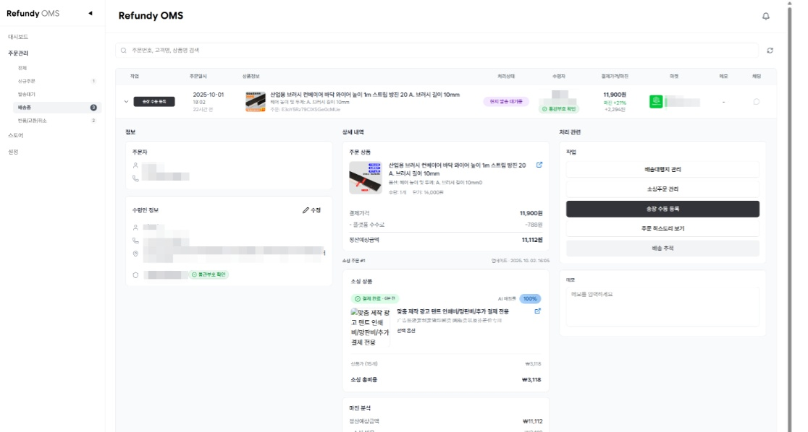
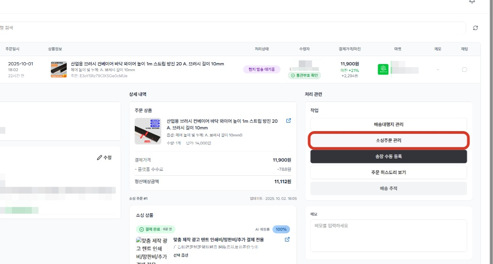
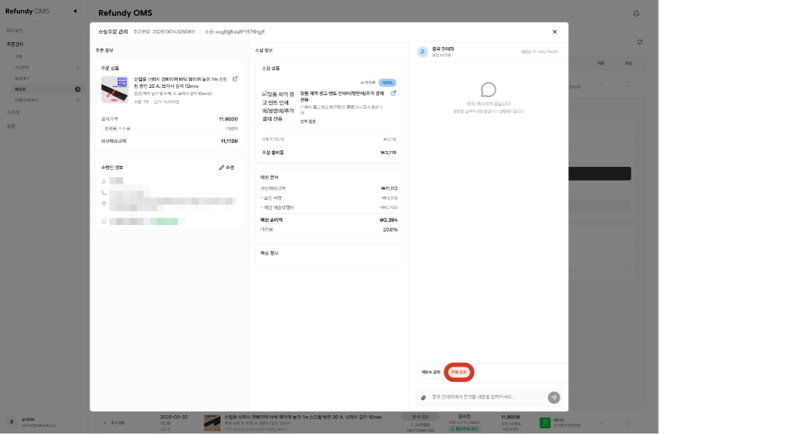
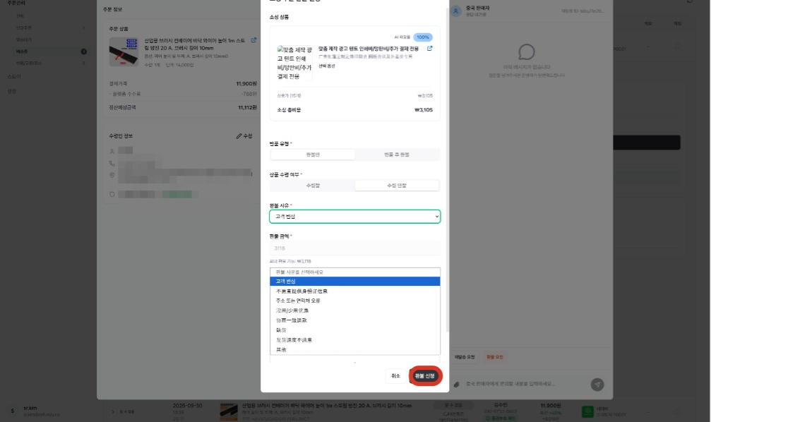
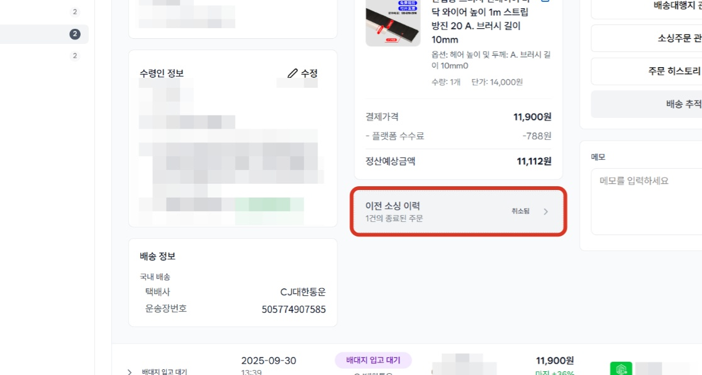
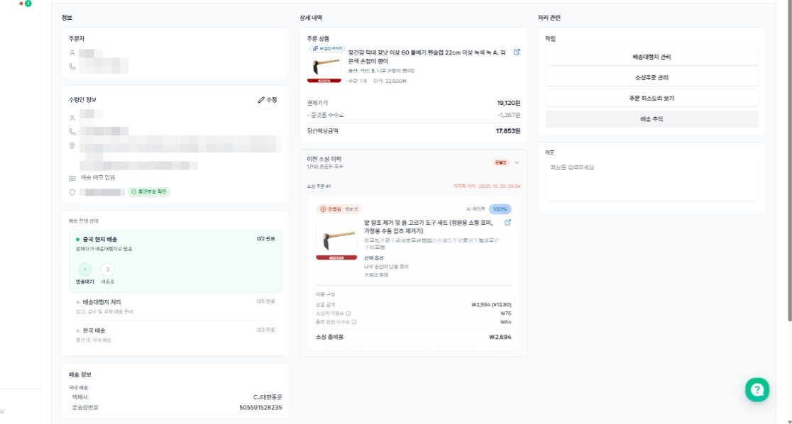

# 3.2 [소싱주문관리] - 소싱주문 환불하기

- **원본 URL**: https://docs.channel.io/oms_refundy/ko/articles/32-%EC%86%8C%EC%8B%B1%EC%A3%BC%EB%AC%B8%EA%B4%80%EB%A6%AC---%EC%86%8C%EC%8B%B1%EC%A3%BC%EB%AC%B8-%ED%99%98%EB%B6%88%ED%95%98%EA%B8%B0-427075fc

---

주문처리 과정에서 고객의 환불 요청, 제품의 이상 등으로 소싱 주문 환불이 필요하시나요?

- 소싱주문관리에서 환불 신청을 편리하게 하실 수 있어요.

#### 1.  환불이 필요한 주문내역을 찾아 클릭합니다.

#### 2. '소싱주문 관리'를 클릭합니다.

#### 3. '환불요청' 버튼을 클릭하여 환불 주문서를 작성합니다.

#### 4. 반품 유형 및 환불 사유 등을 작성하고, 환불 신청 버튼을 눌러 환불 주문서를 제출합니다.

#### 5. 판매자의 환불 승인이 완료 되면, 소싱 주문 환불 처리는 종료됩니다.

소싱 주문 환불 처리
- 소싱 주문의 환불 처리는 판매자의 환불 승인을 거쳐 완료 됩니다. 제품 반품 절차 및 판매자 정책에 따라 환불처리의 지연 및 거부가 발생 될 수 있습니다.

소싱 주문의 환불 처리는 판매자의 환불 승인을 거쳐 완료 됩니다. 제품 반품 절차 및 판매자 정책에 따라 환불처리의 지연 및 거부가 발생 될 수 있습니다.
- 이 때는 판매자의 원할한 협조를 요청해야 하며, 여러번 설득에도 반품이 진행되지 않는 경우, 플랫폼 공식 서비스 센터의 지원을 요청할 수 있습니다.

이 때는 판매자의 원할한 협조를 요청해야 하며, 여러번 설득에도 반품이 진행되지 않는 경우, 플랫폼 공식 서비스 센터의 지원을 요청할 수 있습니다.

공식 서비스 센터 개입 요청은 추후에 업데이트 될 예정이며, 필요한 경우, 채널톡 상담을 통해 주문번호와 사유 및 히스토리를 전달해주시면 처리 도와드리겠습니다.

소싱 주문 환불 예시