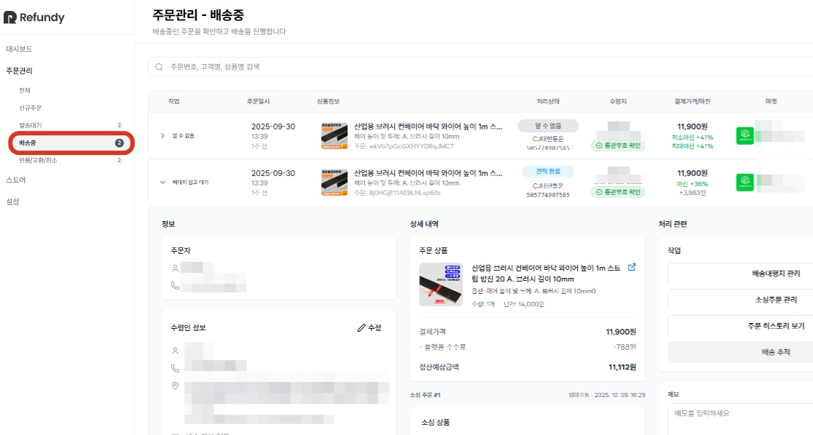
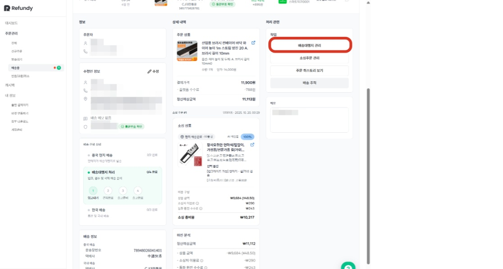
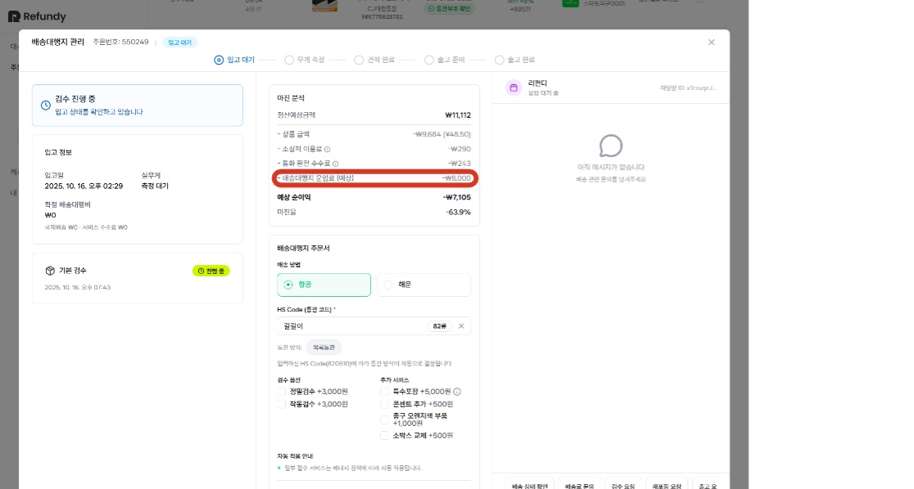
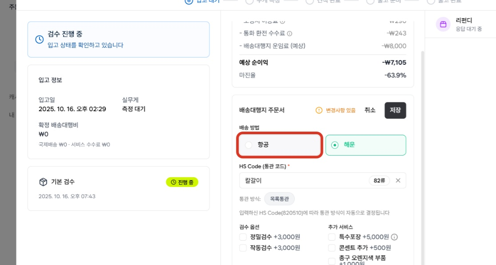
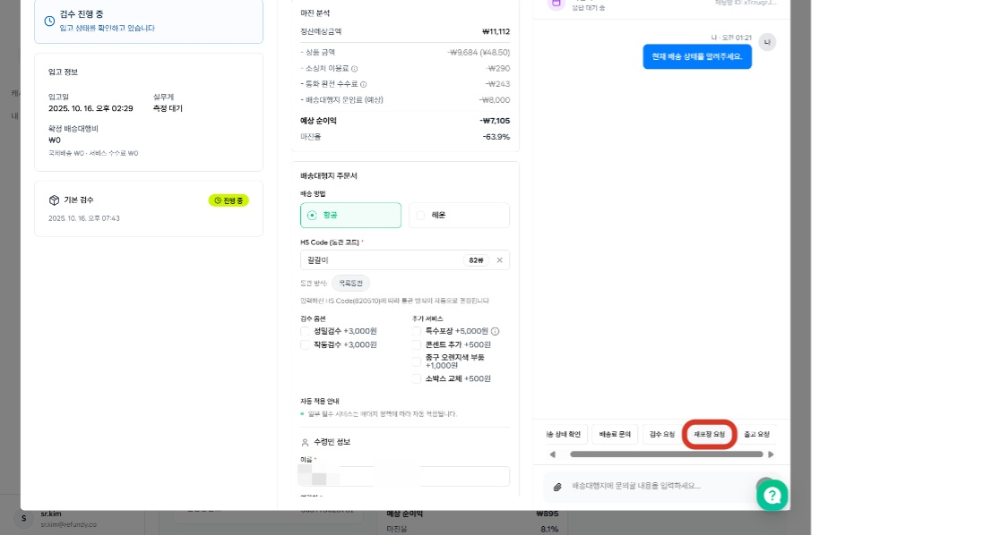

# 3.3 [배송대행지관리] - 배대지 CS

- **원본 URL**: https://docs.channel.io/oms_refundy/ko/articles/33-%EB%B0%B0%EC%86%A1%EB%8C%80%ED%96%89%EC%A7%80%EA%B4%80%EB%A6%AC---%EB%B0%B0%EB%8C%80%EC%A7%80-CS-07ccb3a2

---

소싱이 완료된 주문은 배송대행지를 거쳐 고객에게 배송이 됩니다. 배송대행지에서는 주문한 상품의 검수, 한국 배송지로 출고를 위한 보강 포장 작업, 필요 시 반품 대행, 통관 업무까지 진행하는 아주 중요한 파트너입니다. 배송대행지 관리 메뉴를 통해 주문내역에 대한 배대지 업무 처리를 한번에 관리해보세요.

#### 1. 소싱 제품의 발주가 완료된 주문내역은 모두 '배송중' 상태에서 관리가 됩니다.

중국 트래킹 번호
- 배대지 주문서 제출에 필요한 중국 운송장번호(트래킹 번호)는 중국판매자가 시스템에 기입하는대로 자동으로 업데이트되어, 셀러님은 노데이터 관리를 하실 필요가 없습니다.

배대지 주문서 제출에 필요한 중국 운송장번호(트래킹 번호)는 중국판매자가 시스템에 기입하는대로 자동으로 업데이트되어, 셀러님은 노데이터 관리를 하실 필요가 없습니다.

국내 송장 번호 업데이트
- 한국 마켓에 등록이 필요한 운송장 번호도 배대지에서 국내 운송장 번호가 발급되는 즉시, 오픈마켓 시스템에 업데이트 됩니다. (단, 11번가의 경우 페널티정책을 감안하여, 국내 배송흐름이 감지 될 때, 송장 번호가 업데이트 됩니다.)

한국 마켓에 등록이 필요한 운송장 번호도 배대지에서 국내 운송장 번호가 발급되는 즉시, 오픈마켓 시스템에 업데이트 됩니다. (단, 11번가의 경우 페널티정책을 감안하여, 국내 배송흐름이 감지 될 때, 송장 번호가 업데이트 됩니다.)

#### 2. 주문관리가 필요한 주문내역을 클릭하면, 작업을 할 수 있는 버튼이 표시됩니다.

배송대행지 관리
- 배송대행지에서 일어나는 모든 처리를 한번에 관리할 수 있습니다. (검수사진 확인, 배송상태 확인, 배대지 CS요청 등)

배송대행지에서 일어나는 모든 처리를 한번에 관리할 수 있습니다. (검수사진 확인, 배송상태 확인, 배대지 CS요청 등)

소싱주문 관리
- 소싱 후, 주문관리가 필요한 모든 내용을 관리할 수 있습니다. (반품 요청, 중판 대화 등)

소싱 후, 주문관리가 필요한 모든 내용을 관리할 수 있습니다. (반품 요청, 중판 대화 등)

주문히스토리보기
- 주문내역의 전체 흐름을 살펴볼 수 있습니다. (중국제품 발주일 확인, 배대지 입고일 확인 등)

주문내역의 전체 흐름을 살펴볼 수 있습니다. (중국제품 발주일 확인, 배대지 입고일 확인 등)

#### 3. 배송대행지 관련 작업 세부 내용은 아래를 참고해주세요.

배송대행지 상태

입고 대기 -> (입고 후) 무게 측정 -> 견적완료 -> 출고준비 -> 출고 완료 순으로 진행됩니다.

배대지 비용

견적완료 단계에서 확정되며, 기본 배대지 비용(무게)+추가비용으로 구성됩니다.

무게 측정 전까지는 예상 배대지 비용으로 표시되며, 견적완료 후는 확정 배대지 비용으로 자동으로 업데이트 됩니다.

배대지주문서수정

출고 준비 전까지 수정가능합니다. 배대지 주문서 등록 후 수정이 필요하다면, 배대지 CS 통해 필요한 내용 남겨주시면 안내드리겠습니다.

*배송 방법이 변경되는 경우,국내 송장 번호가 변경되어, 송장 업데이트 연동 미지원 마켓은 수기로 업데이트 관리가 필요합니다.

배대지 비용 결제

견적 완료 후 주문내역 창에 배대지 비용 결제 버튼이 활성화되며, 배대지 비용을 결제하셔야 출고가 됩니다.

견적완료~출고 준비(배대지 비용 결제 전) 주문내역은 모두 출고 보류 상태로 관리됩니다.

출고 작업

일~금 진행되며, 토요일은 출고가 진행되지 않습니다.

출고일 오전 10시까지 출고 준비가 된 건들이 해당일 오후에 출고됩니다.

#### 4. 출고준비 전까지는 배대지 주문서 수정이 가능합니다.

주문서 수정 후에는 반드시 저장 버튼을 눌러주셔야 주문서 업데이트가 가능하며, 출고 준비 후 추가 요청사항이 있다면, 오른쪽 CS 창에 메세지를 통해 요청사항을 전달해주세요.

ex. 보강 포장 요청 (에어캡 등), 돼지코 추가 등

#### 5. 배대지 CS가 필요한 경우, 오른쪽 창에 버튼을 통해 간단히 요청 작업을 전달하시거나, 메세지를 작성해주세요.

리펀디 배송대행지 센터 운영시간 : 평일 오전 9시~오후 6시, 주말 및 공휴일 휴무

