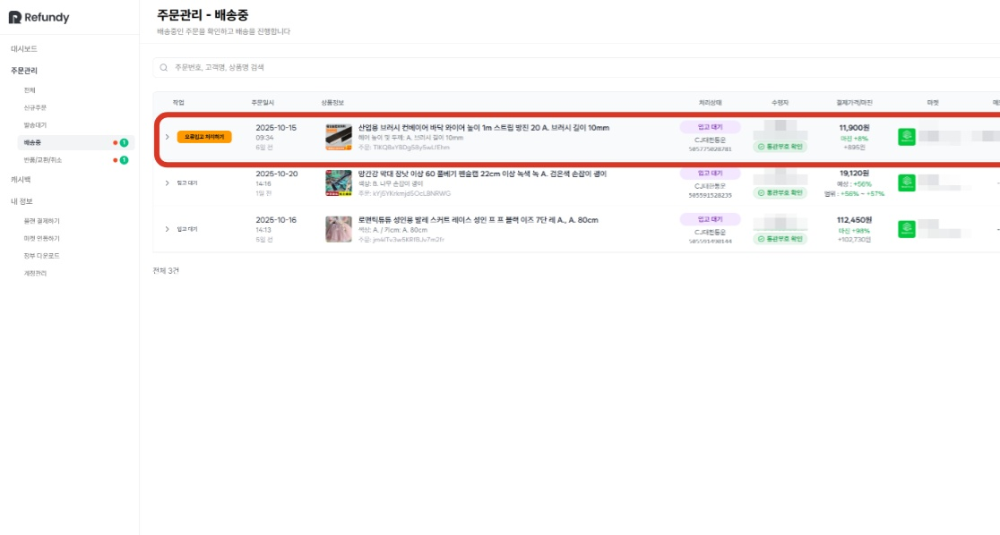
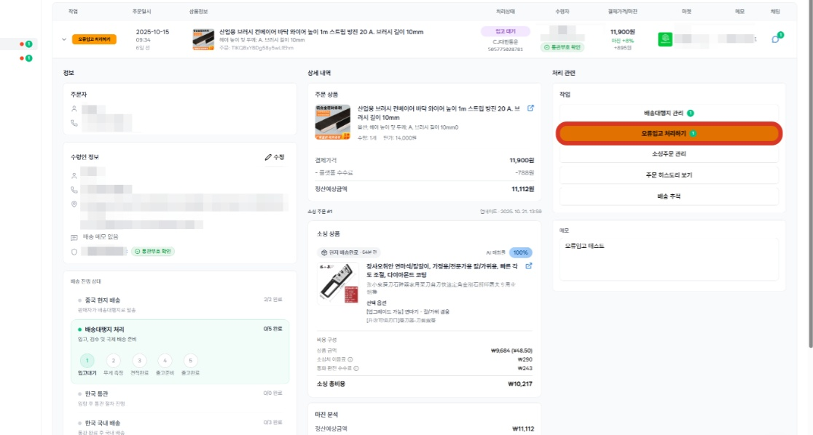
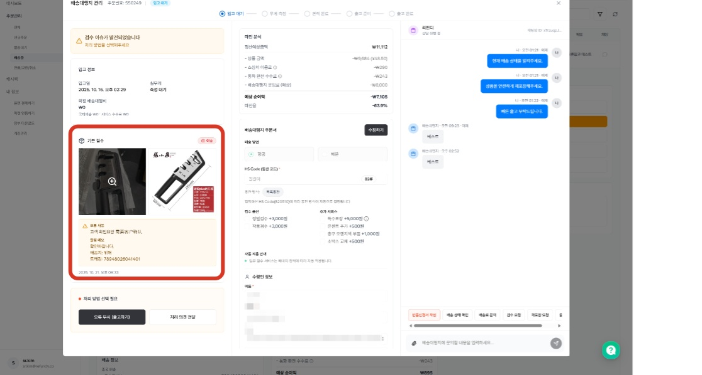
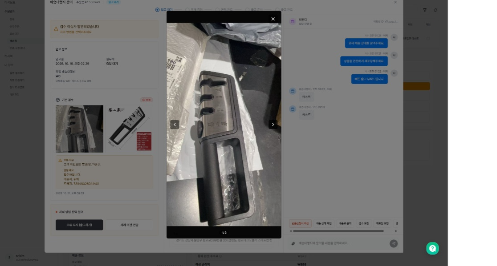
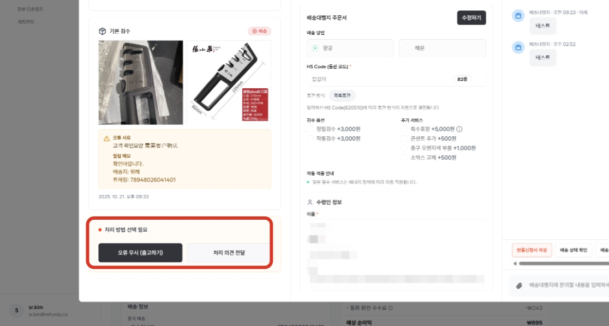
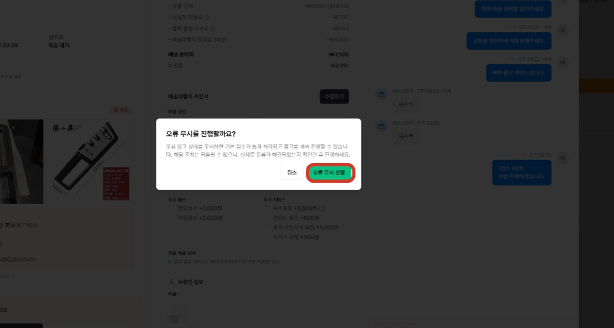
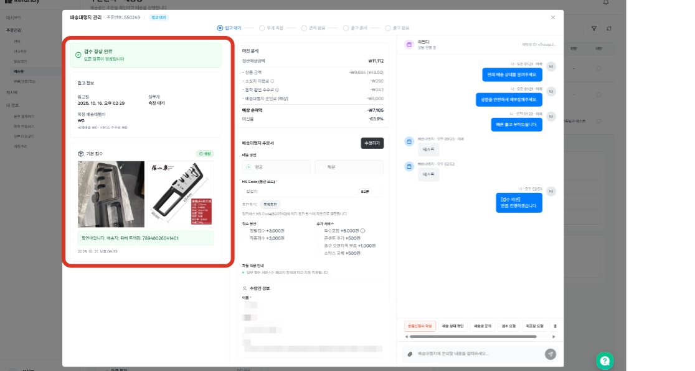
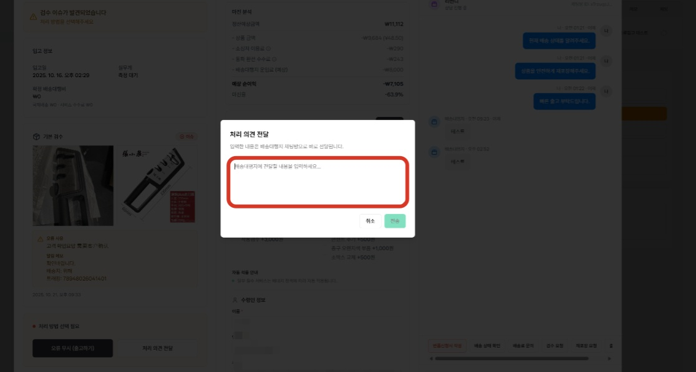

# 3.4 [배송대행지관리] - 오류입고 처리

- **원본 URL**: https://docs.channel.io/oms_refundy/ko/articles/34-%EB%B0%B0%EC%86%A1%EB%8C%80%ED%96%89%EC%A7%80%EA%B4%80%EB%A6%AC---%EC%98%A4%EB%A5%98%EC%9E%85%EA%B3%A0-%EC%B2%98%EB%A6%AC-e195bfcb

---

- 오류 무시의 경우, 제품 상태를 확인함과 동시에 버튼 하나 만으로 처리가 가능합니다.

오류 무시의 경우, 제품 상태를 확인함과 동시에 버튼 하나 만으로 처리가 가능합니다.
- 이슈 처리의 경우, 이슈 처리 의견을 전달해주시면, 배대지에서 맞춰 처리도와드리겠습니다.

이슈 처리의 경우, 이슈 처리 의견을 전달해주시면, 배대지에서 맞춰 처리도와드리겠습니다.

#### 1. 오류입고 처리가 필요한 주문내역을 찾습니다.

#### 2. [오류입고 처리하기] 버튼 클릭합니다.

#### 3. 사진을 클릭하시면, 배대지에 입고된 제품의 상태를 확인할 수 있는 검수사진을 볼 수 있습니다.

검수 사진 예시

#### 4. 해결 방법은 오류 무시 or 처리 의견 전달 중 선택 가능합니다.

오류무시(출고하기)
- 오류 입고 사유 확인을 했음에도 현재 상태 그대로 출고를 원하신다면, 오류무시 버튼만 클릭해주시면 됩니다. 해당 상태 그대로 재포장 되어, 출고 준비가 될 예정입니다.

오류 입고 사유 확인을 했음에도 현재 상태 그대로 출고를 원하신다면, 오류무시 버튼만 클릭해주시면 됩니다. 해당 상태 그대로 재포장 되어, 출고 준비가 될 예정입니다.

처리의견전달
- 제품 사진을 확인했을 때에 교환/환불이 필요하다고 판단되시거나, 고객과 확인 후 작업이 필요하시다면 [처리의견전달] 버튼을 눌러 메세지를 작성해주시면 배대지 CS에서 확인 후 이어서 안내 드리고 있습니다.

제품 사진을 확인했을 때에 교환/환불이 필요하다고 판단되시거나, 고객과 확인 후 작업이 필요하시다면 [처리의견전달] 버튼을 눌러 메세지를 작성해주시면 배대지 CS에서 확인 후 이어서 안내 드리고 있습니다.

오류 무시 화면 예시

#### 5. 오류무시를 선택하는 경우, 오류 입고 상태가 해제 되며, 출고 준비를 위한 다음 작업이 진행됩니다.

배대지 상태
- 오류 입고 상태의 경우, 실제 제품은 배대지에 입고되었지만, 정상 상태의 제품이 입고되지 않은 것으로 간주하여, 배대지 세부 상태값은 입고 대기 상태로 두고 있습니다. 오류 무시를 선택하시게 되면, 해당 제품은 입고 처리를 진행하게 되며, 배송비 확정을 위한 무게 측정 - 배송비 결제 - 출고 준비 - 출고 완료 순으로 처리가 진행됩니다.

오류 입고 상태의 경우, 실제 제품은 배대지에 입고되었지만, 정상 상태의 제품이 입고되지 않은 것으로 간주하여, 배대지 세부 상태값은 입고 대기 상태로 두고 있습니다. 오류 무시를 선택하시게 되면, 해당 제품은 입고 처리를 진행하게 되며, 배송비 확정을 위한 무게 측정 - 배송비 결제 - 출고 준비 - 출고 완료 순으로 처리가 진행됩니다.

#### 6. 처리 의견 전달을 원하신다면, 버튼 클릭 후 원하시는 내용을 입력해주세요.

처리 의견 전달 예시
- 오류처리 판단을 위한 추가 검수 사진 요청, 반품/교환 진행 전달 등

오류처리 판단을 위한 추가 검수 사진 요청, 반품/교환 진행 전달 등
- 입고된 상품의 반품이 필요한 경우, 배대지 반품 프로세스를 참고해주세요.

입고된 상품의 반품이 필요한 경우, 배대지 반품 프로세스를 참고해주세요.

