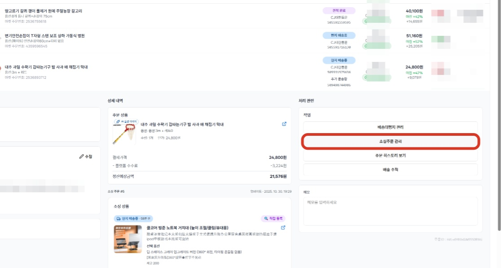
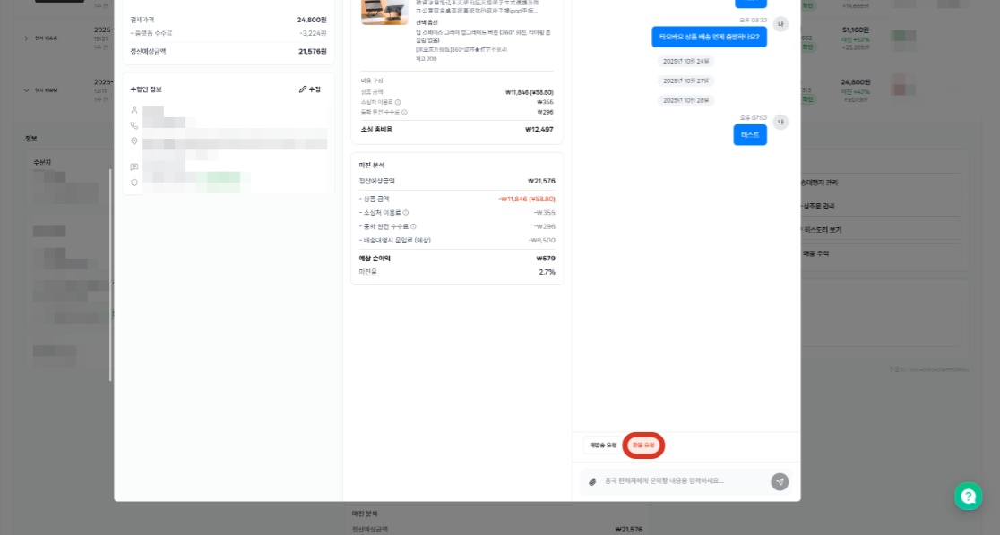
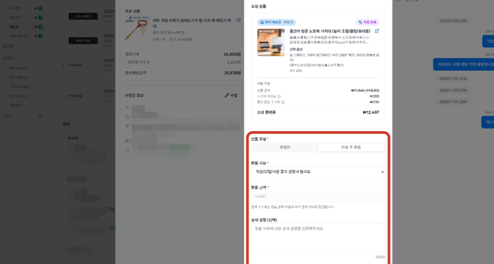
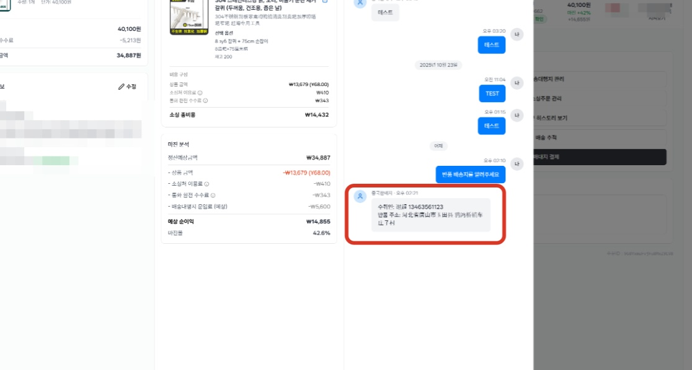
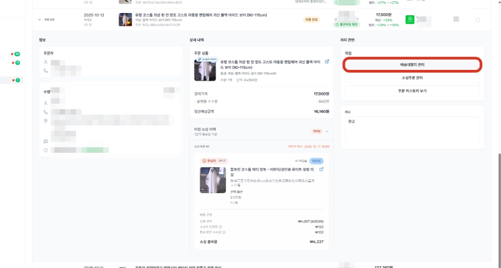
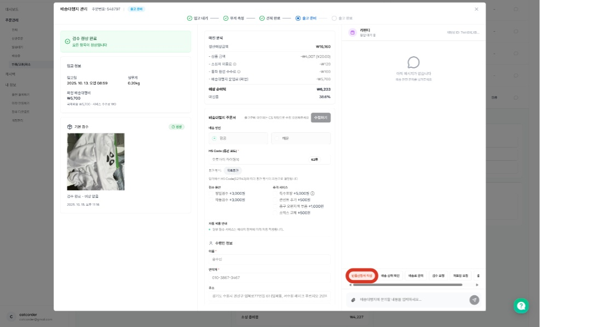
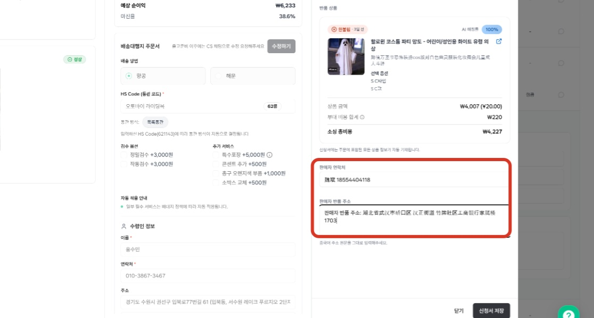

# 3.5 배대지 입고된 소싱 상품 환불(반품) 하기

- **원본 URL**: https://docs.channel.io/oms_refundy/ko/articles/35-%EB%B0%B0%EB%8C%80%EC%A7%80-%EC%9E%85%EA%B3%A0%EB%90%9C-%EC%86%8C%EC%8B%B1-%EC%83%81%ED%92%88-%ED%99%98%EB%B6%88%EB%B0%98%ED%92%88-%ED%95%98%EA%B8%B0-b44f420e

---

배송대행지에 입고 되어 있는 소싱 주문 환불이 필요하신가요?

배송대행지 반품 주문서 작성을 위해서는 소싱 주문 환불 주문서를 제출하여 반품 배송지 정보를 확보가 필요합니다. 소싱 주문 환불 주문서 제출부터 배대지 환불 주문서 제출까지의 단계에 대해서 안내드립니다.

### 1.  소싱 환불(반품) 주문서 작성하기

#### a.  환불이 필요한 상품을 찾아, 소싱 주문의 환불주문서 작성을 합니다.

반품이 필요한 주문

a. 상품이 배송대행지에 입고 된 상태일 때

→ 경우에 따라 배송중 가로채기를 중국판매자에게 요청하여 배송대행지 반품 서비스를 거치지 않아도 진행이 될 수 있습니다. 가로채기에 실패한 경우, 배대지 입고 후에 배대지 반품을 거쳐 환불해주셔야 합니다.

b. 환불 주문서 작성 시 이미 배송이 시작된 상태일 때

#### b. 소싱 주문관리 메뉴의 - 환불요청 버튼을 클릭하면 소싱 주문의 환불 주문서를 작성할 수 있습니다.

#### c. 반품유형과 환불 사유를 선택하고, [환불 신청] 버튼을 클릭하여 환불 주문서를 제출합니다.
- 반품 유형환불만 : 배송시작 전, 제품 폐기 등으로 제품을 돌려주지 않는 상황반품 후 환불 : 제품을 중판에게 돌려줄 때

반품 유형
- 환불만 : 배송시작 전, 제품 폐기 등으로 제품을 돌려주지 않는 상황

환불만 : 배송시작 전, 제품 폐기 등으로 제품을 돌려주지 않는 상황
- 반품 후 환불 : 제품을 중판에게 돌려줄 때

반품 후 환불 : 제품을 중판에게 돌려줄 때
- 환불 사유상황에 맞는 환불 사유를 선택

환불 사유
- 상황에 맞는 환불 사유를 선택

상황에 맞는 환불 사유를 선택

#### d. 제출한 환불 주문서에 대해 중판이 환불 승인을 하는 경우, 반품 배송정보를 전달합니다.
- 환불 승인환불 승인의 주체는 중국 판매자입니다. 환불을 거부하는 경우, 반품 주소를 전달하지 않을 수 있습니다. 이 경우, 고객센터 개입을 요청할 수 있습니다.중판의 환불 승인이 확인되면, 반품 배송지와 연락처 메세지가 중판 CS 메세지로 전달됩니다.해당 정보를 배송대행지 환불 주문서에 입력해주시면 됩니다.

환불 승인
- 환불 승인의 주체는 중국 판매자입니다. 환불을 거부하는 경우, 반품 주소를 전달하지 않을 수 있습니다. 이 경우, 고객센터 개입을 요청할 수 있습니다.

환불 승인의 주체는 중국 판매자입니다. 환불을 거부하는 경우, 반품 주소를 전달하지 않을 수 있습니다. 이 경우, 고객센터 개입을 요청할 수 있습니다.
- 중판의 환불 승인이 확인되면, 반품 배송지와 연락처 메세지가 중판 CS 메세지로 전달됩니다.

중판의 환불 승인이 확인되면, 반품 배송지와 연락처 메세지가 중판 CS 메세지로 전달됩니다.
- 해당 정보를 배송대행지 환불 주문서에 입력해주시면 됩니다.

해당 정보를 배송대행지 환불 주문서에 입력해주시면 됩니다.

### 2. 배송대행지 환불(반품) 주문서 작성하기

#### a. 배송대행지 환불 주문서 작성을 위해 해당 주문의 [배송대행지 관리] 메뉴를 클릭합니다.

배송대행지 환불 주문서를 작성해야, 배송대행지에서 해당 제품의 반품을 진행할 수 있습니다.

#### b.  [배송대행지관리] 메뉴의 [반품주문서작성] 버튼을 클릭하여 배대지 반품 신청서를 작성합니다.

#### c. 중국판매자가 전달한 반품 배송정보를 입력하고, [신청서 저장] 버튼을 눌러 배송대행지 반품 주문서를 제출합니다.
- 소싱 주문 환불주문서에 입력하는 반품 트래킹 번호는 택배가 픽업 되면, 자동으로 업데이트될 예정입니다.

소싱 주문 환불주문서에 입력하는 반품 트래킹 번호는 택배가 픽업 되면, 자동으로 업데이트될 예정입니다.
- 제품이 배대지에서 픽업되어 중국 판매자가 제품을 받은 후 환불을 승인해주면, 소싱 주문 반품/환불은 종료됩니다.

제품이 배대지에서 픽업되어 중국 판매자가 제품을 받은 후 환불을 승인해주면, 소싱 주문 반품/환불은 종료됩니다.
- 중국판매자가 직접 제품을 픽업하는 방식으로 진행되어야 한다면, 반품신청서 작성 전 CS 메세지를 통해 미리 문의부탁드립니다.

중국판매자가 직접 제품을 픽업하는 방식으로 진행되어야 한다면, 반품신청서 작성 전 CS 메세지를 통해 미리 문의부탁드립니다.

