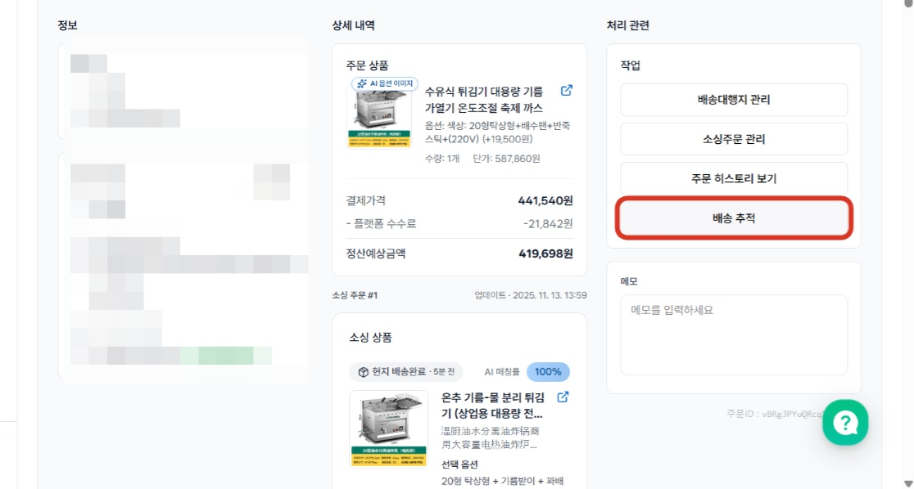
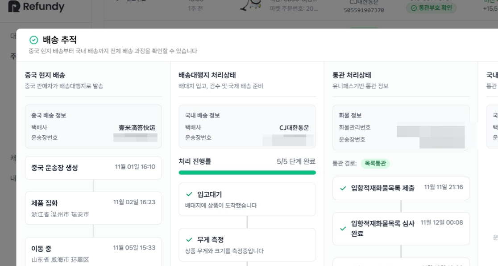
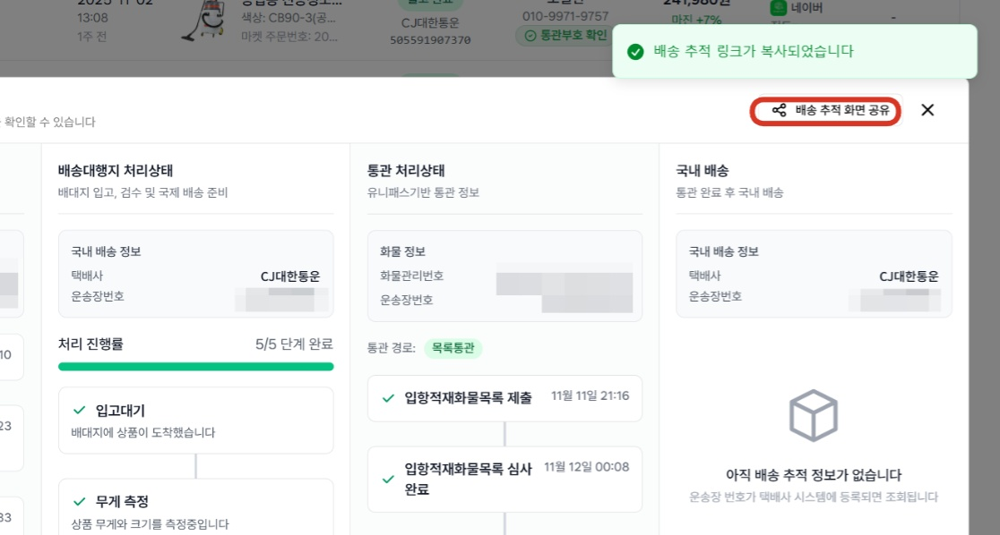
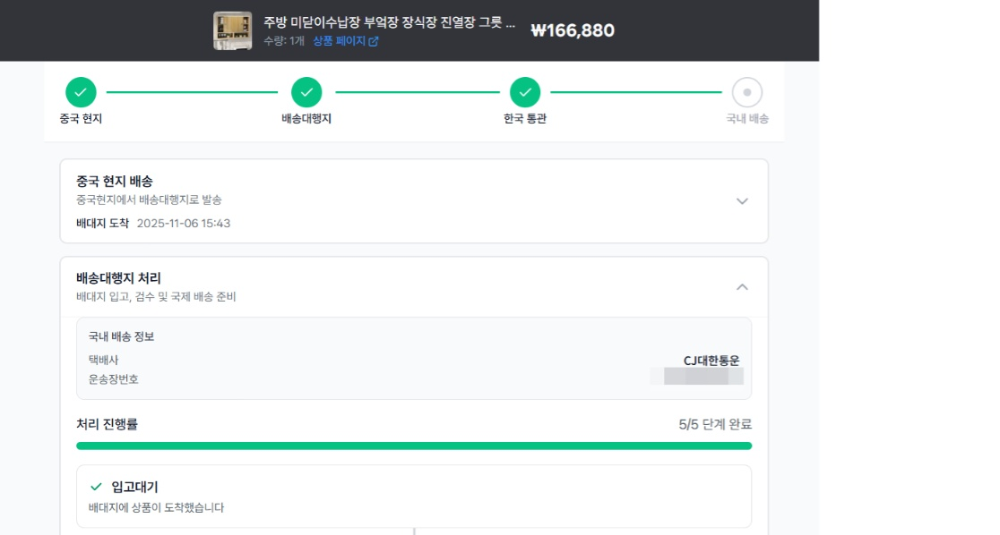

# 3.6 배송조회(배송문의 처리하기)

- **원본 URL**: https://docs.channel.io/oms_refundy/ko/articles/36-%EB%B0%B0%EC%86%A1%EC%A1%B0%ED%9A%8C%EB%B0%B0%EC%86%A1%EB%AC%B8%EC%9D%98-%EC%B2%98%EB%A6%AC%ED%95%98%EA%B8%B0-a05f9c04

---

리펀디에서는 [배송추적] 버튼에서 배송상황을 한번에 확인할 수 있고,

주문 고객님용 배송조회 페이지 링크도 제공 드립니다.

이럴 때 활용해보세요.
- 주문 고객의 배송문의가 들어왔을 때

주문 고객의 배송문의가 들어왔을 때
- 주문 고객의 반품, 취소 요청이 들어왔을 때

주문 고객의 반품, 취소 요청이 들어왔을 때

#### 1. 확인이 필요한 주문내역을 찾아 [배송추적] 버튼을 클릭합니다.

#### 2. 배송추적 페이지에서는 중국 현지 배송부터 국내 배송까지의 전체 배송 추적을 한번에 할 수 있습니다.

#### 3. 오른쪽 상단의 [배송추적 화면공유] 버튼을 클릭하시면 주문고객에게 배송 조회를 할 수 있는 링크를 전달할 수 있습니다.

[배송추적 화면 공유] 버튼 클릭 후, 생성된 링크를 주문 고객님께 전달해주세요.

#### 주문고객전달용 배송추적 화면 예시

