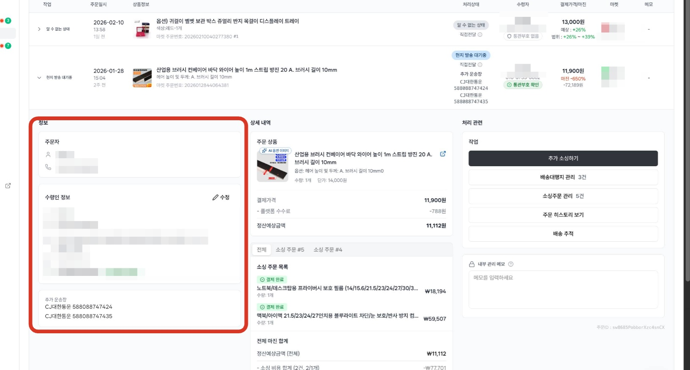
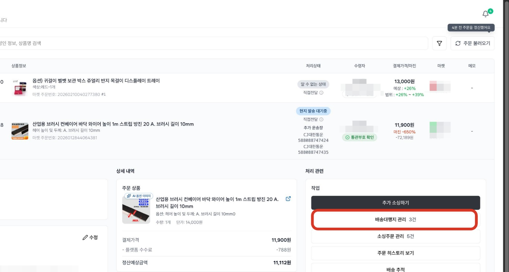
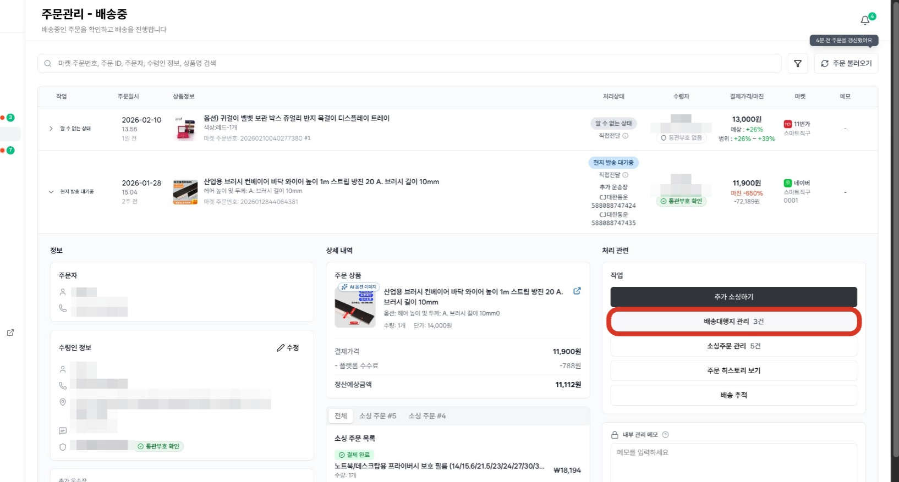
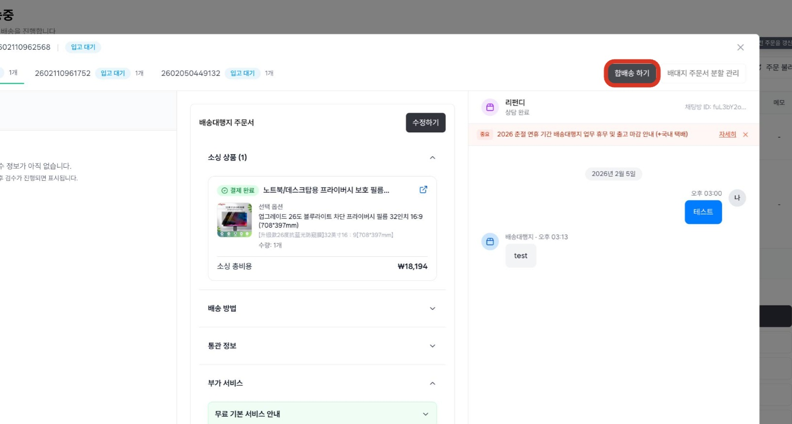
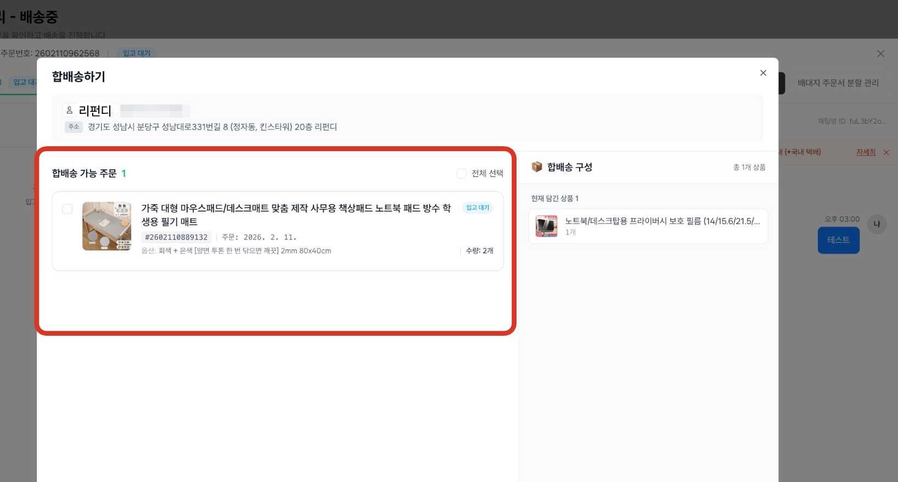
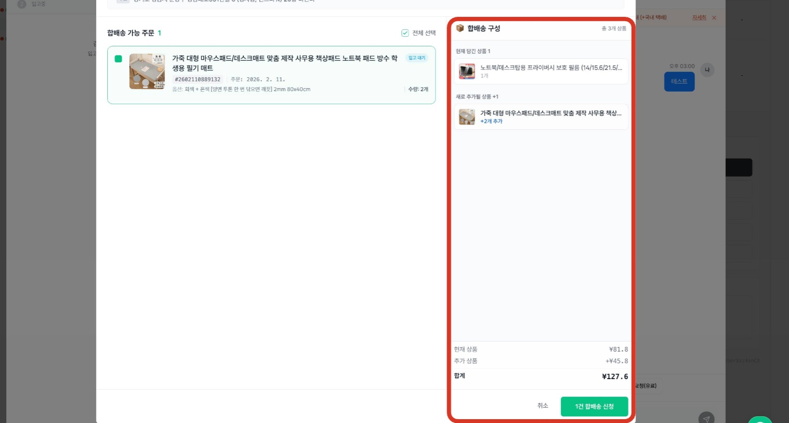
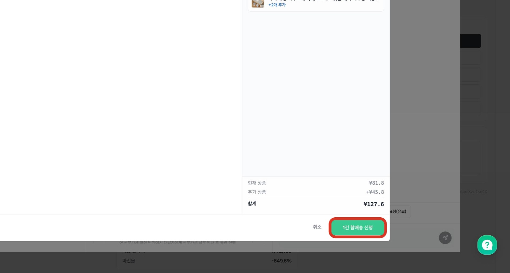
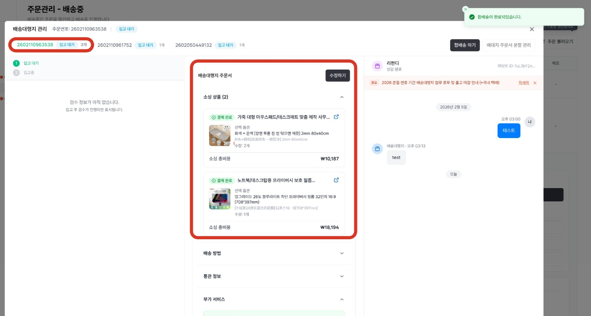
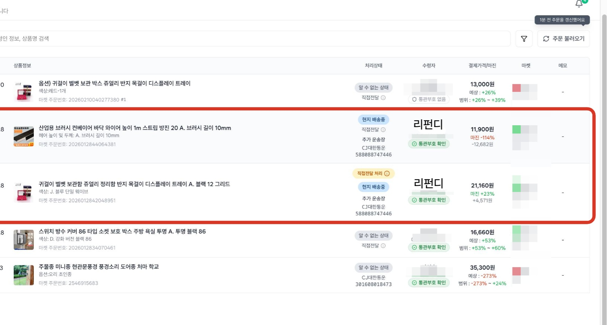

# 3.7 합배송 주문서 만들기

- **원본 URL**: https://docs.channel.io/oms_refundy/ko/articles/37-%ED%95%A9%EB%B0%B0%EC%86%A1-%EC%A3%BC%EB%AC%B8%EC%84%9C-%EB%A7%8C%EB%93%A4%EA%B8%B0-4c8016f4

---

합배송이란?

동일 수취인의 여러 마켓 주문을 하나의 배송대행지 주문서로 합쳐, 배송대행지에서 한 번에 출고하는 기능입니다. 배송대행지 배송비는 보통 기본료 비중이 크기 때문에, 주문을 따로 보내는 것보다 합배송으로 묶는 것이 배송비를 절감하는 데 효과적입니다. 합배송 주문서가 작성되면, 포함된 마켓 주문들은 같은 배송대행지 주문서 번호 아래에서 하나의 국내 운송장으로 배송됩니다.

합배송은 소싱 결제 완료 후, 배송대행지 주문서가 '입고대기' 상태일 때만 가능합니다.입고가 완료된 이후에는 합배송을 진행할 수 없으니, 소싱 결제 후 배송대행지에 제품이 도착하기 전에 합배송 주문서를 작성해주세요.

#### 1. 합배송할 주문의 상세 정보 확인하기

합배송을 진행할 주문을 선택하여 주문자 정보, 수령인 정보, 소싱 주문 목록을 확인합니다. 합배송은 수취인 정보(이름, 연락처, 주소)가 동일한 주문끼리만 가능하므로, 수령인 정보를 먼저 확인해주세요.

#### 2. 배송중 탭에서 대상 주문 찾기

'현지 발송 대기중' 상태의 주문을 클릭합니다. 이 주문이 합배송의 기준 주문이 됩니다.

#### 3. 배송중 탭에서 대상 주문을 찾아, 배송대행지 관리 버튼을 클릭합니다.

합배송으로 출고시킬 마켓 주문의 소싱 결제를 모두 진행한 후, 현지 발송 대기중' 상태에서 기준이 되는 주문 선택합니다. 이 주문이 합배송의 기준 주문이 되며, 상세 내역 보기에서 '배송대행지 관리' 버튼을 클릭합니다.

#### 4. '합배송 하기' 클릭

배송대행지 주문서 화면 상단의 '합배송 하기' 버튼을 클릭합니다. 동일 수취인의 합배송 가능한 주문 목록이 자동으로 표시됩니다.

#### 5. 합배송할 주문 선택하기

합배송 가능 주문 목록에서 함께 묶을 상품의 옵션을 선택합니다.

합배송 주문서 작성 시점으로 합배송으로 묶을 수 있는 주문은 모두 취합해서 보여드리고 있습니다. 합배송으로 묶일 수 있는 주문은 입고 대기 상태의 주문 중, 수취인 정보가 같은 주문에 한해서만 선택이 가능합니다.

수취인정보가 같더라도 아래의 상황일 때는 합배송이 불가할 수 있습니다.
- 합배송 대상 주문의 배대지 주문서 상태가 배대지 주문서 상태가 입고대기 상태가 아닐 때 (ex. 입고중)

합배송 대상 주문의 배대지 주문서 상태가 배대지 주문서 상태가 입고대기 상태가 아닐 때 (ex. 입고중)
- 합배송으로 진행하는 경우, 통관에서 문제가 발생할 가능성 이 있는 제품인 경우 (ex. 전자제품 등)

합배송으로 진행하는 경우, 통관에서 문제가 발생할 가능성 이 있는 제품인 경우 (ex. 전자제품 등)

선택한 상품은 오른쪽 '합배송 구성' 영역에 추가됩니다.

#### 6. 합배송 구성 내역 확인하기

현재 담긴 상품과 새로 추가될 상품, 합계 금액을 확인합니다. 하나의 배송대행지 주문서로 묶일 전체 상품 구성이 맞는지 확인한 후 다음 단계로 진행해주세요.

주문서 기준, 주문금액이 150$ 이상인 경우, 관부가세 납부 대상이 됨으로 주문금액을 유의해주세요.

#### 7. 합배송 신청 완료하기

구성 확인이 끝났다면 하단의[합배송 신청]버튼을 클릭합니다. 선택한 상품들이 하나의 배송대행지 주문서로 합쳐집니다.

#### 8. 합배송 주문서 확인하기

합배송 주문서가 생성되면, 이전 주문서는 모두 삭제되고 합배송으로 묶인 주문서가 새롭게 생성되며, 주문서 아이템 정보에 합배송으로 묶은 아이템 정보를 확인하실 수 있습니다.

합배송이 완료된 배송대행지 주문서에서 소싱 상품, 배송 방법, 통관 정보, 부가 서비스(검수, 포장 등)를 최종 확인할 수 있습니다. 필요 시 '수정하기' 버튼을 통해 배송 옵션을 변경할 수 있습니다.

#### 9. 국내 송장 확인하기

합배송으로 묶인 마켓 주문들은 같은 배대지 주문서 아래에 하나의 국내 운송장으로 한 번에 출고-배송됩니다.

