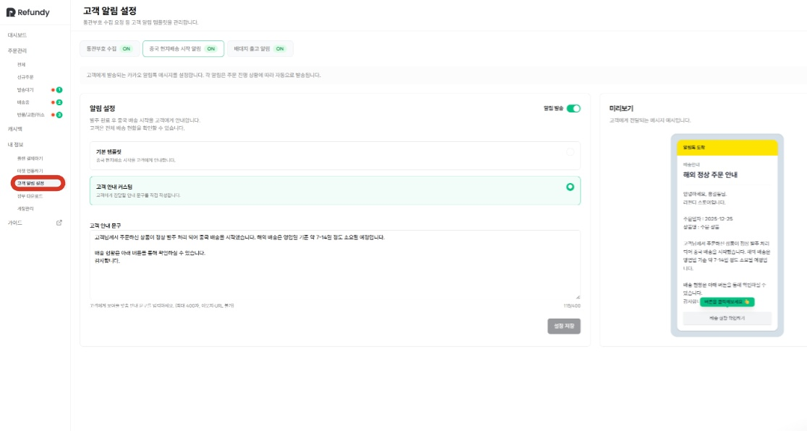
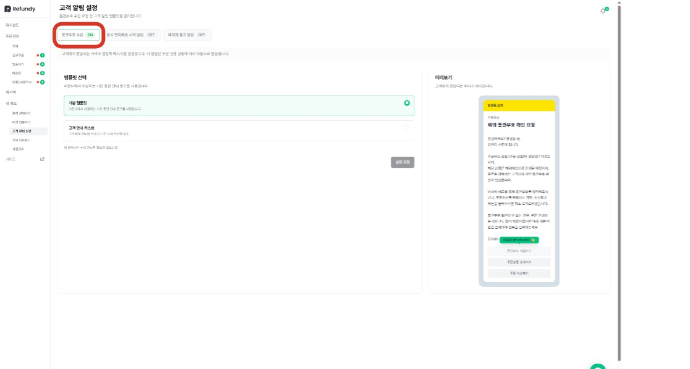
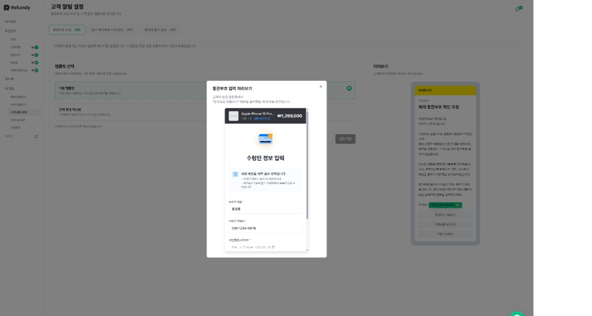
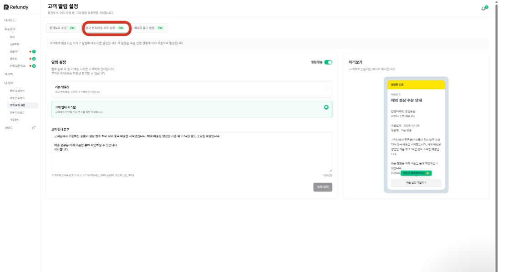
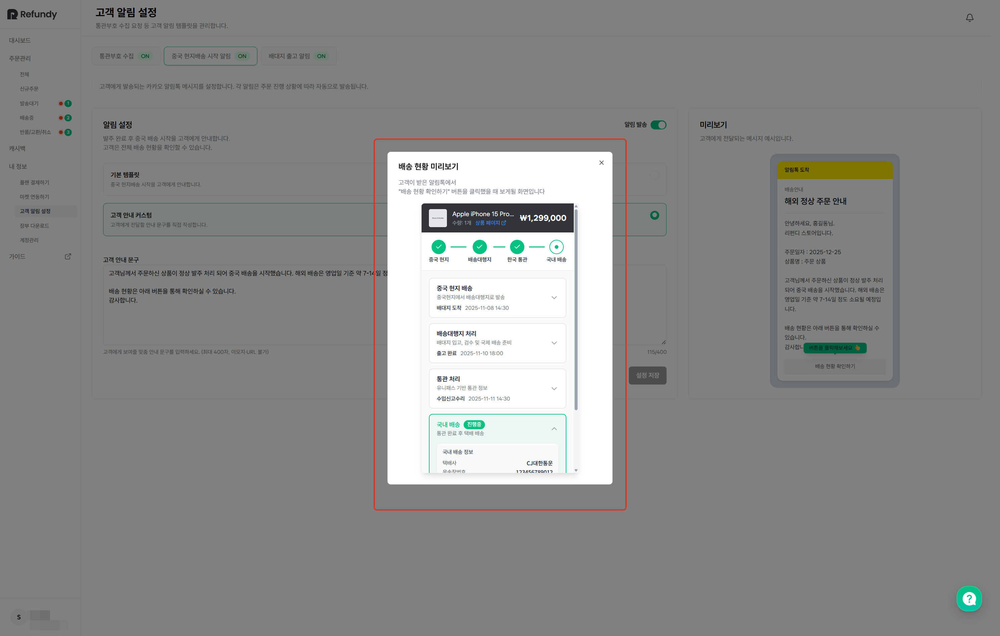
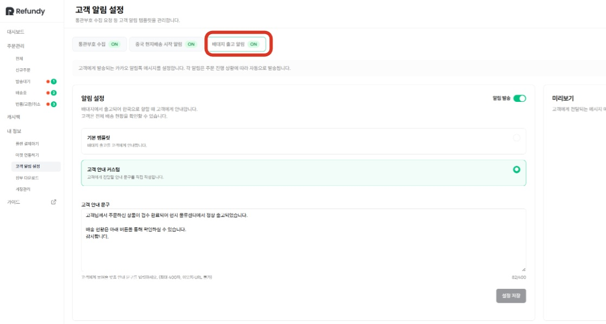
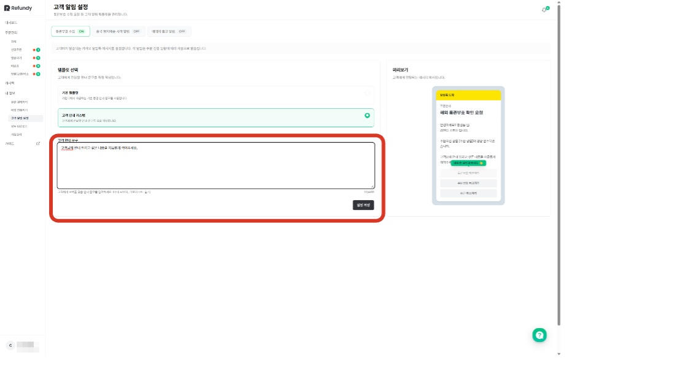
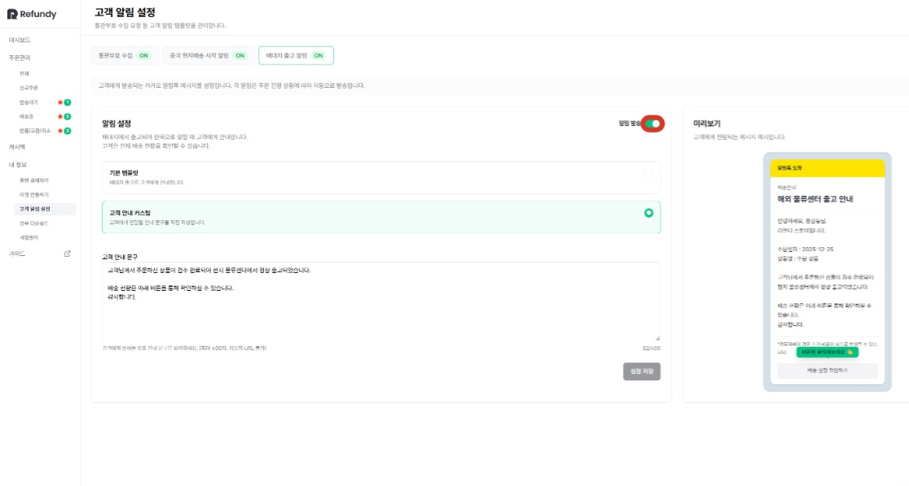
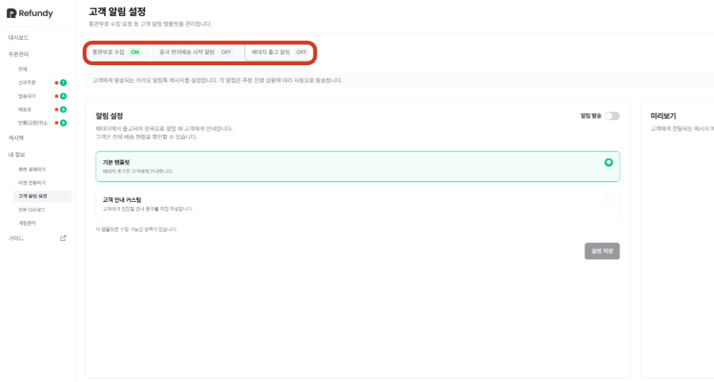

# 5. 고객 알림 설정하기

- **원본 URL**: https://docs.channel.io/oms_refundy/ko/articles/5-%EA%B3%A0%EA%B0%9D-%EC%95%8C%EB%A6%BC-%EC%84%A4%EC%A0%95%ED%95%98%EA%B8%B0-d5e24481

---

리펀디 프로그램에서는 통관부호수집, 중국 현지 배송 시작(소싱 제품 출고), 배대지 출고 시에 주문고객에게 자동으로 알려줄 수 있는 알림톡 설정 기능 이용이 가능합니다.

[고객알림설정] 메뉴에서 각 기능을 on/off 하여 자동 발송 기능을 사용하지 않을 수도 있고, 안내 메세지를 직접 수정할 수도 있습니다.

#### 알림톡 설정은 고객 알림설정 메뉴에서 활성화 및 수정이 가능합니다.

#### 1. 통관부호 수집 알림톡
- on 상태로 전환하면?발송대기 상태의 주문 중 통관부호 수집이 필요한 주문이 발견되면, 자동으로 알림톡이 발송 됩니다.

on 상태로 전환하면?
- 발송대기 상태의 주문 중 통관부호 수집이 필요한 주문이 발견되면, 자동으로 알림톡이 발송 됩니다.

발송대기 상태의 주문 중 통관부호 수집이 필요한 주문이 발견되면, 자동으로 알림톡이 발송 됩니다.

알림톡 구성 내용
- 통관부호제출 링크유효한 통관부호만 제출이 가능하도록 설정 되어 있으며, 유니패스(관세청) 홈페이지 링크를 삽입하여, 통관부호 생성/재발급을 바로 하실 수 있도록 해두었습니다.

통관부호제출 링크
- 유효한 통관부호만 제출이 가능하도록 설정 되어 있으며, 유니패스(관세청) 홈페이지 링크를 삽입하여, 통관부호 생성/재발급을 바로 하실 수 있도록 해두었습니다.

유효한 통관부호만 제출이 가능하도록 설정 되어 있으며, 유니패스(관세청) 홈페이지 링크를 삽입하여, 통관부호 생성/재발급을 바로 하실 수 있도록 해두었습니다.
- 주문상품 정보주문 고객이 주문 정보를 확인하고 정보를 제출할 수 있도록 마켓정보, 주문상품 정보를 제공합니다.

주문상품 정보
- 주문 고객이 주문 정보를 확인하고 정보를 제출할 수 있도록 마켓정보, 주문상품 정보를 제공합니다.

주문 고객이 주문 정보를 확인하고 정보를 제출할 수 있도록 마켓정보, 주문상품 정보를 제공합니다.
- 주문취소하기통관부호제출 요청으로 인한 마켓 페널티를 막기 위해, 주문고객이 취소를 하고 싶은 경우, 해당 알림톡의 주문 취소 버튼을 클릭하여 셀러님께 문자를 발송할 수 있습니다.해당 문자는 마켓 연동 시에 등록하신 CS 연락처로 수신됩니다.

주문취소하기
- 통관부호제출 요청으로 인한 마켓 페널티를 막기 위해, 주문고객이 취소를 하고 싶은 경우, 해당 알림톡의 주문 취소 버튼을 클릭하여 셀러님께 문자를 발송할 수 있습니다.

통관부호제출 요청으로 인한 마켓 페널티를 막기 위해, 주문고객이 취소를 하고 싶은 경우, 해당 알림톡의 주문 취소 버튼을 클릭하여 셀러님께 문자를 발송할 수 있습니다.
- 해당 문자는 마켓 연동 시에 등록하신 CS 연락처로 수신됩니다.

해당 문자는 마켓 연동 시에 등록하신 CS 연락처로 수신됩니다.

#### - 통관부호 제출 버튼 화면

#### 2.  중국 현지 배송 시작 알림톡
- on 상태로 전환하면?소싱 주문 결제 후, 중국 판매자가 배송을 시작하면, 주문 고객님께 알림톡이 발송됩니다.

on 상태로 전환하면?
- 소싱 주문 결제 후, 중국 판매자가 배송을 시작하면, 주문 고객님께 알림톡이 발송됩니다.

소싱 주문 결제 후, 중국 판매자가 배송을 시작하면, 주문 고객님께 알림톡이 발송됩니다.
- 알림톡 구성 내용배송현황확인하기해당 주문의 중국 배송부터 국내 배송까지의 상태를 한번에 확인할 수 있습니다.

알림톡 구성 내용
- 배송현황확인하기해당 주문의 중국 배송부터 국내 배송까지의 상태를 한번에 확인할 수 있습니다.

배송현황확인하기
- 해당 주문의 중국 배송부터 국내 배송까지의 상태를 한번에 확인할 수 있습니다.

해당 주문의 중국 배송부터 국내 배송까지의 상태를 한번에 확인할 수 있습니다.

#### - [배송 현황 확인하기] 버튼 화면

#### 3. 배대지 출고 알림톡
- on 상태로 전환하면?배대지에서 출고가 완료되면, 주문 고객님께 알림톡이 발송됩니다.

on 상태로 전환하면?
- 배대지에서 출고가 완료되면, 주문 고객님께 알림톡이 발송됩니다.

배대지에서 출고가 완료되면, 주문 고객님께 알림톡이 발송됩니다.
- 알림톡 구성 내용배송현황확인하기해당 주문의 중국 배송부터 국내 배송까지의 상태를 한번에 확인할 수 있습니다.

알림톡 구성 내용
- 배송현황확인하기해당 주문의 중국 배송부터 국내 배송까지의 상태를 한번에 확인할 수 있습니다.

배송현황확인하기
- 해당 주문의 중국 배송부터 국내 배송까지의 상태를 한번에 확인할 수 있습니다.

해당 주문의 중국 배송부터 국내 배송까지의 상태를 한번에 확인할 수 있습니다.

#### (공통)

#### a. 알림톡 문구 수정을 원하신다면, '고객안내커스텀' 버튼을 클릭하여 자유롭게 수정하실 수 있습니다.

단, 기본 템플릿으로 제공된 기능 버튼(주문취소하기 등) 의 경우, 수정이 불가합니다.

#### b. 각각의 알림톡은 알림발송 설정 on/off 하여 자유롭게 사용하실 수 있습니다.

원하시지 않으시는 알림이 있다면, 비활성화해두시면, 알림톡이 발송되지 않습니다.

통관부호 수집 알림 기능만 활성화하고, 나머지는 비활성화한 상태