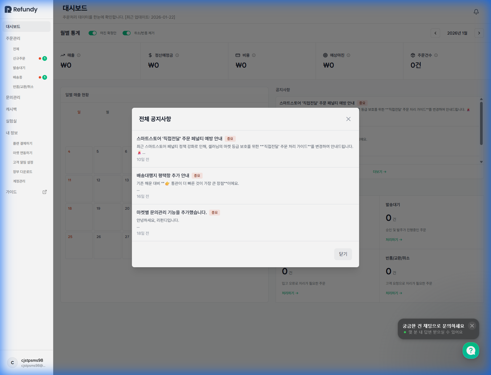
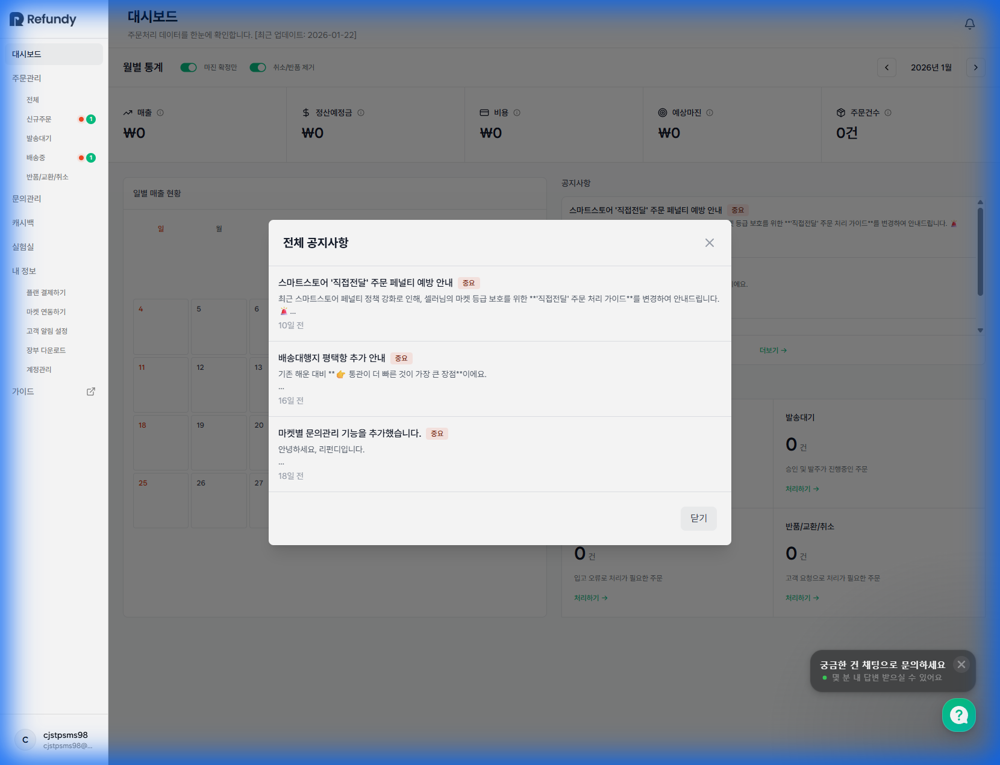

# [기획서] 1.0 대시보드 (Dashboard)

## 1. 개요 (Overview)
본 화면은 판매자가 로그인 후 가장 먼저 접하는 메인 화면으로, 현재 마켓의 매출 현황과 처리해야 할 긴급한 업무(주문, 클레임 등)를 한눈에 파악할 수 있도록 설계된 **종합 상황판**이다.

## 2. 화면 구성 (UI Layout) (Verified)
화면은 크게 상단의 **핵심 지표 영역**, 중단의 **매출 캘린더 및 공지사항**, 하단의 **업무 현황 보드**로 구성된다.

### 2.1 주요 영역 구분
1.  **Global Header**: 페이지 타이틀, 데이터 업데이트 시각, 알림 센터.
2.  **월별 통계 필터 (Top Control)**: 월 이동 네비게이터 및 데이터 보기 옵션(토글).
3.  **핵심 지표 카드 (Key Metrics)**: 5대 주요 수치(매출, 정산예정금, 비용, 수수료/마진, 주문건수).
4.  **일별 매출 현황 (Calendar Chart)**: 달력 형태의 일간 매출 리포트.
5.  **공지사항 (Notice Widget)**: 플랫폼 중요 업데이트 및 이슈 사항.
6.  **남은 작업 (Work Queue)**: 즉시 처리가 필요한 주문 단계별 건수.

---

## 3. 상세 기능 명세 (Detailed Specifications)

### A. 헤더 및 컨트롤 영역 (Header & Controls) (Verified)
*   **페이지 타이틀**: "대시보드" (H1, 좌측 상단)
*   **업데이트 정보**: "최근 업데이트: YYYY-MM-DD" (타이틀 하단, 회색 텍스트)
*   **알림 센터**: 우측 상단 '종' 아이콘.
    *   *Click Action*: 알림 팝오버(Popover) 노출. (탭 구분: '새로운 채팅', '읽은 채팅')
    *   *New Batch*: 미확인 알림 있을 경우 Red Dot 표시.

### B. 월별 통계 영역 (Monthly Stats)
데이터 조회 기준을 설정하는 영역이다.

1.  **마진 확정만 (Toggle Switch)**
    *   *Default*: OFF
    *   *Function*: ON 설정 시, '구매 확정'되어 정산이 완료된 건에 대한 매출/마진만 필터링하여 계산.
2.  **취소/반품 제거 (Toggle Switch)**
    *   *Default*: ON (기본적으로 순매출 기준)
    *   *Function*: OFF 설정 시, 취소 및 반품된 주문 건을 포함하여 전체 볼륨 표시.
3.  **월 이동 네비게이터**
    *   *UI*: `<` [ YYYY년 MM월 ] `>`
    *   *Interaction*: 좌우 화살표 클릭 시 전월/익월 데이터로 전체 대시보드 리로드(AJAX).

### C. 핵심 지표 카드 5종 (Scorecards) (Verified)
각 카드는 `아이콘 + 라벨 + 툴팁(i) + 수치`로 구성된다.

*   **매출**: 해당 월의 총 결제 금액. (단위: ￦)
*   **정산예정금**: 마켓수수료를 제외하고 입금될 예정 금액.
*   **비용**: 매입가 + 배송비 등 지출 합계.
*   **예상마진**: 정산예정금 - 비용. (수익성 지표)
*   **매출**: 해당 월의 총 결제 금액. (단위: ￦)
*   **정산예정금**: 마켓수수료를 제외하고 입금될 예정 금액.
*   **비용**: 매입가 + 배송비 등 지출 합계.
*   **예상마진**: 정산예정금 - 비용. (수익성 지표)
*   **캐시백 (New)**: AI 발주로 적립된 누적 캐시백 금액. (100% 자동 적립, 출금 가능액 표시)
*   **주문건수**: 해당 기간 발생한 총 주문 건수. (단위: 건)

### D. 일별 매출 현황 (Daily Sales Calendar)
*   **Type**: Monthly Calendar View (7열: 일~토)
*   **Cell Data**:
    *   날짜 (우측 상단)
    *   매출액 (중앙, 숫자로 표시)
    *   *Visual Guide*: 매출 규모에 따라 배경색 농도 차등 적용 (Heatmap 방식) 혹은 텍스트 컬러 강조.

### E. 공지사항 위젯 (Announcements)
*   **List Item**: `[배지: 중요/일반]` `제목(말줄임)` `작성일(N일 전)`
*   **더보기 링크**: 우측 하단 "더보기 →" 클릭 시 **전체 공지사항 모달(Modal)** 호출.
    *   *Modal UI*: 리스트 형태, 스크롤 페이징 지원.

### F. 남은 작업 (Pending Tasks) (Verified)
사용자가 처리해야 할 업무를 프로세스 단계별로 보여준다. 클릭 시 해당 메뉴로 즉시 이동한다(Deep Link).

| 카드 명칭 | 설명 | 이동 경로(Target URL) |
| :--- | :--- | :--- |
| **신규주문** | 새로 들어온 주문 확인 및 발주 필요 | `/orders/new` (신규주문 페이지) |
| **발송대기** | 운송장 입력 대기 중인 주문 | `/orders/waiting` (발송대기 페이지) |
| **오류입고** | 배송대행지 등에서 입고 오류 처리된 건 | `/orders/shipping` (배송중 메뉴와 통합) |
| **반품/교환/취소** | 고객 클레임 접수 건 | `/orders/claims` |

*   *각 카드 하단*: "처리하기 →" 텍스트 링크 버튼 제공.
*   *Zero Case*: 건수가 0일 경우 "0 건"으로 표시하되, 활성화(Color) 상태는 유지.

---

## 4. 데이터 로직 (Data Logic)
1.  **초기 로딩**: 접속 시점의 '현재 월(Current Month)' 데이터를 기본으로 호출.
2.  **캐싱**: 월 변경 시 이전에 조회했던 월 데이터는 클라이언트 캐싱 권장 (UX 속도 향상).
3.  **동기화**: '남은 작업'의 카운트는 실시간성(Real-time)이 중요하므로, 대시보드 진입 시마다 최신 상태를 조회해야 함.

## 5. 예외 처리 (Exception Handling)
*   **데이터 로드 실패**: 각 카드 및 차트 영역에 스켈레톤(Skeleton) UI 노출 후, 실패 시 "데이터를 불러오지 못했습니다" 토스트 메시지 출력.
*   **서비스 점검**: 서버 점검 중일 경우 대시보드 전체를 덮는 Full-screen 안내 페이지 노출.
