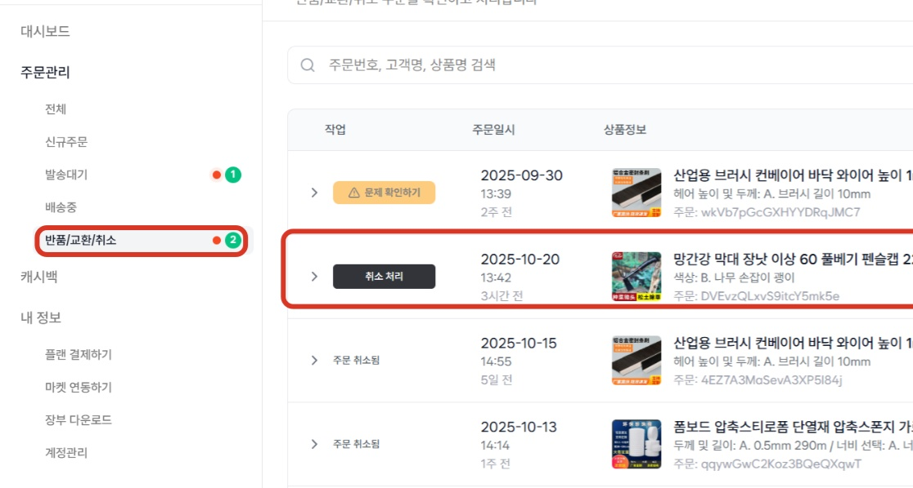
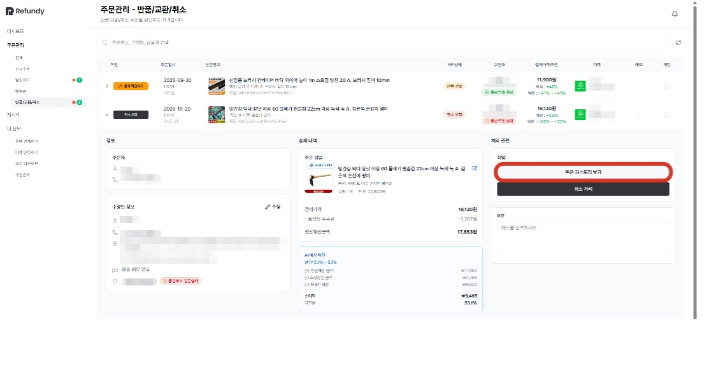
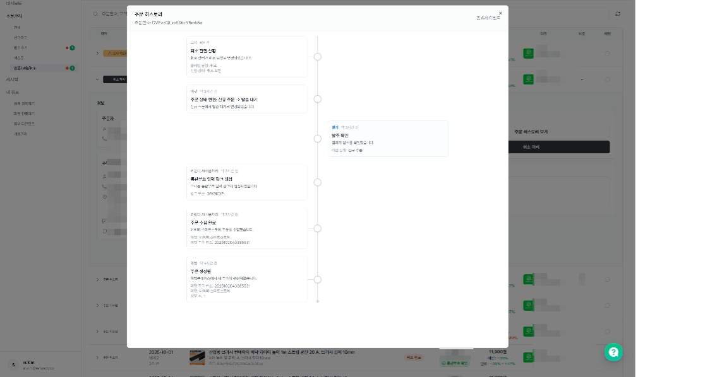
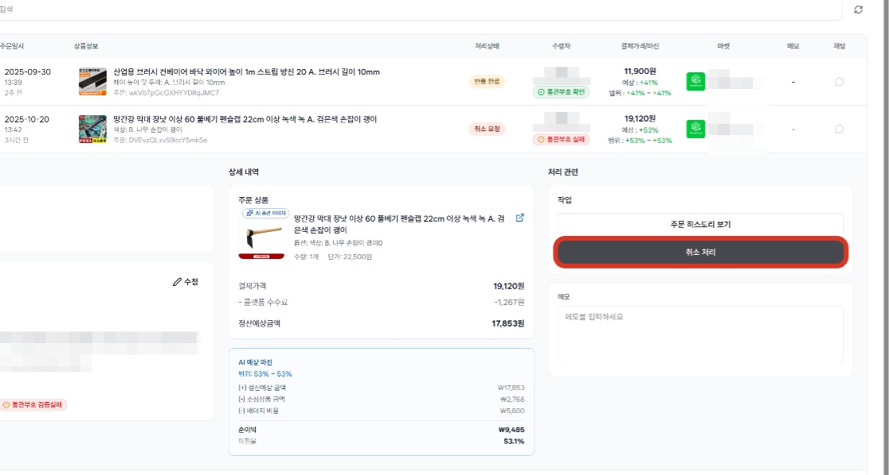
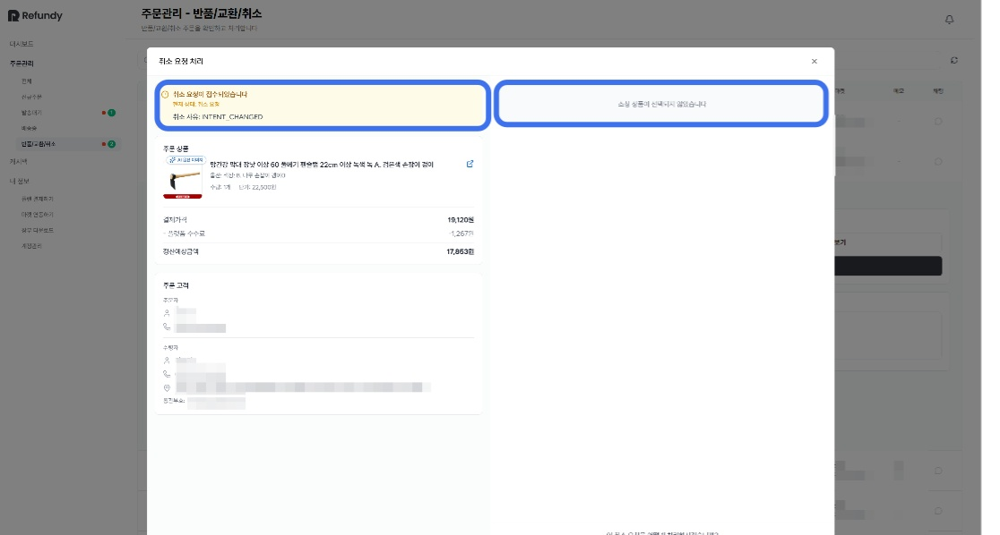
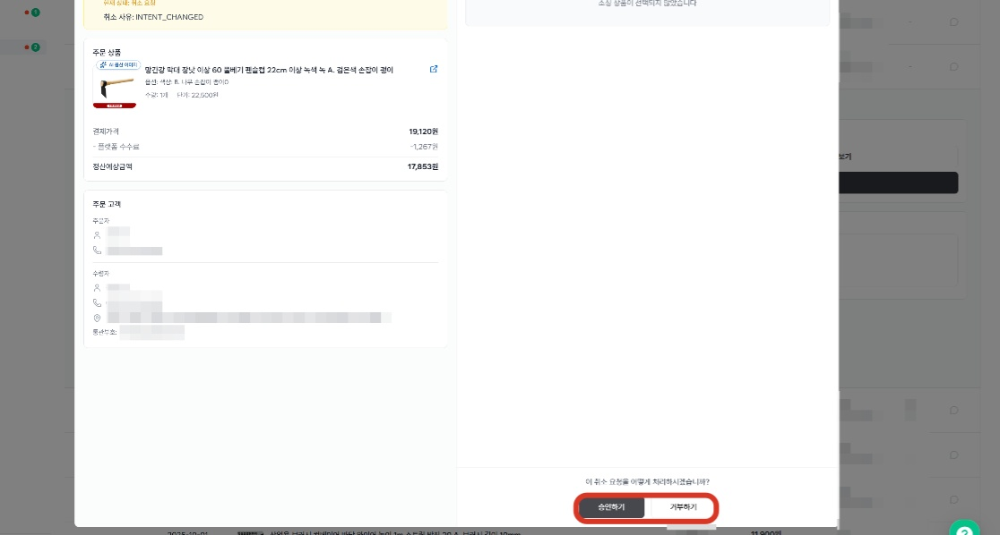
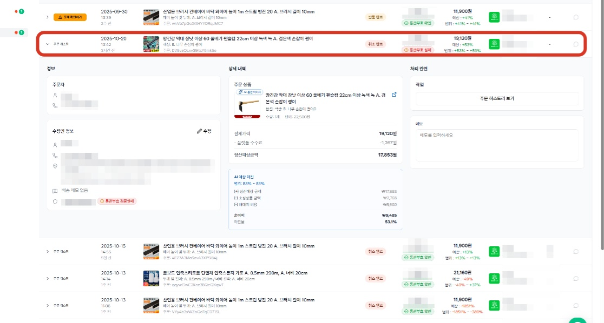
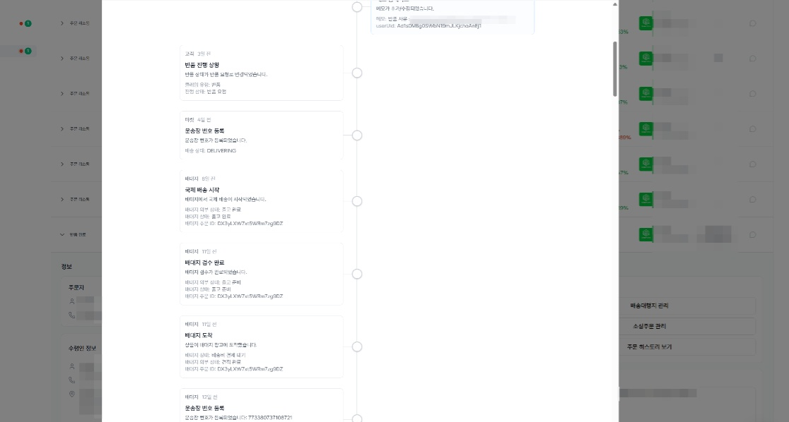
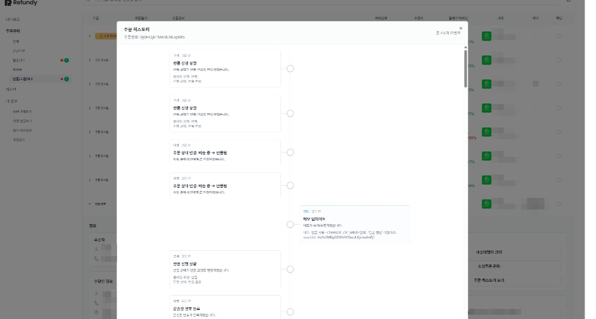

4. 주문 취소 요청 처리하기
고객의 반품, 교환, 취소 요청이 들어오면, 진행 중인 주문내역은 모두 [반품/교환/취소] 상태로 업데이트 됩니다.

리펀디 AI 주문처리에서 고객의 주문 취소(환불) 요청을 확인하고, 처리할 수 있으며, 취소 작업 후 내용은 자동으로 오픈마켓 시스템에 업데이트 됩니다.

1. 고객의 반품/교환/취소 요청이 들어오면 진행 중인 주문내역은 모두 반품/교환/취소 상태로 업데이트 됩니다.
round_pushpin
고객의 환불/취소 요청이 들어오는 경우, [취소처리]라는 버튼이 작업상태에 활성화됩니다.

[취소처리] 버튼을 통해 셀러님은 취소 승인 or 취소 거부를 할 수 있습니다.

2. 취소 검토를 위해 현재 주문의 진행상황을 살펴보기 원하신다면 [주문히스토리 보기]를 통해 한번에 확인 하실 수 있습니다.

*주문 히스토리 예시
round_pushpin
제품 발주가 완료 된 이후 소비자가 취소를 요청하는 경우라면, 주문 상태 확인이 반드시 필요합니다.

배대지 도착 여부 : 중국내 반품 배송 비용 필요

배대지 출고 이후 : 제품 소싱 비용 회수가 어려움

4. 모든 검토가 끝나, 고객의 요청에 대해 작업이 필요하다면 [취소처리] 버튼을 클릭합니다.

5. 취소 검토에 필요한 고객의 취소 사유와 소싱 주문내역에 대한 정보를 확인할 수 있습니다.

6. 취소 검토 후 원하는 처리 방식을 선택해주세요.

7. 취소 작업이 완료 되면, [취소처리] 버튼이 사라집니다.

*주문히스토리 예시1

*주문히스토리 예시2
