2. 마켓(스토어) 연동_공통
스토어 연동을 하시면 신규주문을 수집하는 것부터 주문처리 절차가 가능해집니다

5대 마켓(쿠팡, 스마트 스토어, ESM, 11번가) 연동을 지원하고 있으며,

아래 매뉴얼을 보고 따라서 연동을 시작해 주세요!

1. 주문팡팡 AI 주문처리 내 좌측 패널 [스토어] 클릭
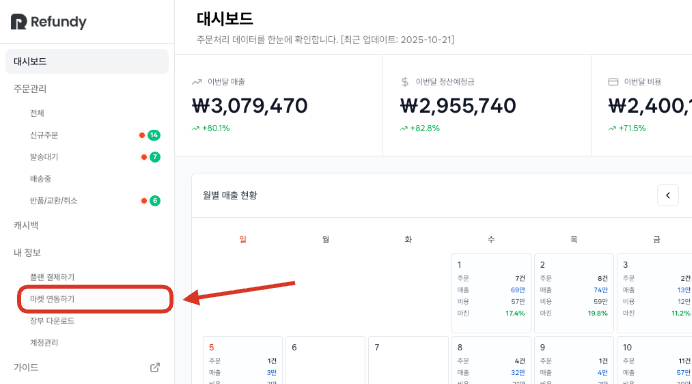

2. 우측 상단 [스토어 추가] 클릭
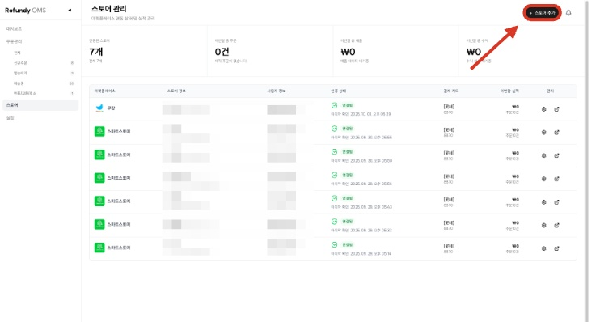

3. [마켓플레이스] 선택
round_pushpin
5대 마켓(쿠팡, 스마트 스토어, ESM, 11번가) 중 등록할 마켓을 선택하면 됩니다.
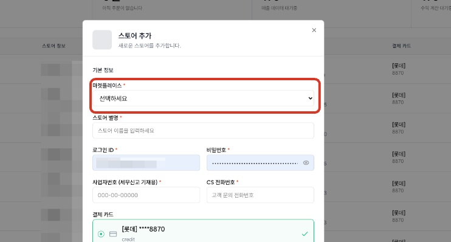

4. [스토어 별명] 입력
round_pushpin
bulb스토어 별명은 마켓 이름이나 임의로 기억하기 쉽게 지정해 주세요.

신규 주문이 들어오면 스토어 별명이 함께 표기되어 구별이 쉽습니다blush
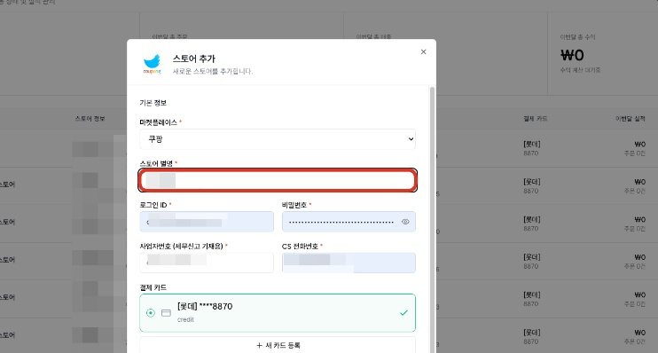

5. [로그인 ID/PW]
round_pushpin
 해당 스토어 로그인 아이디와 비밀번호를 입력해 주세요.

이 부분은 연동에 영향을 주지 않으며 마켓 관리용으로 이용해 보세요!
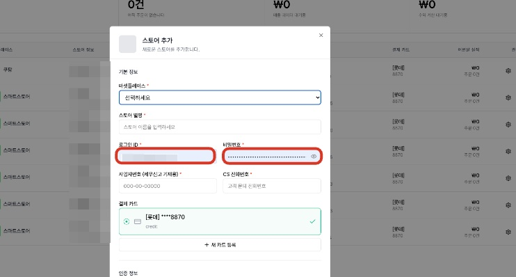

6. [사업자번호],[CS 전화번호] 입력
round_pushpin
bulb 해당 마켓 사업자 번호와 CS 전화번호를 입력해 주세요.
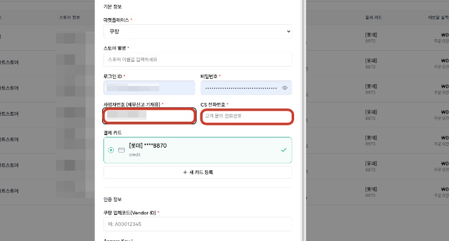

7. [새 카드 등록]을 눌러 카드정보 등록
round_pushpin
주문팡팡 AI 주문처리는 타오바오 결제를 지원하고 있습니다.

상품을 결제하실 사업용 카드 또는 개인 카드 정보를 입력해 주세요.

해당 마켓에 등록된 카드 정보로 결제됩니다. 따라서 사업자별 카드를 개별 등록하시면 관리하기가 쉽습니다
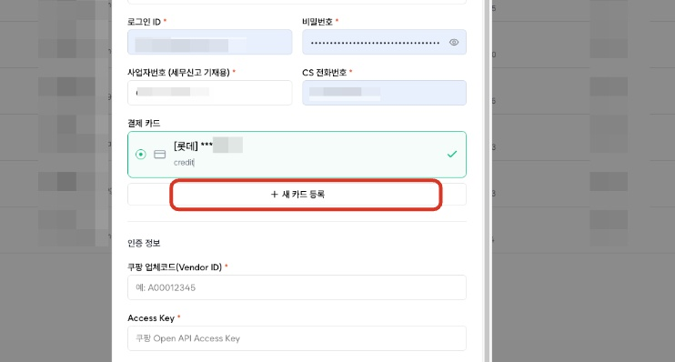

8. 마켓별 [인증 정보] 입력
round_pushpin
스토어 기본 정보를 입력했다면 인증 정보를 작성해야 합니다. 5대 마켓별 작성해야 할 인증 정보는 각각 다르기 때문에, 해당 내용은 스토어 매뉴얼에서 더 자세히 확인 가능합니다 smile
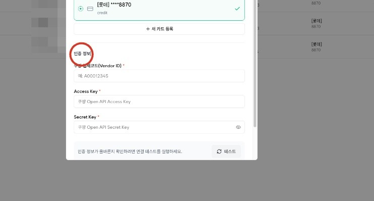

9. [테스트] 클릭
round_pushpin
마켓 인증 정보를 입력하셨다면 [테스트] 버튼을 눌러 잘 연동이 되는지 확인합니다.
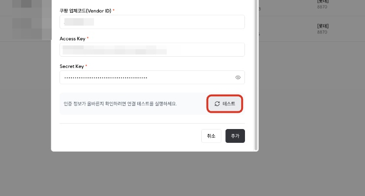

round_pushpin
인증 정보가 유효하다면 [성공] 알림이 나옵니다.
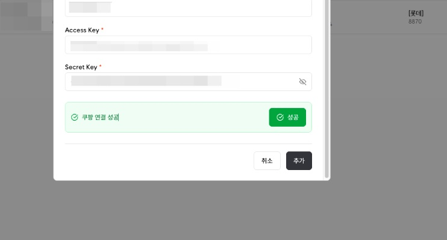

10. [추가] 클릭
bulb 마지막으로 [추가]버튼 까지 눌러 마무리합니다.
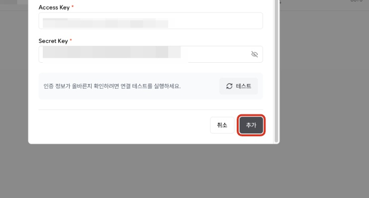
