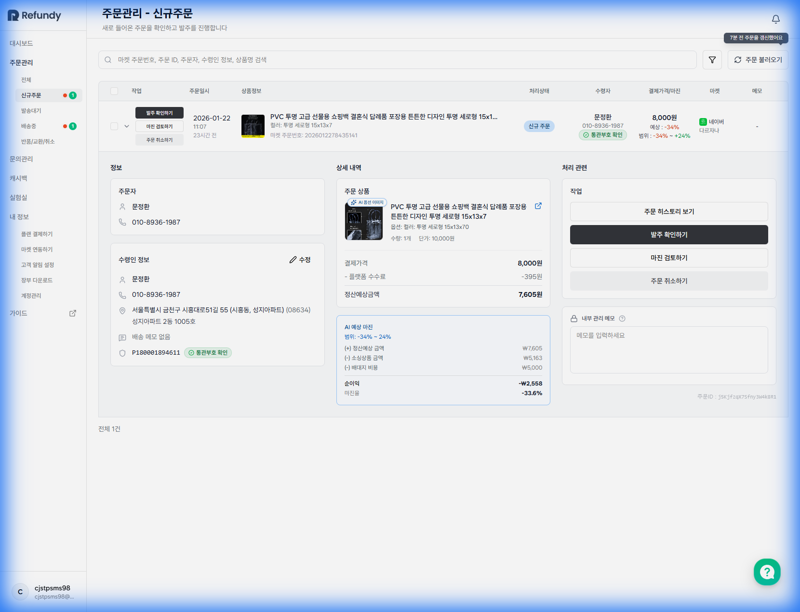
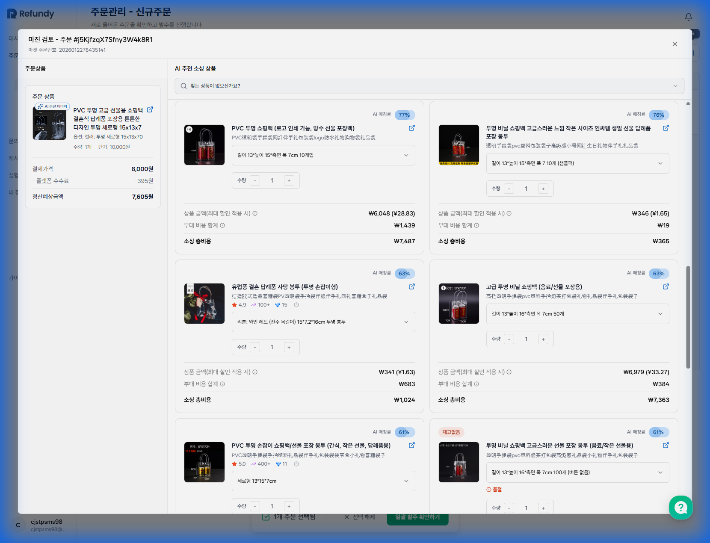
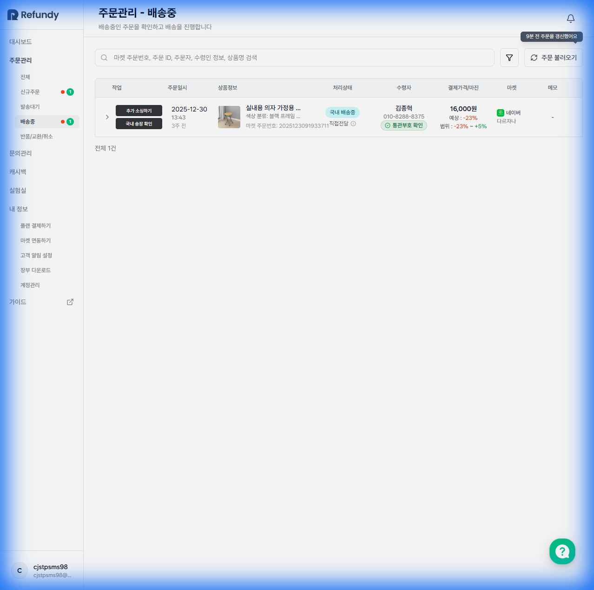
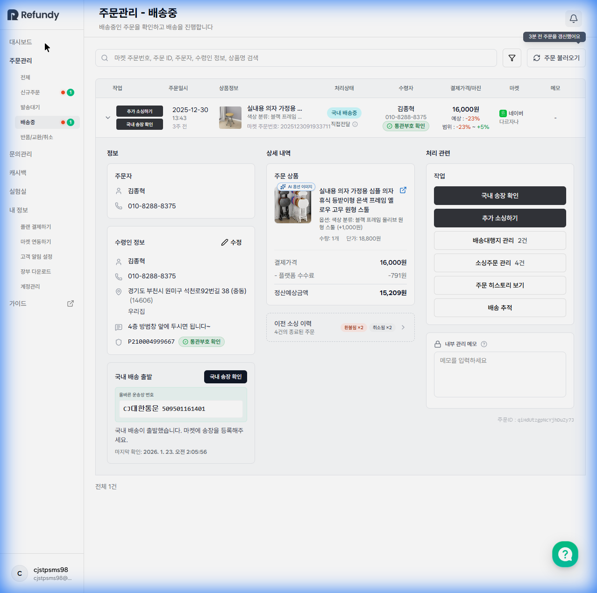

# [기획서] 4.0 주문관리 (Order Management)

## 1. 개요
주문팡팡(Jumunpangpang) 서비스의 핵심 기능으로, 여러 마켓에서 발생한 주문을 수집하여 [발주 확인 -> 송장 입력 -> 배송 추적 -> 클레임]에 이르는 전체 물류 프로세스를 통합 관리하는 시스템이다.

## 2. 정보 구조 (IA)
주문 프로세스 단계에 따라 서브 메뉴로 구성된다.
- **전체 (All)**: 모든 상태의 주문 통합 조회 및 검색. (URL: `/orders/all`)
- **신규주문 (New)**: 마켓에서 수집된 미확인(신규) 주문 관리. (URL: `/orders/new`)
- **발송대기 (Pending)**: 발주 확인 후 송장 입력 대기 중인 주문.
- **배송중 (Shipping)**: 송장 입력 완료 및 배송이 시작된 주문.
- **반품/교환/취소 (Claims)**: 고객 클레임이 발생한 예외 주문 관리.
- **오류입고 (Inbound Error)**: 물류센터 입고 오류 등 예외 주문 관리.

---

## 3. 공통 UI/UX 명세

### 3.1 검색 및 필터 (Search & Filter)
- **통합 검색바**:
    - 검색 대상: 주문번호(마켓), 주문 ID, 주문자, 수령인 정보(성함/연락처), 상품명.
    - Placeholder: "마켓 주문번호, 주문 ID, 주문자, 수령인 정보, 상품명 검색"
- **상태 필터 (Status Filter)**:
    - UI: `상태 필터` 버튼 클릭 시 검색 가능한 드롭다운 팝오버 노출.
    - 옵션: 총 27개 상태 (신규 주문, 통관부호 수집중, 결제 완료, 발주 확인, 현지 배송중, 배대지 입고, 출고 대기, 출고 완료, 국내 입항, 통관중, 통관 완료, 국내 배송 시작, 배송 완료, 주문 취소, 반품 요청 등).
    - 정책: 최대 10개까지 다중 선택 가능.
- **주문 불러오기 (Sync)**:
    - 위치: 우측 상단 Primary 버튼.
    - 기능: 연동된 모든 마켓의 최신 주문 데이터를 수집.
    - 정보: 버튼 좌측에 "마지막 업데이트: [N분/시간 전]" 표시.

### 3.2 데이터 테이블 (Data Grid)
주문 리스트를 표현하는 공통 테이블 구조이다.

| 컬럼명 | 상세 데이터 | 비고 |
| :--- | :--- | :--- |
| **작업** | [발주 확인하기], [마진 검토하기], [주문 취소하기] 버튼 | 액션 컬럼 |
| **주문일시** | `YYYY-MM-DD HH:mm` (하단에 `N시간 전` 등 상대 시간 병기) | - |
| **상품정보** | [썸네일] [상품명] [옵션명] [마켓주문번호] | 핵심 정보 |
| **처리상태** | 상태 배지 (예: `신규 주문`, `국내 입항`) | 세부 상태 병기 (예: 직접전달) |
| **수령자** | [성함] [연락처] [통관부호 확인 버튼] | - |
| **결제가격/마진** | 판매가(KRW) / 예상마진율(%) / 마진범위(%) | 수익성 지표 |
| **마켓** | [마켓 아이콘] [스토어명] | - |
| **메모** | 관리자 메모 아이콘 (미작성 시 공백) | - |

#### 3.2.1 상세 정보 확장 (Expand Row)
작업 열의 `v` (Chevron) 버튼 클릭 시 호출되는 상세 레이아웃.

**A. 정보 (Information)**:
*   **주문자**: 성함, 연락처
*   **수령인 정보**:
    *   항목: 성함, 연락처, 주소(우편번호 포함), 장소명(예: 우리집), 배송 메시지
    *   **PCCC (개인통관고유부호)**: 번호 필드 + `통관부호 확인` 배지
    *   **액션**: `수정` (연필 아이콘 버튼 - 수령인/주소/통관번호 즉시 편집 가능)

**B. 상세 내역 (Detailed Breakdown)**:
*   **주문 상품**: 
    *   상품 썸네일 (AI 옵션 이미지 배지 포함)
    *   상품명 + 원문 바로가기 버튼 (↗ 아이콘)
    *   옵션 정보(가격 변동 포함), 수량, 단가
*   **비용 상세**: 
    *   `결제가격`: 고객 실 결제 금액
    *   `- 플랫폼 수수료`: 마켓 수수료
    *   `= 정산예상금액`: 수수료 제외 최종 정산 예정액
*   **이전 소싱 이력**: 
    *   요약: "X건의 종료된 주문" (상태 배지: `환불됨`, `취소됨`)
    *   아코디언 확장 시: 과거 소싱 시도 차수별(#4, #3 등) 상품명, 매칭률, 비용 구성, 마진 분석 상세 노출

**C. 처리 관련 (Workflow & Memo)**:
*   **워크플로우 버튼군**: 주문 상태에 따라 후속 처리를 위한 버튼이 제공됨 (페이지별로 다를 수 있음).
    - 신규주문: `추가 소싱하기`, `배송대행지 관리`, `소싱주문 관리`, `주문 히스토리 보기` 등
    - 배송중: `국내 송장 확인`, `추가 소싱하기`, `배송대행지 관리`, `소싱주문 관리`, `주문 히스토리 보기`, `배송 추적` 등 (최대 6개)
    - *세부 버튼 구성은 각 페이지별 상세 기획 참조*
*   **내부 관리 메모**: 
    *   라벨: "내부 관리 메모" (ⓘ 정보 툴팁 포함)
    *   입력창: "메모를 입력하세요" 텍스트 영역
    *   액션: `저장` 버튼 (포커스 아웃 시 자동 저장 처리)
*   **주문 메타데이터**: `주문ID` (시스템 고유 식별자)

### 3.3 핵심 워크플로우 액션 (Workflow Actions Detail)
각 워크플로우 버튼 클릭 시 호출되는 상세 모달/인터페이스 기획.

#### 3.3.1 추가 소싱하기 (Add Sourcing Modal)
타오바오/티몰 상품 매칭을 위한 2단계 프로세스 모달.
*   **좌측 (주문 상품)**: 썸네일(AI 옵션 이미지), 상품명(마켓 링크 ↗), 옵션 정보, 수량/단가, 결제 정보(결제가격, 수수료, 정산예상금액), 고객 요청사항.
*   **우측 (AI 추천)**: 직접 찾기(URL 입력), 추천 카드 리스트(AI 매칭률, 원문링크 ↗, 옵션 선택기, 수량 조절, 실시간 소싱 총비용 계산).

#### 3.3.2 배송대행지 관리 (Warehouse Management Modal)
*   **탭 구성**: 배대지 주문번호/상태별 탭 (예: `584997 출고 완료`).
*   **비용 상세**: 적용무게, 합계(배송비용, 부가서비스 개별 내역, 추천포장, **결제수수료**).
*   **검수 사진**: 사진 개수 표기, 입고 일시, 썸네일 그리드 (확대/다운로드 가능).
*   **상세 설정 (아코디언)**:
    - `배송 방법`: 항공(AI 추천), 해운(인천/평택) 라디오.
    - `통관 정보`: 상품금액/배송비(CNY), **HS Code**(필수), 통관 방식(목록/간이).
    - `부가 서비스`: 검수(정밀/작동), 포장(추천/에어캡/에어스틱/모서리 보호), 기타(콘센트/원산지/**관부가세 대납**).
*   **상담 & 클레임**: 배대지 채팅 이력, **`반품신청서 작성`**, `포장 보완 요청`, `부가서비스 요청` 버튼.

#### 3.3.3 소싱주문 관리 (Sourcing Management Modal)
*   **탭 구성**: 소싱 시도 차수별 탭 (#1, #2, #3, #4).
*   **상세 정보**: 매칭률, 상품가, 현지 배송비, 환전 수수료, 정산액 기반 마진 분석(순이익/마진율).
*   **셀러 채팅**: 중국 판매자 상담 내역 (중문 원문 + **국문 자동 번역**), `재발송 요청`, `환불 요청` 버튼.

#### 3.3.4 주문 히스토리 보기 (Order History Modal)
*   **요약**: "총 N개 이벤트" 카운트.
*   **타임라인**:
    - **범주**: `배대지`, `셀러`, `주문팡팡 AI주문처리`, `시스템`.
    - **이벤트**: `국제 배송 시작`, `검수 완료`, `결제 완료`, `오류 입고 무시`, `송장 등록`, `소싱 환불` 등.
    - **상세 내역 카드**: 내부에 `PerformedBy`, `AmountKRW`, `소싱 주문 ID`, `환불 사유` 등 로우 데이터 속성 표시.

#### 3.3.5 배송 추적 (Tracking Modal)
*   **상단 액션**: **`배송 추적 화면 공유`** 버튼 (고객용 외부 트래킹 페이지 링크).
*   **4단계 트래킹 섹션**:
    1. `중국 현지 배송`: 현지 택배사, 송장, 타임라인(집화~배대지 도착), `자세히 보기` 확장.
    2. `배송대행지 처리`: **5단계 프로그레스**(입고대기 -> 입고중 -> 견적완료 -> 출고준비 -> 출고완료) 및 단계별 시각 보존.
    3. `통관 처리`: **유니패스 연동**, 통관 상태 배지, 국내 입항 정보.
    4. `국내 배송`: 국내 택배사, 운송장, 국내 배송 흐름 전수 표시.

---

### 3.4 데이터 테이블 작업(Action) 컬럼 버튼 정의 (Standardized Actions)
각 주문 상태(페이지)별로 [작업] 컬럼에 노출되는 버튼의 표준 정의이다.

| 상태 (페이지) | 버튼 구성 (UI 타입) | 기능 (Action) | 비고 |
| :--- | :--- | :--- | :--- |
| **신규 주문** (New) | **[송장]** (Outline Button) | 송장/발주 정보 입력 모달 오픈 | 라벨: '송장' |
| | **[마진]** (Blue Outline Button) | 마진 검토 및 소싱 모달 오픈 | 라벨: '마진' |
| | **[취소]** (Red Ghost Button) | 주문 취소 모달 오픈 | 라벨: '취소' |
| **발송 대기** (Pending) | **[작업필요]** (Orange Outline + Alert Icon) | 가송장 등록/수정 모달 오픈 | 스마트스토어, 11번가 등 수동 송장 처리 필요 시 |
| | *[자동 동기화됨]* (Secondary Badge) | - | 쿠팡, ESM 등 API 자동 처리 시 |
| **배송중** (Shipping) | **[추가소싱]** (Outline Button) | 추가 소싱 모달 오픈 | 소싱처 추가 발굴 시 |
| | **[송장확인]** (Blue Fill + Truck Icon) | 국내 배송 조회 모달 오픈 | 상태가 `국내 배송중`일 때만 노출 |
| **클레임** (Claims) | - (없음) | - | 상세 보기 및 히스토리에서 처리 |

---

## 4. 페이지별 상세 기획

### 4.1 신규주문 (New Orders)
마켓에서 수집되었으나 아직 판매자가 확인하지 않은 주문이다.

- **화면 특성**:
    - **체크박스**: 목록 좌측에 일괄 선택을 위한 체크박스 제공.
    - **하단 플로팅 바**: 주문 선택 시 노출. "N개 주문 선택됨" 텍스트, `선택 해제`, `일괄 발주 확인하기` 버튼 포함.
        - **동작**: `일괄 발주 확인하기` 클릭 시 선택된 모든 주문의 상태가 `발송대기`로 변경됨.
- **상세 확장 (Verified)**:
    - **주문자 정보**: 성함, 연락처 (수정 불가).
    - **수령인 정보**: 성함, 연락처, 주소, 배송메모, 통관고유부호(PCCC) 표시 및 `수정` 가능.
        - **수정 모드**: `수정` 버튼 클릭 시 인라인 편집 모드로 전환.
            - 입력 필드: 이름, 연락처, 우편번호, 기본주소, 상세주소, 배송 메모, 통관고유부호
            - 버튼: `확인`, `취소`
    - **상세 내역**: AI 옵션 이미지 배지, 단가, 수량, 상품명 우측 외부 링크 아이콘(↗) 포함.
    - **결제 금액 내역**: 결제가격 - 플랫폼 수수료 = 정산예상 금액 상세 계산.
    - **AI 예상 마진**: (정산예상 금액) - (소싱상품 금액) - (배대지 비용) = 순이익 및 마진율 분석.
    - **내부 관리 메모**: 자유 입력 가능한 Textarea 제공.
- **주요 액션**:
    - **통관부호 수집 및 검증 (New)**
        - **UI 표시**:
            - 미수집 상태: 붉은색 텍스트 **'통관부호 확인 필요'** 표시 및 **[통관부호 확인]** 파란색 버튼 활성화.
            - 수집 완료: 정상적인 검정색 텍스트로 표시.
        - **자동화 로직**:
            - 발송대기 상태 진입 시 알림톡 자동 발송.
            - 미입력 시 **최대 3회**까지 자동 리마인드 알림 발송 (스케줄러 구현).
    - **발주 확인**: 개별 또는 일괄 처리 시 상태가 `발송대기`로 변경됨.
    - **마진 검토 (Verified)**: 소싱 상품과 마진을 재확인하는 모달 인터페이스.
        
        
        
        - **좌측 (주문상품)**: 썸네일, 상품명, 옵션, 수량/단가, 결제가격, 플랫폼 수수료, 정산예상금액 표시.
        - **우측 (AI 추천 소싱 상품)**: 
            - **헤더**: "모두 보기" 링크 (AI 추천 상품 리스트 보기)
            - **상품 카드**: 써네일, AI 매칭률(%), 번역 상품명, 원문보기 링크(↗)
            - **옵션 선택기**: 드롭다운으로 상품 옵션 선택 ("1개의 선택, 1개의 핵심 속성" 등)
            - **수량 조절**: `-`, `+` 버튼으로 수량 조정
            - **비용 브레이크다운**: 상품 금액(KRW/CNY), 부대 비용 합계, 소싱 총비용 표시
            - **정책**: 품절 상품은 '재고없음/품절' 배지 노출
        - **하단 영역**: "이 상품으로 소싱하겠습니까?" 텍스트 + `소싱 진행` 버튼
    - **주문 취소 (Verified)**: 마켓 연동 자동 취소 기능 제공.
        - **모달 UI 구성**:
            - **헤더 및 주문 정보** (회색 박스):
                - 주문번호 (주문팡팡 내부 주문 ID)
                - 마켓 주문번호 (네이버, 쿠팡 등 해당 마켓의 주문번호)
                - 상품명 (취소 대상 상품 전체 명칭)
            - **취소 사유 (필수 *)**: 드롭다운 선택
                - 선택해주세요 (기본값)
                - 구매 의사 취소
                - 색상 및 사이즈 변경
                - 다른 상품 잘못 주문
                - 서비스 불만족
                - 배송 지연
                - 상품 품절
                - 상품 정보 상이
            - **상세 사유 (선택)**: Textarea
                - 플레이스홀더: "추가로 전달하실 내용이 있다면 입력해주세요"
            - **경고 문구** (노란색 강조 박스):
                - "주문 취소 요청 후에는 되돌릴 수 없습니다. 신중하게 결정해주세요."
            - **하단 버튼**:
                - `닫기`: 모달 닫기
                - `주문 취소하기`: 취소 처리 실행 (마켓에 자동 취소 요청 전달)

### 4.2 발송대기 (Pending Shipment)
발주 확인 처리는 했으나 송장이 입력되지 않은 상태이다.
- **특화 기능 (Verified)**:
    - **[중요] 마켓별 송장 처리 제약 사항 (Implementation)**:
        - 시스템 자동화 예외 처리를 위해 아래 규칙을 필수로 반영해야 함.
        | 마켓명 | 가송장 -> 실송장 업데이트 | 비고 |
        | :--- | :--- | :--- |
        | **쿠팡/ESM** | **자동 업데이트됨** | 별도 작업 불필요 |
        | **스마트스토어** | **❌ 자동 불가 (수동)** | '작업필요' 알림 띄우고 사용자가 직접 수정 유도 필요 |
        | **11번가** | **❌ 자동 불가 (수동)** | 가송장 입력 시 택배가 아닌 **'직접전달'** 모드로 설정 필수 |
    - **가송장 필터 (Toggle)**: "가송장만 보기" 스위치 제공. 임시 송장 번호가 부여된 주문만 별도로 필터링 가능.
- **주요 인터랙션**:
    - **송장 입력**: (미확인: 주문 데이터 부재로 개별/대량 입력 UI 직접 확인 불가).
- **Empty State**: "발송 대기 중인 주문이 없습니다. 상품 확인이 완료된 주문이 여기에 표시됩니다."

### 4.3 배송중 (Shipping)
송장이 입력되어 배송이 시작된 주문이다. 배송 전 과정을 통합적으로 관리할 수 있는 풍부한 기능을 제공한다.

#### 4.3.1 목록 화면 (List View)
- **화면 특성**:
    - **벌크 액션 미지원**: 목록 좌측에 체크박스가 없어 일괄 처리가 불가능함.
    - **상태 필터**: 깔때기 아이콘 클릭 시 11개의 세부 배송 상태 다중 선택 가능.
        - `현지 발송 대기중`, `현지 배송중`, `입고 대기`, `입고중`
        - `견적 완료`, `배송비 결제 완료`, `출고 준비`, `출고 완료`
        - `국내 입항`, `국내 배송중`, `알 수 없는 상태`
- **목록 액션 버튼 (테이블 행별)**:
    - **추가 소싱하기**: 동일 주문에 대해 새로운 소싱처를 발굴할 수 있는 버튼. 즉시 "추가 소싱하기 모달"로 진입.
    - **국내 송장 확인**: 국내 배송 단계에 진입한 주문에서 활성화. 국내 택배사와 운송장 번호를 즉시 확인 가능.

#### 4.3.2 주문 상세 확장 (Expanded Detail View)
목록의 행을 클릭하면 하단에 3개 섹션으로 구성된 상세 정보가 노출된다.

##### A. 정보 (Information Section)
*   **주문자 정보**: 성함, 연락처 (수정 불가).
*   **수령인 정보**:
    - 성함, 연락처, 주소(우편번호, 경기도 부천시 등 상세 주소 포함).
    - **배송 메시지**: "4층 방범창 앞에 두시면 됩니다~" 등 고객 요청사항 표시.
    - **개인통관고유부호 (PCCC)**: 번호 필드(`P210004999667` 등) + `통관부호 확인` 배지.
    - **액션**: `수정` 버튼 (연필 아이콘) - 클릭 시 수령인 정보 즉시 편집 가능.
*   **국내 배송 출발**:
    - **택배사**: CJ대한통운, 롯데택배 등.
    - **운송장 번호**: `509501161401` 등.
    - **마지막 업데이트**: 마켓 송장 등록 시간 표시 (예: `2026-1-23 오전 2:05:56`).
    - **액션**: `국내 송장 확인` 버튼 - 클릭 시 실시간 택배 조회 API 연동 결과 표시.

##### B. 상세 내역 (Detailed Breakdown Section)
*   **주문 상품**:
    - **상품 썸네일**: AI 옵션 이미지 배지(`AI 옵션 이미지`) 포함.
    - **상품명**: "삼성볼트 칼라 자작 가공보 스툴 타원형 원형 와이드 사각 ~" 등.
    - **원문 바로가기**: 마켓 상품 상세 페이지로 연결되는 외부 링크 아이콘(↗).
    - **옵션 정보**: "블랙 프레임 올리브 원형 스툰(+1,000원)"과 같이 옵션명과 가격 변동 표시.
    - **수량 및 단가**: 수량 1개, 단가 18,800원 등.
*   **비용 상세**:
    - `결제가격`: 고객 실 결제 금액 (예: 16,000원).
    - `- 플랫폼 수수료`: 네이버 등 마켓 수수료 (예: -791원).
    - `= 정산예상금액`: 수수료 제외 최종 정산 예정액 (예: 15,209원).
*   **이전 소싱 이력 (Accordion)**:
    - **요약**: "4건의 종료된 주문" + 상태 배지 집계 (`환불됨` 2건, `취소됨` 2건 등).
    - **아코디언 확장 시**: 과거 소싱 시도 차수별로 다음 정보 표시.
        - **소싱 번호**: `#4`, `#3`, `#2`, `#1` 등 역순 정렬.
        - **소싱 상품**: 썸네일, 상품명(`감이의 원목 스툴 소파 스툴 ~`), AI 매칭률(`90%` 등), 원문 보기 링크(↗).
        - **옵션 정보**: 소싱 당시 선택한 상세 옵션 (예: "원목 컬러 스툴 블랙 프레임 원형").
        - **소싱 총비용**: 상품가(W54,521 / ¥292), 배대지 이용료(¥0), 환전 수수료(¥0).
        - **상태**: `환불됨`, `취소됨` 등 최종 처리 상태 배지.

##### C. 처리 관련 (Workflow & Memo Section)
*   **워크플로우 버튼군** (우측 사이드바 형태, 6개 버튼):
    1.  `국내 송장 확인`: 국내 배송 시작 후 활성화. 실시간 배송 조회.
    2.  `추가 소싱하기`: 소싱처 재발굴 및 매칭 (3.3.1 모달 호출).
    3.  `배송대행지 관리 (N건)`: 배대지 주문 건수 배지 표시. 클릭 시 4.3.3 모달 호출.
    4.  `소싱주문 관리 (N건)`: 소싱 시도 차수 카운트 배지. 클릭 시 4.3.4 모달 호출.
    5.  `주문 히스토리 보기`: 전체 처리 로그 확인 (4.3.5 모달 호출).
    6.  `배송 추적`: 국내/외 배송 단계별 트래킹 (4.3.6 모달 호출).
*   **내부 관리 메모**:
    - **라벨**: "내부 관리 메모" (ⓘ 정보 툴팁 포함).
    - **입력창**: "메모를 입력하세요" 텍스트 영역 (플레이스홀더).
    - **액션**: `저장` 버튼 (명시적 클릭 저장 또는 포커스 아웃 시 자동 저장).
*   **주문 메타데이터**: 시스템 고유 식별자 `주문ID` 표시 (예: `w8kd1Ozgit6cXu4Q2n`).

#### 4.3.3 배송대행지 관리 모달 (Warehouse Management Modal)
배대지 주문번호와 상태별로 탭을 제공하며, 각 탭당 다음 정보를 관리한다.

*   **탭 헤더**: 주문번호와 상태 표시 (예: `584997 - 국내 배송중`, `584951 - 입고 대기`).
*   **왼쪽 섹션 - 비용 및 사진 정보**:
    *   **확정 배송대행비**:
        - `적용무게`: 실측 무게 (예: 1.6kg).
        - `합계`: 총 배송 비용 (예: 11,103원).
        - **세부 내역**: 배송비용(8,600원), 부가서비스(예: 정밀검수 2,000원, 추천포장 3,000원), 결제 수수료(-497원).
    *   **검수 사진 (Inspection Photos)**:
        - **사진 개수**: "총 8장" 등 카운트 표시.
        - **입고 일시**: `2026-1-13 오전 2:02 11:29`.
        - **썸네일 그리드**: 6~8장의 사진 썸네일 (2열 그리드 레이아웃).
        - **액션**: 썸네일 클릭 시 원본 확대 뷰어 팝업, 다운로드 가능.
    *   **상세 설정 (Accordion 3개)**:
        1.  **배송 방법**:
            - **옵션**: 항공 (AI 추천), 해운 (인천), 해운 (평택)
            - **AI 가이드**: 상품 특성 분석하여 최적 배송 방법 추천 (예: "일반 가구 제품이라 항공 배송을 추천합니다")
            - **물류비 과금 정책 (Tooltip)**: 부피무게 `(가로*세로*높이)/6000` 적용, 30일 무료 보관 후 **500원/일** 과금.
        2.  **통관 정보**:
            - **입력 항목**: 
                - 상품 금액 (CNY)
                - 중국 내 배송비 (CNY)
                - 합계 금액 (자동 계산)
                - **HS Code**: 대분류 선택 가능 (예: 94류 - 가구/침구)
            - **통관 방식**:
                - 목록통관 (AI 추천): "인증이 필요 없는 가구라 목록통관이 가능해요" 등 안내
                - 간이통관: +3,000원 추가 비용
        3.  **부가 서비스**:
            - **무료 기본 서비스** (아코디언 확장):
                - 기본 검수 (수량, 옵션, 외관)
                - 송장 제거 서비스
                - 박스 제거 서비스
                - 합배송 (최대 5건 무료)
            - **검수**: 정밀검수 (+2,000원), 작동검수 (+3,000원)
            - **포장**: 
                - 추천포장 (AI 추천, 변동 금액)
                - 포장 선택하기 (변동 금액)
                - 세부: 에어캡(뽁뽁이), 에어스틱, 모서리 보호 포장 등 (각 1,000원~)
            - **기타**: 
                - 콘센트 돼지코 변환 (변동)
                - 원산지 표기 (+100원~)
            - **출고·운송 서비스**:
                - **관부가세 대납**: 대납자 이름/연락처 입력란 제공
                - **경동택배 선불**: 국내 배송 선불 처리 옵션
*   **우측 섹션 - 배대지 채팅 (Live Chat)**:
    *   **채팅 창**: 배송대행지 담당자(`배송대행지`)와의 실시간 메시징 인터페이스.
    *   **채팅 내역 예시**:
        - `배송대행지` (2월 6일 MaC4Piq): "안녕하세요 고객님 ~"
        - `배송대행지` (2월 6일): "가는 대행비 기본요금 ~ 고객님께서 확인 후..."
        - `나` (시작일): "감사합니다." 등.
    *   **하단 액션 버튼 (3개)**:
        - `반품신청서 작성`: 배대지로 반품 신청 프로세스 시작.
        - `포장 보완 요청`: 추가 포장 재요청.
        - `부가서비스 요청`: 기타 부가 서비스 요청.
    *   **채팅 메시지 입력창**: "중국 판매자와 대화하는 내용을 입력하세요..." (플레이스홀더).

#### 4.3.4 소싱주문 관리 모달 (Sourcing Management Modal)
소싱 시도 차수별로 탭을 제공하며, 각 소싱 이력의 상세 정보와 셀러 채팅을 관리한다.
> **[중요] 2단계 반품 프로세스**: 주문팡팡 정책상 반품은 **반드시 2단계**로 진행되어야 합니다.
> 1. **1단계 (소싱 환불)**: 채팅으로 판매자에게 반품 의사를 밝히고 **'반품지 주소'**를 획득.
> 2. **2단계 (배대지 반품 요청)**: 획득한 주소를 바탕으로 '배송대행지 관리' 탭에서 **'반품 신청서'** 작성.

*   **탭 헤더**: 소싱 번호와 상태 표시 (예: `#4 - 환불됨`, `#3 - 취소됨`, `#2 - 취소됨`, `#1 - 환불됨`).
*   **왼쪽 섹션 - 주문 및 소싱 정보**:
    *   **주문 정보**:
        - **주문 상품**: 마켓 상품명, 썸네일, 옵션, 수량, 단가.
        - **결제가격**: 16,000원.
        - **정산예상금액**: 15,209원 (플랫폼 수수료 제외).
    *   **소싱 정보**:
        - **소싱 상품**: 타오바오/티몰 상품명(`감이의 원목 스툴 소파 ~`), 썸네일(`환불됨` 배지), AI 매칭률(`90%` 등), 원문 보기 링크(↗).
        - **옵션 정보**: 소싱 당시 선택 옵션 (예: "원목 컬러 블랙 프레임 원형").
        - **소싱 총비용**: W6,074원 (¥32.31).
            - 상품가: ¥W32.
            - 배대지 이용료: ¥W32.
            - 환전 수수료: ¥W1.
    *   **마진 분석**:
        - **정산예상금액**: W15,209원 (플랫폼 수수료 제외 후 판매자 정산 예정액).
        - **국내 배송비**: -W399원.
        - **예상 순이익**: -W399원 (음수인 경우 적자 표시, Red Color).
        - **마진율**: -2.6% (음수인 경우 경고 아이콘 노출).
*   **우측 섹션 - 중국 판매자 채팅**:
    *   **채팅 창**: 중국 셀러와의 메시징 인터페이스.
    *   **자동 번역**: 중국어 원문 + 한국어 자동 번역 텍스트 병기.
    *   **채팅 내역 예시**:
        - `중국 판매자` (2월 8일 04:12): "취소 요청이 승인되었습니다."
        - `중국 판매자` (2월 8일): "양해 부탁드립니다~" (중국어 원문: "谅解拜托~").
        - `나` (시작일): "재발송 요청합니다." 등.
    *   **하단 액션 버튼 (탭 2개)**:
        - `재발송 요청`: 품절/배송 실패 시 재발송 요청 메시지 작성 및 전송.
        - `환불 요청`: 환불 사유 작성 및 환불 프로세스 시작.
    *   **채팅 메시지 입력창**: "중국 판매자와의 대화 내용을 입력하세요..." (플레이스홀더).

#### 4.3.5 주문 히스토리 보기 모달 (Order History Modal)
주문 생성부터 현재까지의 모든 시스템 이벤트를 타임라인으로 시각화한다.

*   **상단 요약**: "총 33개 이벤트" 등 전체 이벤트 카운트.
*   **타임라인 (Timeline View)**:
    *   **범주 컬러 코딩**: 이벤트 범주별로 아이콘 및 컬러로 구분.
        - `배대지`: 주황색.
        - `셀러`: 파란색.
        - `주문팡팡 AI주문처리`: 보라색.
        - `시스템`: 회색.
    *   **이벤트 카드 (역순 정렬, 최신순)**:
        1.  **국제 배송 시작** (배대지, 3월 3일):
            - 출발지: `중국도 -> 배송대행지`.
            - 세부 정보: 배송 추적 번호 등.
        2.  **배대지 검수 완료** (배대지, 2월 28일):
            - 사진 업로드 여부 및 검수 결과.
        3.  **배대지 결제 완료** (배대지, 2월 28일):
            - `action: payment`, `amountKRW: 11,03`, `performedBy: a8kQxw4bL0b2cGn9HaccJE`.
        4.  **오류 입고 무시됨** (주문팡팡 AI주문처리, 2월 28일):
            - 자동 처리 로그, `cause: Inbound_Error`.
        5.  **배대지 국제 송장 등록** (배대지, 2월 28일):
            - 송장 번호: `Z4357046134342`.
        6.  **소싱 주문 환불** (셀러, 2월 28일):
            - `소싱 주문 ID: aQr1RCB1p7GT9wrZ`.
            - `환불 사유: 재고 부족`.
        7.  **배대지 견적 완료**, **배대지 입고 완료**, **소싱 결제 완료** 등 (이하 생략).
    *   **상세 내역 카드**: 각 이벤트 클릭 시 Raw 데이터(JSON) 속성 표시.
        - `performedBy`: 수행자 ID.
        - `amountKRW`: 금액 (원화).
        - `cause`: 사유/원인.
        - `note`: 메모.

#### 4.3.6 배송 추적 모달 (Delivery Tracking Modal)
중국 현지부터 국내 배송까지 전 과정을 4단계로 통합 추적한다.

*   **상단 액션**: `배송 추적 화면 공유` 버튼 (고객용 외부 트래킹 페이지 URL 복사 또는 공유).
*   **4단계 트래킹 섹션 (Accordion)**:
    
    **1. 중국 현지 배송 (China Local Delivery)**:
    - **헤더**: "중국 현지" + 최종 상태 (`배대지 도착` 등).
    - **택배사**: "중국 현지 배송".
    - **운송장 번호**: `9874576944341342`.
    - **타임라인**:
        - `집화 완료` (0718 07월 09:37).
        - `간선 상차` (0718 07월 10:00).
        - `간선 하차` (0718 07월 19:32).
        - `배달 완료` (0718 07월 14:36) - "흔쾌히, 이미 배달완료~".
    - **자세히 보기**: 아코디언 확장 시 전체 배송 흐름 노출.
    
    **2. 배송대행지 처리 (Warehouse Processing)**:
    - **헤더**: "배송대행지".
    - **5단계 프로그레스 바** (시각적 단계 표시):
        1.  `입고대기` - 완료 (✓), 1월 24일 (토).
        2.  `입고중` - 완료 (✓).
        3.  `견적완료` - 완료 (✓), 1월 24일 19:30.
        4.  `출고준비` - 완료 (✓).
        5.  `출고완료` - 완료 (✓), 1월 25일 00:00 (단계별 시각화: 초록색 체크 + 진행 바).
    
    **3. 통관 처리 (Customs Clearance)**:
    - **헤더**: "통관 처리" + 최종 상태 (`통관 완료` 등).
    - **유니패스 연동**: 화물관리번호 (`24-YZB4477000201`, `C.자진제출` 등).
    - **통관 타임라인**:
        - `입항보고` (1월 27일): `보세구역 입항보고가 접수되었습니다`.
        - `통관목록 접수` (1월 27일 11:39): "보세운송사 CJ대한통~ 통관목록 등록접수~".
        - `세관신고필증발급` (1월 27일 11:55): 통관 대기 단계.
        - `통관목록 수리` (1월 27일 13:46): "통관목록 수리되었습니다".
        - `입항보고필증발급` (1월 27일): 최종 완료.
    - **예상 완료일**: `1월 27일 13:07` 등 (통관 대기 정책에 따라 변동 가능).
    
    **4. 국내 배송 (Domestic Delivery)**:
    - **헤더**: "국내 배송" + 최종 상태 (`배송 완료` 등).
    - **택배사**: CJ대한통운 등.
    - **운송장 번호**: `509501161401` 등.
    - **국내 배송 타임라인**:
        - `집화 완료` (1월 22일 18:09).
        - `간선 상차` (1월 22일 20:52).
        - `간선 하차` (1월 23일 03:47).
        - `배달 출발` (1월 23일 10:26).
        - `배달 완료` (1월 23일 20:21) - "문 앞에 놓고 갑니다~".
    - **자세히 보기**: 아코디언 확장 시 전체 배송 경로 및 시간 노출.

### 4.4 반품/교환/취소 (Claims)
클레임이 접수된 주문이다.
- **화면 특성 (Verified)**:
    - **벌크 액션 미지원**: 일괄 선택 기능을 제공하지 않음.
    - **상태 강조**: `주문 취소됨` 등 클레임 상태를 붉은색 배지로 강조.
- **상세 확장 (Verified)**:
    - **취소 사유**: 붉은색 경고 아이콘과 함께 고객/시스템의 취소 사유를 별도 섹션으로 노출.
    - **워크플로우 버튼**: `주문 히스토리 보기`, `배송 추적` 버튼 제공.

### 4.5 오류입고 (Inbound Error)
물류센터(배송대행지) 입고 과정에서 상품 파손, 수량 불일치, 오배송 등 예외가 발생한 주문을 관리한다. 독립된 페이지가 아닌 **대시보드와 '배송중' 메뉴가 연동된 통합 워크플로우**로 최우선 처리가 필요한 예외 프로세스이다.

#### 4.5.1 발생 및 인지
1.  **배송대행지 식별**: 배대지에서 상품 검수 중 오류 발생 시 시스템에 '오류입고' 상태를 전송.
2.  **대시보드 알림**: 대시보드의 '남은 작업' 섹션 내 **[오류입고]** 카드에 실시간 건수가 표시됨.
    - 카드 설명: "입고 오류로 처리가 필요한 주문"
3.  **처리 진입**: 대시보드 카드의 **[처리하기 →]** 버튼 클릭 시, '배송중' 메뉴로 이동하며 해당 오류 주문들만 필터링되어 노출됨.

#### 4.5.2 식별 및 상세 확인
- **배송중 목록**: 오류입고된 주문은 처리상태 배지에 `오류입고` 또는 `검수불합격` 등 예외 상태가 강조됨.
- **상세 확장**: 주문 상세의 '처리 관련' 섹션에서 **배송대행지 관리** 버튼에 오류 발생 알림(Red Dot 등)이 표시됨.

#### 4.5.3 처리 워크플로우 (Resolution)
사용자는 **[배송대행지 관리]** 모달(4.3.3)을 통해 오류를 해결한다.

1.  **시각적 검증**: 배대지에서 업로드한 **검수 사진(8장)**을 통해 파손 부위나 오배송된 상품을 직접 확인.
2.  **배대지 상담**: 우측 채팅 창을 통해 배대지 담당자와 구체적인 오류 원인 및 해결 방법 논의.
3.  **후속 액션**:
    - **반품신청서 작성**: 상품 하자 시 셀러에게 반품하기 위해 배대지 반품 절차 진행.
    - **포장 보완 요청**: 포장 불량 시 추가 유료 포장 서비스 신청.
    - **오류 무시/진행**: 사소한 오류(예: 상자 찌그러짐)일 경우 채팅으로 확인 후 배송 진행 승인.
4.  **히스토리 기록**: 모든 오류 발생 및 처리 과정은 **[주문 히스토리 보기]**(4.3.5)에 `오류 입고 무시`, `검수 완료` 등의 이벤트로 영구 기록됨.

---

## 5. 구현 시 유의사항
1.  **마진 계산 로직**: `판매가 - (매입가 + 배송비 + 마켓수수료)` 공식을 프론트엔드에 적용하여 실시간 마진율 표시. 마진율 < 0% 일 경우 `Color: Red` 및 경고 아이콘 노출.
2.  **대량 데이터 처리**: 주문 건수가 수천 건일 수 있으므로 페이지네이션(Pagination) 필수 적용. (페이지당 20/50/100개 보기 옵션)
3.  **반응형**: 모바일에서는 가로 스크롤 테이블 대신 '카드형 리스트'로 레이아웃 변경 권장.
